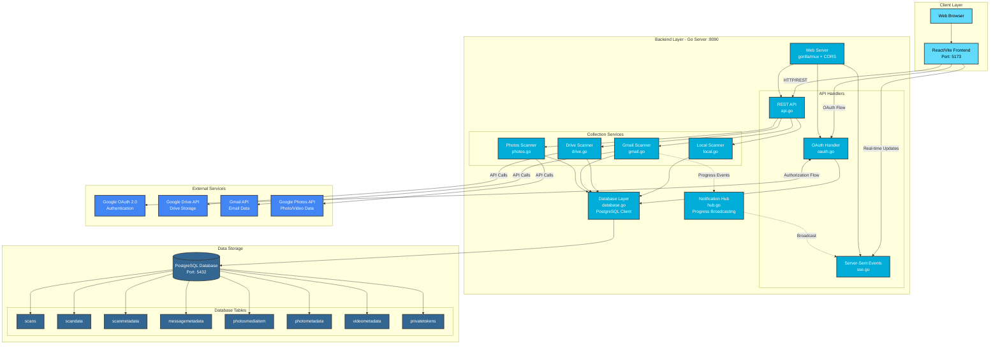
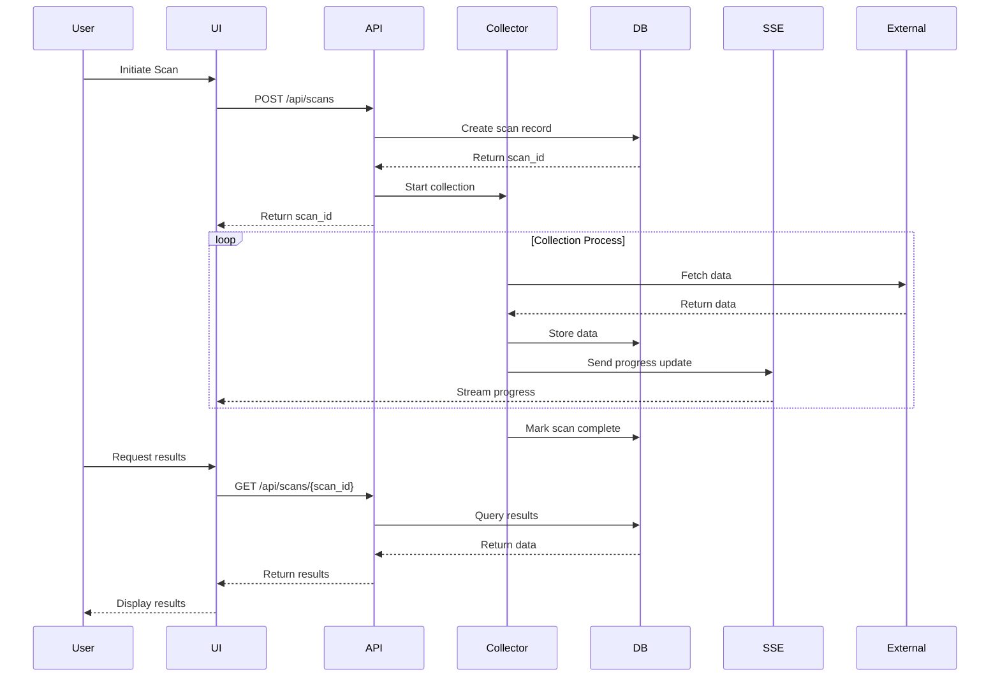
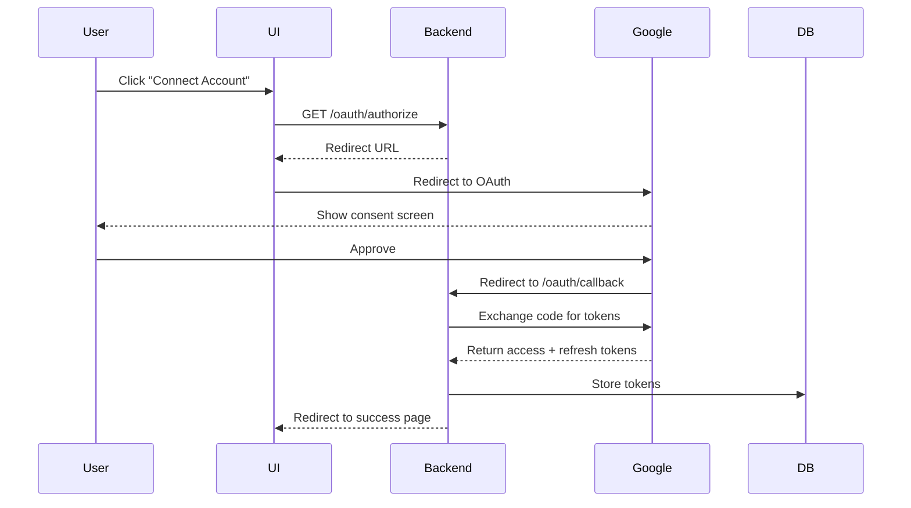
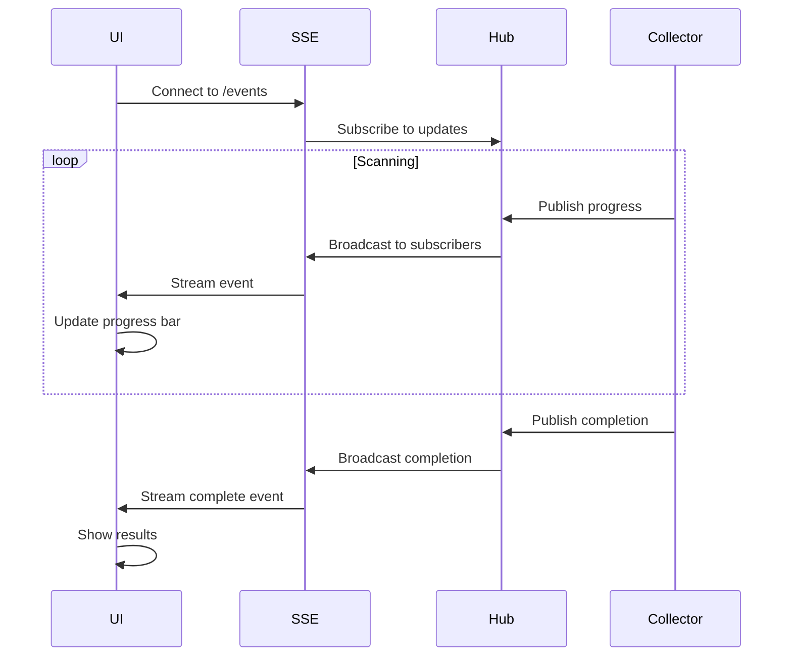

# Bhandaar Architecture

## System Overview

Bhandaar is a storage analyzer application that scans and analyzes data across multiple sources: local filesystems, Google Drive, Gmail, and Google Photos.

## Architecture Diagram



## Component Details

### 1. Frontend Layer (React + TypeScript)

**Technology Stack:**
- React 18 with TypeScript
- Vite (build tool)
- TanStack Router (routing)
- TanStack Query (data fetching)
- Tailwind CSS (styling)

**Key Components:**
- `/routes/request.tsx` - Main scan request form and results display
- `/routes/requests.tsx` - List view of scan requests by account
- `/routes/oauth/glink.tsx` - OAuth callback handler
- `/api/index.ts` - Backend API client
- `/components/ScanProgress.tsx` - Real-time progress display
- `/components/hooks/useSse.ts` - SSE connection hook

### 2. Backend Layer (Go)

#### Web Server (`web/`)
- **Framework:** Gorilla Mux router
- **Port:** 8090
- **Features:** CORS enabled, RESTful API, OAuth2, SSE

#### API Endpoints (`web/api.go`)

| Endpoint | Method | Description |
|----------|--------|-------------|
| `/api/health` | GET | Health check |
| `/api/scans` | POST | Submit scan request |
| `/api/scans` | GET | List all scans (paginated) |
| `/api/scans/requests/{account_key}` | GET | Get scan requests for account |
| `/api/scans/{scan_id}` | GET | Get scan data |
| `/api/scans/{scan_id}` | DELETE | Delete scan |
| `/api/gmaildata/{scan_id}` | GET | Get Gmail scan results |
| `/api/photos/{scan_id}` | GET | Get Photos scan results |
| `/api/photos/albums` | GET | List photo albums |
| `/api/accounts` | GET | List OAuth-authenticated accounts |
| `/api/scans/accounts` | GET | List accounts with scans |

#### OAuth Flow (`web/oauth.go`)
- `/oauth/authorize` - Initiate Google OAuth2 flow
- `/oauth/callback` - Handle OAuth callback, store refresh tokens

#### Server-Sent Events (`web/sse.go`)
- `/events` - Real-time scan progress updates
- Broadcasts progress for Gmail scans

#### Collection Services (`collect/`)

**Local Scanner (`local.go`):**
- Scans local filesystem
- Recursive directory traversal
- Calculates sizes including subdirectories
- Stores: filename, path, size, modification time, MD5 hash

**Drive Scanner (`drive.go`):**
- Uses Google Drive API
- Scans cloud storage
- Directory-level size calculation (non-recursive)
- Authentication via service account or OAuth2

**Gmail Scanner (`gmail.go`):**
- Uses Gmail API
- Scans mailbox messages
- Extracts: message ID, thread ID, from, to, subject, size, labels
- Real-time progress updates via SSE
- Deduplication by message ID

**Photos Scanner (`photos.go`):**
- Uses Google Photos API
- Scans photos and videos
- Extracts metadata: camera info, EXIF data, file size
- Separate tables for photo vs video metadata

#### Notification Hub (`notification/hub.go`)
- Pub/sub pattern for progress updates
- Channel-based communication
- Broadcasts to all subscribers or specific client keys
- Progress data: processed count, completion %, ETA

### 3. Database Layer (PostgreSQL)

**Connection Details:**
- Host: `hdd_db` (Docker) / `localhost` (local)
- Port: 5432
- User: `hddb`
- Database: `hdd_db`

**Schema:**

```
scans (main scan records)
├── scandata (file/directory data from local/drive scans)
├── scanmetadata (scan configuration)
├── messagemetadata (Gmail message data)
└── photosmediaitem (Photos/videos)
    ├── photometadata (photo-specific EXIF)
    └── videometadata (video-specific metadata)

privatetokens (OAuth refresh tokens)
```

**Auto-Migration:**
- Tables auto-created on startup
- Migration system with versioning
- Handles schema updates

### 4. External Services (Google APIs)

**OAuth 2.0:**
- Authorization code flow
- Refresh token storage
- Scopes: Drive (readonly), Gmail (readonly), Photos

**Required Credentials:**
- `OAUTH_CLIENT_ID` - Google OAuth client ID
- `OAUTH_CLIENT_SECRET` - Google OAuth client secret
- `GOOGLE_APPLICATION_CREDENTIALS` - Service account key file path

## Data Flow

### Scan Request Flow



### OAuth Flow



### Real-time Progress Updates (SSE)



## Deployment

### Docker Compose Stack

```yaml
Services:
├── hdd_db (PostgreSQL)
│   └── Port: 5432
├── hdd_be (Go Backend)
│   ├── Port: 8090
│   └── Volume: ~/keys/gae_creds.json
└── hdd_ui (React Frontend)
    └── Port: 80/443
```

### Environment Variables

**Backend:**
- `OAUTH_CLIENT_ID` - Google OAuth client ID
- `OAUTH_CLIENT_SECRET` - Google OAuth client secret
- `GOOGLE_APPLICATION_CREDENTIALS` - Path to service account JSON
- `FRONTEND_URL` - Frontend URL for CORS

**Frontend:**
- Backend API URL configured in `ui/src/api/index.ts`

## Technology Stack Summary

| Layer | Technology |
|-------|-----------|
| Frontend | React, TypeScript, Vite, TanStack Router/Query, Tailwind CSS |
| Backend | Go 1.x, Gorilla Mux, sqlx |
| Database | PostgreSQL 15+ |
| APIs | Google Drive API, Gmail API, Google Photos API |
| Auth | Google OAuth 2.0 |
| Real-time | Server-Sent Events (SSE) |
| Containerization | Docker, Docker Compose |

## Key Features

1. **Multi-source Scanning:** Local, Google Drive, Gmail, Photos
2. **Real-time Progress:** SSE-based progress updates for long-running scans
3. **OAuth Integration:** Secure Google account authentication
4. **Persistent Storage:** PostgreSQL with auto-migration
5. **RESTful API:** Clean REST endpoints with pagination
6. **Deduplication:** Gmail messages deduplicated by message ID
7. **Rich Metadata:** EXIF data for photos, email headers, file attributes

## Known Limitations

1. **Directory Size Inconsistency:**
   - Local scans: recursive size calculation
   - Cloud scans: directory-level only (excludes subdirectories)

2. **No Testing:** Codebase currently lacks test coverage

3. **Hardcoded Configuration:** Database connection and API URLs are hardcoded

4. **Single Region:** Timestamps converted to America/Los_Angeles timezone

