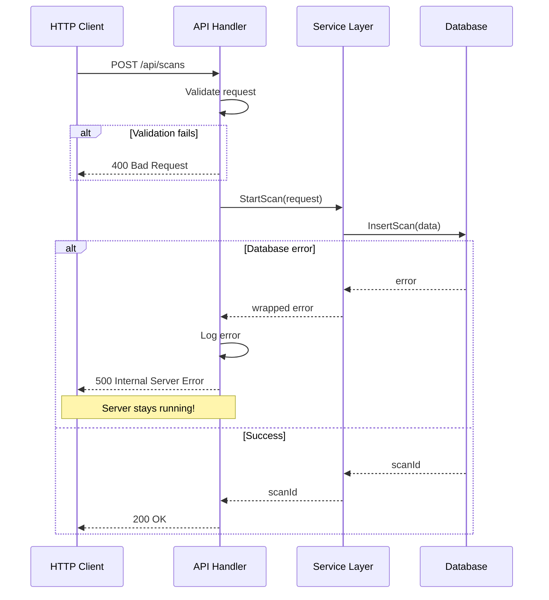

# Plan: Replace Panic-Driven Error Handling (Issue #1)

**Issue:** Panic-Driven Error Handling Crashes Server  
**Severity:** CRITICAL  
**Priority:** P0 - Do first  
**Estimated Effort:** 5-7 days  
**Created:** 2025-12-21  
**Status:** Ready for Implementation

---

## Problem Summary

The codebase uses panic-driven error handling through a `checkError()` utility function that crashes the entire server when any error occurs. This function is used in **104 locations** across the codebase (verified via `grep -r "checkError" be/`), making it a systemic issue that affects production stability.

**Additionally, the database package uses `init()` with panic-based error handling**, which means the application crashes before `main()` even starts if there's any database connection issue.

**Current Risk:**
- **Database connection fails → application crashes before `main()` starts** (init panic)
- Any database error → entire server crashes
- Any network error → all users disconnected
- Any file I/O error → complete service outage
- In-flight requests from all users terminated
- No graceful degradation or error recovery
- No way to retry failed database connections

## Current Implementation Issues

**Locations:** `be/db/database.go:581-586`, `be/collect/common.go:14-21`

### Database Package (`db/database.go`)

```go
func checkError(err error, msg ...string) {
    if err != nil {
        fmt.Println(msg)
        panic(err)  // ❌ Crashes entire server!
    }
}

// Used in 27+ locations in database.go:
func insertScanData(scanId int, ...) {
    _, err := db.Exec(query, ...)
    checkError(err, "insertScanData failed")  // ❌ Panic on DB error
}
```

### Collect Package (`collect/common.go`)

```go
func checkError(err error, msg ...string) {
    if err != nil {
        retryEligible := isRetryError(err)
        fmt.Printf("retryEligible: %v\n", retryEligible)
        fmt.Println(msg)
        panic(err)  // ❌ Crashes entire server!
    }
}

// Used in 30+ locations across:
// - collect/gmail.go (5 uses)
// - collect/photos.go (18 uses)
// - collect/local.go (4 uses)
// - collect/drive.go (4 uses)
```

**Problems:**
1. Server crashes instead of handling errors gracefully
2. All users affected when one operation fails
3. No error context or recovery mechanism
4. Violates Go best practices (errors should be values)
5. Makes testing extremely difficult
6. No way to implement retry logic or fallbacks

**Impact Examples:**

| Scenario | Current Behavior | Desired Behavior |
|----------|------------------|------------------|
| Database connection lost | Server crashes | Return error, retry, log |
| Google API rate limit | Server crashes | Retry with backoff |
| Invalid file path | Server crashes | Skip file, continue scan |
| Network timeout | Server crashes | Return error to user |

---

## Solution Architecture



### Design Pattern

**Replace panic-driven error handling with proper error returns:**

1. **Functions return errors** instead of panicking
2. **Callers handle errors** at appropriate levels
3. **HTTP handlers** convert errors to HTTP responses
4. **Service layer** wraps errors with context
5. **Database layer** returns domain-specific errors

---

## Implementation Steps

### Overview: Two Return Patterns

When updating functions, follow these patterns:

| Current Signature | New Signature | Example |
|-------------------|---------------|---------|
| `func DoX()` | `func DoX() error` | Database insert functions |
| `func GetX() T` | `func GetX() (T, error)` | `LogStartScan`, collect functions |
| `func GetX() (T, U)` | `func GetX() (T, U, error)` | `GetScansFromDb` |

**Key Examples:**
```go
// Pattern 1: void → error
func SaveScanMetadata(...) error

// Pattern 2: value → (value, error)
func LogStartScan(scanType string) (int, error)
func LocalDrive(localScan LocalScan) (int, error)
func Gmail(gMailScan GMailScan) (int, error)

// Pattern 3: multiple values → (values..., error)
func GetScansFromDb(pageNo int) ([]Scan, int, error)
```

### Step 1: Remove `init()` and `checkError` from Database Package

**File:** `be/db/database.go`

#### 1.1 🚨 DELETE the entire `init()` function 🚨

**⚠️ CRITICAL: This is not a refactor - this is a DELETION**

The existing `init()` function (lines 25-51) in `db/database.go` must be **COMPLETELY REMOVED**. Do not try to "update" it or "refactor" it. **DELETE IT ENTIRELY.**

**❌ WRONG: Keeping init() and adding SetupDatabase()**
```go
// ❌ DON'T DO THIS - BOTH FUNCTIONS WILL RUN!
func init() {
    // ... existing code ...
    db, err = sqlx.Open("postgres", psqlInfo)
    checkError(err)  // Still crashes on startup!
}

func SetupDatabase() error {
    // New code here
}
// Result: init() auto-runs and crashes before SetupDatabase() is called
```

**✅ CORRECT: Delete init(), only SetupDatabase() exists**
```go
// ✅ DO THIS - Only explicit initialization

// NO init() function here anymore!

func SetupDatabase() error {
    // All initialization logic here
}
```

**Current code to DELETE (db/database.go lines 25-51):**
```go
// ❌❌❌ DELETE THIS ENTIRE FUNCTION - ALL 27 LINES ❌❌❌
func init() {
    // Line 26-39: Logger setup (duplicated in main.go)
    options := &slog.HandlerOptions{
        ReplaceAttr: func(groups []string, a slog.Attr) slog.Attr {
            if a.Key == slog.TimeKey {
                a.Value = slog.StringValue(a.Value.Time().Format("2006-01-02 15:04:05.999"))
            }
            return a
        },
        Level: slog.LevelDebug,
    }
    handler := slog.NewTextHandler(os.Stdout, options)
    logger := slog.New(handler)
    slog.SetDefault(logger)
    slog.SetLogLoggerLevel(slog.LevelDebug)

    // Line 41-50: Database connection with panics
    psqlInfo := fmt.Sprintf("host=%s port=%d user=%s "+
        "password=%s dbname=%s sslmode=disable",
        host, port, user, password, dbname)
    var err error
    db, err = sqlx.Open("postgres", psqlInfo)
    checkError(err)  // ❌ Panics on error - crashes before main()
    err = db.Ping()
    checkError(err)  // ❌ Panics on error - crashes before main()
    slog.Info("Successfully connected to DB!")
    migrateDB()      // ❌ Also calls checkError internally
}
// ❌❌❌ END OF DELETION - REMOVE EVERYTHING ABOVE ❌❌❌
```

**Action Steps:**
1. **SELECT** lines 25-51 in `db/database.go`
2. **DELETE** them completely
3. **VERIFY** no `func init()` remains in the file
4. **Then** add the new `SetupDatabase()` function

**Why DELETE (not refactor)?**
- `init()` runs automatically before `main()` - can't be controlled
- Even if you add `SetupDatabase()`, `init()` will still run first
- Panics in `init()` crash before error handling is possible
- No way to retry or handle connection failures in `init()`
- Couples database to package import
- Makes testing impossible

**Verification after deletion:**
```bash
# This should return NOTHING
grep -n "^func init()" be/db/database.go

# This should return 0
grep -c "^func init()" be/db/database.go
```

#### 1.2 Remove the `checkError` function

```go
// DELETE THIS (line ~581-586):
func checkError(err error, msg ...string) {
    if err != nil {
        fmt.Println(msg)
        panic(err)
    }
}
```

#### 1.2 Update all database functions to return errors

**Pattern to follow:**
- **Functions that return void** → Add `error` return type
- **Functions that return a value** → Change to `(value, error)` 
- Replace `checkError(err, msg)` with proper error handling
- Use `fmt.Errorf` with `%w` for error wrapping
- **Add rich context to error messages** - include all relevant debugging info

**Error Context Best Practices:**

Include as much contextual information as possible without exposing sensitive data:

| Operation | Good Context | Better Context |
|-----------|-------------|----------------|
| Database insert | `"failed to insert scan data: %w"` | `"failed to insert scan data for scan %d (path=%s, size=%d bytes): %w"` |
| API call | `"API call failed: %w"` | `"API call failed for endpoint %s (retry %d/%d, status=%d): %w"` |
| File operation | `"failed to read file: %w"` | `"failed to read file %s (size=%d, mode=%s): %w"` |
| Network | `"connection failed: %w"` | `"connection failed to %s:%d (timeout=%s, attempt=%d): %w"` |

**What to include:**
- ✅ IDs (scan_id, user_id, etc.)
- ✅ Paths (file paths, URLs)
- ✅ Sizes, counts, indices
- ✅ Retry counts, timeouts
- ✅ Status codes, error codes
- ❌ Passwords, tokens, sensitive data

**Example 1: Function that returns void**

**Before:**
```go
func SaveScanMetadata(name string, searchPath string, searchFilter string, scanId int) {
    _, err := db.Exec(query, ...)
    checkError(err, "SaveScanMetadata failed")  // ❌ No context
}
```

**After:**
```go
func SaveScanMetadata(name string, searchPath string, searchFilter string, scanId int) error {
    _, err := db.Exec(query, ...)
    if err != nil {
        // ✅ Rich context: scanId, name, path for debugging
        return fmt.Errorf("failed to save scan metadata for scan %d (name=%s, path=%s): %w", 
            scanId, name, searchPath, err)
    }
    return nil
}
```

**Example 2: Function that returns a value**

**Before:**
```go
func LogStartScan(scanType string) int {
    // ... code ...
    err := db.QueryRow(query, scanType).Scan(&scanId)
    checkError(err, "Failed to insert scan")
    return scanId
}
```

**After:**
```go
func LogStartScan(scanType string) (int, error) {
    // ... code ...
    err := db.QueryRow(query, scanType).Scan(&scanId)
    if err != nil {
        return 0, fmt.Errorf("failed to insert scan for type %s: %w", scanType, err)
    }
    return scanId, nil
}
```

---

### Step 2: Remove `checkError` from Collect Package

**File:** `be/collect/common.go`

#### 2.1 Remove the `checkError` function

```go
// DELETE THIS:
func checkError(err error, msg ...string) {
    if err != nil {
        retryEligible := isRetryError(err)
        fmt.Printf("retryEligible: %v\n", retryEligible)
        fmt.Println(msg)
        panic(err)
    }
}
```

#### 2.2 Keep `isRetryError` for retry logic

```go
// KEEP THIS - it's useful for retry logic
func isRetryError(err error) bool {
    var googleErr *googleapi.Error
    if errors.As(err, &googleErr) {
        statusCode := googleErr.Code
        if statusCode == http.StatusTooManyRequests {
            return true
        }
        if statusCode == http.StatusForbidden {
            if len(googleErr.Errors) > 0 && googleErr.Errors[0].Reason == "rateLimitExceeded" {
                return true
            }
        }
    }
    return false
}
```

#### 2.3 Update Helper Functions with `checkError`

**The following helper functions use `checkError` or need error handling added:**

##### 2.3.1 `getGmailService` (collect/gmail.go:46)

**Current:**
```go
func getGmailService(refreshToken string) *gmail.Service {
    tokenSrc := oauth2.Token{RefreshToken: refreshToken}
    ctx := context.Background()
    gmailService, err := gmail.NewService(ctx, option.WithTokenSource(gmailConfig.TokenSource(ctx, &tokenSrc)))
    checkError(err)  // ❌ Panics on error
    return gmailService
}
```

**After:**
```go
func getGmailService(refreshToken string) (*gmail.Service, error) {
    tokenSrc := oauth2.Token{RefreshToken: refreshToken}
    ctx := context.Background()
    gmailService, err := gmail.NewService(ctx, option.WithTokenSource(gmailConfig.TokenSource(ctx, &tokenSrc)))
    if err != nil {
        return nil, fmt.Errorf("failed to create gmail service: %w", err)
    }
    return gmailService, nil
}
```

**Callers to update:**
- `Gmail()` function (collect/gmail.go:68)
- `GetIdentity()` function (collect/gmail.go:79)

##### 2.3.2 `getDriveService` (collect/drive.go:35)

**Current:**
```go
func getDriveService(refreshToken string) *drive.Service {
    tokenSrc := oauth2.Token{RefreshToken: refreshToken}
    ctx := context.Background()
    driveService, err := drive.NewService(ctx, option.WithTokenSource(cloudConfig.TokenSource(ctx, &tokenSrc)))
    checkError(err)  // ❌ Panics on error
    return driveService
}
```

**After:**
```go
func getDriveService(refreshToken string) (*drive.Service, error) {
    tokenSrc := oauth2.Token{RefreshToken: refreshToken}
    ctx := context.Background()
    driveService, err := drive.NewService(ctx, option.WithTokenSource(cloudConfig.TokenSource(ctx, &tokenSrc)))
    if err != nil {
        return nil, fmt.Errorf("failed to create drive service: %w", err)
    }
    return driveService, nil
}
```

**Callers to update:**
- `CloudDrive()` function (collect/drive.go:48)

##### 2.3.3 `getPhotosService` (collect/photos.go:41)

**Current:**
```go
func getPhotosService(refreshToken string) *http.Client {
    tokenSrc := oauth2.Token{RefreshToken: refreshToken}
    client := photosConfig.Client(context.Background(), &tokenSrc)
    client.Timeout = 10 * time.Second
    return client
}
```

**Issue:** No error handling. OAuth token could be invalid, expired, or malformed.

**After:**
```go
func getPhotosService(refreshToken string) (*http.Client, error) {
    if refreshToken == "" {
        return nil, fmt.Errorf("refresh token is empty")
    }

    tokenSrc := oauth2.Token{RefreshToken: refreshToken}
    client := photosConfig.Client(context.Background(), &tokenSrc)
    client.Timeout = 10 * time.Second
    return client, nil
}
```

**Note:** OAuth2 `Client()` doesn't return an error, but we add validation and return error for consistency.

**Callers to update:**
- `Photos()` function (collect/photos.go:50)

##### 2.3.4 `getMd5ForFile` (collect/local.go:88-96)

**Current:**
```go
func getMd5ForFile(filePath string) string {
    file, err := os.Open(filePath)
    checkError(err)  // ❌ Panics on error
    defer file.Close()
    hash := md5.New()
    _, err = io.Copy(hash, file)
    checkError(err)  // ❌ Panics on error
    return hex.EncodeToString(hash.Sum(nil))
}
```

**After (Option A: Return empty string, log and continue):**
```go
func getMd5ForFile(filePath string) string {
    file, err := os.Open(filePath)
    if err != nil {
        // Log but don't fail - MD5 is optional metadata
        slog.Warn("Failed to open file for MD5 calculation, skipping hash",
            "path", filePath,
            "error", err)
        return ""
    }
    defer file.Close()

    hash := md5.New()
    _, err = io.Copy(hash, file)
    if err != nil {
        // Log but don't fail - MD5 is optional metadata
        slog.Warn("Failed to calculate MD5 hash, skipping",
            "path", filePath,
            "error", err)
        return ""
    }

    return hex.EncodeToString(hash.Sum(nil))
}
```

**Rationale:** MD5 is optional metadata. File scan should succeed even if MD5 calculation fails (e.g., permission denied, file locked, etc.).

**Callers:** No signature change needed, existing callers work as-is.

##### 2.3.5 `GetIdentity` (collect/gmail.go:74)

**Current:**
```go
func GetIdentity(refreshToken string) string {
    if refreshToken == "" {
        slog.Warn("Refresh token not found. Cannot proceed.")
        return ""
    }
    gmailService := getGmailService(refreshToken)
    profile := gmailService.Users.GetProfile("me")
    profileInfo, err := profile.Do()
    checkError(err)  // ❌ Panics on error
    return profileInfo.EmailAddress
}
```

**After:**
```go
func GetIdentity(refreshToken string) (string, error) {
    if refreshToken == "" {
        return "", fmt.Errorf("refresh token is empty")
    }

    gmailService, err := getGmailService(refreshToken)
    if err != nil {
        return "", fmt.Errorf("failed to get gmail service: %w", err)
    }

    profile := gmailService.Users.GetProfile("me")
    profileInfo, err := profile.Do()
    if err != nil {
        return "", fmt.Errorf("failed to get user profile from Gmail API: %w", err)
    }

    return profileInfo.EmailAddress, nil
}
```

**Callers to update:**
- OAuth callback handler in `web/oauth.go` (uses this to get email address)

---

### Step 3: Update Database Functions

**File:** `be/db/database.go`

Update all 27+ functions that use `checkError`. Here are the key functions:

---

#### 3.0 Transaction Strategy Summary

Before diving into specific functions, understand when to use transactions:

**✅ USE TRANSACTIONS when:**
- Multiple INSERTs must succeed together (atomicity)
- Child records depend on parent ID (RETURNING id pattern)
- Complex operation with multiple steps
- Already using transactions (e.g., DeleteScan from Issue #5)

**❌ DON'T USE TRANSACTIONS when:**
- Processing independent items from a channel
- Single INSERT/UPDATE operation
- Want to skip failures and continue (resilience pattern)
- Items are unrelated to each other

**Decision Tree:**

```
Need to save data
     ↓
Multiple related operations?
     ↓
YES → Parent-child relationship?
     ↓                     ↓
   YES                   NO
     ↓                     ↓
Use Transaction    Independent items?
(all-or-nothing)         ↓
                       YES
                         ↓
                    No Transaction
                  (skip-and-continue)
```

**Current Codebase Analysis:**

| Function | Transaction? | Reason |
|----------|-------------|---------|
| `SavePhotosMediaItem` | ✅ YES | Parent + children (photo/video metadata) |
| `SaveStatToDb` | ❌ NO | Independent file items, skip failures |
| `SaveMessageMetadataToDb` | ❌ NO | Independent messages, skip failures |
| `DeleteScan` | ✅ YES | Already implemented (Issue #5) |
| `LogStartScan` | ❌ NO | Single INSERT |
| `MarkScanCompleted` | ❌ NO | Single UPDATE |
| `MarkScanFailed` | ❌ NO | Single UPDATE |

---

#### 3.1 `insertScanData` (or similar function)

**Note:** Check actual function name - may be part of `SaveStatToDb`

```go
func insertScanData(scanId int, size int64, name string, path string, isFolder bool, md5 string) error {
    query := `INSERT INTO scandata (scan_id, size, name, path, is_folder, md5) 
              VALUES ($1, $2, $3, $4, $5, $6)`
    _, err := db.Exec(query, scanId, size, name, path, isFolder, md5)
    if err != nil {
        // ✅ Rich context: scanId, path, size, type (folder vs file)
        itemType := "file"
        if isFolder {
            itemType = "folder"
        }
        return fmt.Errorf("failed to insert scan data for scan %d (path=%s, size=%d bytes, type=%s): %w", 
            scanId, path, size, itemType, err)
    }
    return nil
}
```

#### 3.2 `SaveScanMetadata`

```go
func SaveScanMetadata(scanId int, metadata ScanMetadata) error {
    query := `INSERT INTO scanmetadata (scan_id, num_files, num_folders, total_size)
              VALUES ($1, $2, $3, $4)`
    _, err := db.Exec(query, scanId, metadata.NumFiles, metadata.NumFolders, metadata.TotalSize)
    if err != nil {
        return fmt.Errorf("failed to save scan metadata for scan %d: %w", scanId, err)
    }
    return nil
}
```

#### 3.3 `SaveMessageMetadata` (part of SaveMessageMetadataToDb)

**Note:** This is typically called in a loop from `SaveMessageMetadataToDb`. Show inline error handling:

```go
func SaveMessageMetadataToDb(scanId int, username string, messageMetaData <-chan MessageMetadata) {
    for {
        mmd, more := <-messageMetaData
        if !more {
            if err := MarkScanCompleted(scanId); err != nil {
                slog.Error("Failed to mark scan complete",
                    "scan_id", scanId,
                    "error", err)
            }
            break
        }

        query := `INSERT INTO messagemetadata (message_id, thread_id, date, mail_from, 
                  mail_to, subject, size_estimate, labels, scan_id, username) 
                  VALUES ($1, $2, $3, $4, $5, $6, $7, $8, $9, $10)`

        _, err := db.Exec(query, mmd.MessageId, mmd.ThreadId, mmd.Date.UTC(),
            substr(mmd.From, 500), substr(mmd.To, 500), substr(mmd.Subject, 2000),
            mmd.SizeEstimate, substr(strings.Join(mmd.LabelIds, ","), 500), scanId, username)

        if err != nil {
            // ✅ Rich context: scanId, messageId, username, subject (truncated), size
            slog.Error("Failed to save message metadata, skipping",
                "scan_id", scanId,
                "message_id", mmd.MessageId,
                "username", username,
                "subject", substr(mmd.Subject, 50),  // First 50 chars
                "size_bytes", mmd.SizeEstimate,
                "error", err)
            continue  // Skip this message, continue with others
        }
    }
}
```

#### 3.4 Transaction Handling Strategy

**⚠️ IMPORTANT: When to Use Transactions**

Not all database operations need transactions. Use this decision matrix:

| Operation | Needs Transaction? | Reason |
|-----------|-------------------|---------|
| Single INSERT | ❌ No | Atomic by nature |
| Multiple related INSERTs | ✅ Yes | Must succeed/fail together |
| INSERT with RETURNING + dependent INSERT | ✅ Yes | Second depends on first |
| Channel-driven loop of INSERTs | ❌ No | Independent items, skip on error |
| UPDATE scan status | ❌ No | Single operation |
| DELETE with CASCADE | ✅ Yes | Already implemented (Issue #5) |

**Examples by Function:**

##### 3.4.1 `SavePhotosMediaItem` - NEEDS TRANSACTION

**Why:** Parent insert returns ID needed for child inserts. Must be atomic.

```go
func SavePhotosMediaItem(scanId int, photosMediaItem PhotosMediaItem) error {
    tx, err := db.Beginx()
    if err != nil {
        return fmt.Errorf("failed to begin transaction: %w", err)
    }
    defer tx.Rollback()  // Auto-rollback if commit not called

    // Insert parent record (photosmediaitem)
    query := `INSERT INTO photosmediaitem (scan_id, media_item_id, base_url, 
              mime_type, filename, creation_time, width, height)
              VALUES ($1, $2, $3, $4, $5, $6, $7, $8) RETURNING id`
    
    var id int
    err = tx.QueryRow(query, scanId, photosMediaItem.MediaItemId, 
        photosMediaItem.BaseUrl, photosMediaItem.MimeType, photosMediaItem.Filename,
        photosMediaItem.CreationTime, photosMediaItem.Width, photosMediaItem.Height).Scan(&id)
    
    if err != nil {
        return fmt.Errorf("failed to save photos media item for scan %d (item_id=%s, filename=%s): %w", 
            scanId, photosMediaItem.MediaItemId, photosMediaItem.Filename, err)
    }

    // Insert child record (photometadata) - depends on parent ID
    if photosMediaItem.PhotoMetadata != nil {
        query = `INSERT INTO photometadata (photos_media_item_id, camera_make, 
                 camera_model, focal_length, aperture, iso)
                 VALUES ($1, $2, $3, $4, $5, $6)`
        
        _, err = tx.Exec(query, id, photosMediaItem.PhotoMetadata.CameraMake,
            photosMediaItem.PhotoMetadata.CameraModel, photosMediaItem.PhotoMetadata.FocalLength,
            photosMediaItem.PhotoMetadata.Aperture, photosMediaItem.PhotoMetadata.Iso)
        
        if err != nil {
            return fmt.Errorf("failed to save photo metadata for item %d (camera=%s %s): %w", 
                id, photosMediaItem.PhotoMetadata.CameraMake, 
                photosMediaItem.PhotoMetadata.CameraModel, err)
        }
    }

    // Insert child record (videometadata) - depends on parent ID
    if photosMediaItem.VideoMetadata != nil {
        query = `INSERT INTO videometadata (photos_media_item_id, fps, status)
                 VALUES ($1, $2, $3)`
        
        _, err = tx.Exec(query, id, photosMediaItem.VideoMetadata.Fps, 
            photosMediaItem.VideoMetadata.Status)
        
        if err != nil {
            return fmt.Errorf("failed to save video metadata for item %d (fps=%.2f, status=%s): %w", 
                id, photosMediaItem.VideoMetadata.Fps, photosMediaItem.VideoMetadata.Status, err)
        }
    }

    if err := tx.Commit(); err != nil {
        return fmt.Errorf("failed to commit transaction for media item %s: %w", 
            photosMediaItem.MediaItemId, err)
    }

    return nil
}
```

##### 3.4.2 `SaveStatToDb` - NO TRANSACTION (Current Pattern)

**Why:** Independent items in a loop. Skip failures, continue processing.

```go
func SaveStatToDb(scanId int, scanData <-chan db.FileData) {
    // ❌ DON'T wrap entire loop in transaction
    // ✅ DO process items independently
    
    for {
        fd, more := <-scanData
        if !more {
            // Check scan status and mark complete if not failed
            scan, err := GetScanById(scanId)
            if err != nil {
                slog.Error("Failed to get scan status",
                    "scan_id", scanId,
                    "error", err)
                return
            }
            
            if scan.Status != "Failed" {
                if err := MarkScanCompleted(scanId); err != nil {
                    slog.Error("Failed to mark scan complete",
                        "scan_id", scanId,
                        "error", err)
                }
            }
            break
        }
        
        // Single INSERT - no transaction needed
        query := `INSERT INTO scandata (scan_id, size, name, path, is_folder, md5)
                  VALUES ($1, $2, $3, $4, $5, $6)`
        
        _, err := db.Exec(query, scanId, fd.Size, fd.Name, fd.Path, fd.IsFolder, fd.Md5)
        if err != nil {
            // Log and skip - don't fail entire scan
            itemType := "file"
            if fd.IsFolder {
                itemType = "folder"
            }
            slog.Error("Failed to insert scan data, skipping item",
                "scan_id", scanId,
                "path", fd.Path,
                "size_bytes", fd.Size,
                "type", itemType,
                "error", err)
            continue  // Skip this item, process next
        }
    }
}
```

##### 3.4.3 `SaveMessageMetadataToDb` - NO TRANSACTION (Current Pattern)

**Why:** Same as SaveStatToDb - independent messages, skip failures.

```go
func SaveMessageMetadataToDb(scanId int, username string, messageMetaData <-chan MessageMetadata) {
    // ❌ DON'T wrap loop in transaction
    // ✅ DO process messages independently
    
    for {
        mmd, more := <-messageMetaData
        if !more {
            // Mark scan complete (if not already failed)
            scan, _ := GetScanById(scanId)
            if scan != nil && scan.Status != "Failed" {
                MarkScanCompleted(scanId)
            }
            break
        }

        // Single INSERT per message - no transaction needed
        query := `INSERT INTO messagemetadata (...) VALUES (...)`
        _, err := db.Exec(query, ...)
        
        if err != nil {
            // Log and skip - don't fail entire scan
            slog.Error("Failed to save message metadata, skipping",
                "scan_id", scanId,
                "message_id", mmd.MessageId,
                "username", username,
                "subject", substr(mmd.Subject, 50),
                "error", err)
            continue  // Skip this message
        }
    }
}
```

#### 3.4.4 Batch Operations - Future Optimization (Out of Scope)

**Current Approach:** Process items one at a time from channels.

**Future Enhancement:** Batch multiple items into single transaction.

```go
// FUTURE: Not in this PR
func SaveStatToDb(scanId int, scanData <-chan db.FileData) {
    const batchSize = 100
    batch := make([]db.FileData, 0, batchSize)
    
    for {
        fd, more := <-scanData
        if !more || len(batch) >= batchSize {
            if len(batch) > 0 {
                // Process batch in transaction
                if err := insertBatch(scanId, batch); err != nil {
                    // Fallback: Try one-by-one for this batch
                    for _, item := range batch {
                        insertSingle(scanId, item)  // Log and skip on error
                    }
                }
                batch = batch[:0]  // Clear batch
            }
            if !more {
                break
            }
        }
        batch = append(batch, fd)
    }
}
```

**Why defer to future:**
- Adds complexity (batching logic, partial failure handling)
- Current one-at-a-time is simpler and sufficient
- Can optimize later with profiling data
- This PR is already large

**Trade-offs:**
- **Current (one-at-a-time):** Simple, clear error handling, slightly slower
- **Future (batched):** Faster, more complex error handling, requires fallback logic

#### 3.4.5 Savepoints - Not Needed (Out of Scope)

**What are savepoints?**
Nested transaction markers that allow partial rollback within a transaction.

```sql
BEGIN;
  INSERT INTO parent ...;
  SAVEPOINT sp1;
    INSERT INTO child1 ...;  -- Might fail
  ROLLBACK TO sp1;  -- Undo child1, keep parent
  SAVEPOINT sp2;
    INSERT INTO child2 ...;  -- Try alternative
  RELEASE sp2;  -- Success
COMMIT;
```

**Do we need savepoints in this PR?**
❌ **NO** - Not needed because:

1. **Simple parent-child relationships:** Our transactions are simple (1 parent + 1-2 children)
2. **All-or-nothing is correct:** If child insert fails, we WANT to rollback parent
3. **No conditional logic:** We don't have complex "try this, if fails try that" scenarios
4. **Loop items are independent:** Items in channels don't need savepoints (no transaction)

**When would we need savepoints?** (Future consideration)
- Complex multi-step operations with optional steps
- "Try alternative strategies" logic
- Partial rollback without losing previous work

**Verdict:** Not needed for panic-to-error refactoring. Keep it simple.

---

#### 3.5 `migrateDB` (called from init, needs error return)

**Current:**
```go
func migrateDB() {
    var version int
    err := db.Get(&version, "SELECT version FROM version")
    if err != nil {
        if err != sql.ErrNoRows {
            checkError(err, "Failed to query schema version")  // ❌ Panics
        }
        version = 0
    }
    // ... migration logic with checkError calls
}
```

**After:**
```go
func migrateDB() error {
    var version int
    err := db.Get(&version, "SELECT version FROM version")
    if err != nil {
        if err == sql.ErrNoRows {
            version = 0
        } else {
            return fmt.Errorf("failed to get current migration version: %w", err)
        }
    }

    if version < 1 {
        slog.Info("Running migration", "from_version", version, "to_version", 1)
        
        _, err = db.Exec(create_tables)
        if err != nil {
            return fmt.Errorf("failed to create tables during migration v1: %w", err)
        }

        _, err = db.Exec("INSERT INTO version (version) VALUES (1)")
        if err != nil {
            return fmt.Errorf("failed to update version table during migration v1 (from=%d, to=%d): %w", 
                version, 1, err)
        }

        slog.Info("Database migrated successfully", "version", 1)
    }

    return nil
}
```

**Note:** This function was previously called from `init()`. After removing `init()`, it will be called from `SetupDatabase()`.

#### 3.6 Update `migrateDB` to add scan status columns

Add migration for new columns:

```go
func migrateDB() error {
    var version int
    err := db.Get(&version, "SELECT version FROM version")
    if err != nil {
        if err == sql.ErrNoRows {
            version = 0
        } else {
            return fmt.Errorf("failed to get database version: %w", err)
        }
    }

    // Existing migration (version 1)
    if version < 1 {
        _, err = db.Exec(create_tables)
        if err != nil {
            return fmt.Errorf("failed to create tables: %w", err)
        }

        _, err = db.Exec("INSERT INTO version (version) VALUES (1)")
        if err != nil {
            return fmt.Errorf("failed to update version: %w", err)
        }

        slog.Info("Database migrated to version 1")
    }

    // NEW: Migration for scan status tracking (version 2)
    if version < 2 {
        slog.Info("Running migration", "from_version", version, "to_version", 2, "description", "scan status tracking")
        
        migration := `
            -- Add error_msg column if it doesn't exist
            ALTER TABLE scans ADD COLUMN IF NOT EXISTS error_msg TEXT;
            
            -- Add completed_at column if it doesn't exist
            ALTER TABLE scans ADD COLUMN IF NOT EXISTS completed_at TIMESTAMP;
            
            -- Ensure status column exists (may already exist from version 1)
            ALTER TABLE scans ADD COLUMN IF NOT EXISTS status TEXT DEFAULT 'InProgress';
            
            -- Update existing scans without status to 'Completed' (legacy data)
            UPDATE scans SET status = 'Completed' 
            WHERE status IS NULL AND scan_end_time IS NOT NULL;
            
            -- Update version
            UPDATE version SET version = 2;
        `
        
        _, err = db.Exec(migration)
        if err != nil {
            return fmt.Errorf("failed to run migration v2 (scan status tracking, from_version=%d): %w", 
                version, err)
        }

        slog.Info("Database migrated successfully", "version", 2, "description", "scan status tracking")
    }

    return nil
}
```

#### 3.6 `SetupDatabase` (entry point)

```go
func SetupDatabase() error {
    connStr := fmt.Sprintf("host=%s port=%d user=%s password=%s dbname=%s sslmode=disable",
        host, port, user, password, dbname)

    var err error
    db, err = sqlx.Connect("postgres", connStr)
    if err != nil {
        return fmt.Errorf("failed to connect to database: %w", err)
    }

    slog.Info("Database connection established")

    if err := migrateDB(); err != nil {
        return fmt.Errorf("failed to migrate database: %w", err)
    }

    return nil
}
```

#### 3.7 Update `LogStartScan` (returns value + error)

**Before:**
```go
func LogStartScan(scanType string) int {
    query := `INSERT INTO scans (scan_time, scan_type, status) VALUES ($1, $2, $3) RETURNING id`
    var scanId int
    err := db.QueryRow(query, time.Now().UTC(), scanType, "InProgress").Scan(&scanId)
    checkError(err, "Failed to insert scan")
    return scanId
}
```

**After:**
```go
func LogStartScan(scanType string) (int, error) {
    query := `INSERT INTO scans (scan_time, scan_type, status) VALUES ($1, $2, $3) RETURNING id`
    var scanId int
    err := db.QueryRow(query, time.Now().UTC(), scanType, "InProgress").Scan(&scanId)
    if err != nil {
        return 0, fmt.Errorf("failed to insert scan for type %s: %w", scanType, err)
    }
    return scanId, nil
}
```

---

### Step 4: Update Collect Functions

Update functions in `collect/gmail.go`, `collect/photos.go`, `collect/local.go`, and `collect/drive.go`.

**Key Changes:**
- Entry point functions (Gmail, Photos, LocalDrive, CloudDrive) return `(int, error)`
- Internal helper functions return `error`
- Propagate errors up the call stack

#### 4.1 Gmail Functions (`collect/gmail.go`)

**Entry Point Function:**

**Before:**
```go
func Gmail(gMailScan GMailScan) int {
    scanId := db.LogStartScan("gmail")  // ❌ No error handling
    // ... setup ...
    startGmailScan(gmailService, scanId, gMailScan, messageMetaData)
    return scanId  // ❌ Always returns, even if failed
}
```

**After:**
```go
func Gmail(gMailScan GMailScan) (int, error) {
    // Phase 1: Create scan record (synchronous)
    scanId, err := db.LogStartScan("gmail")
    if err != nil {
        return 0, fmt.Errorf("failed to start gmail scan (account=%s, filter=%s): %w", 
            gMailScan.ClientKey, gMailScan.Filter, err)
    }
    
    // Get Gmail service
    gmailService, err := getGmailService(gMailScan.RefreshToken)
    if err != nil {
        return 0, fmt.Errorf("failed to get gmail service for scan %d: %w", scanId, err)
    }
    
    // Phase 2: Start collection in background (asynchronous)
    messageMetaData := make(chan db.MessageMetadata)
    go func() {
        defer close(messageMetaData)
        
        err := startGmailScan(gmailService, scanId, gMailScan, messageMetaData)
        if err != nil {
            slog.Error("Gmail scan collection failed",
                "scan_id", scanId,
                "account", gMailScan.ClientKey,
                "error", err)
            db.MarkScanFailed(scanId, err.Error())
            return
        }
    }()
    
    // Start processing messages in background
    go db.SaveMessageMetadataToDb(scanId, gMailScan.ClientKey, messageMetaData)
    
    // ✅ Returns immediately after starting goroutines
    return scanId, nil
}
```

**Internal Helper Function:**

**Before:**
```go
func getMessageInfo(gmailService *gmail.Service, id string, ...) {
    message, err := gmailService.Users.Messages.Get("me", id).Do()
    checkError(err, "get message failed")
    // ...
}
```

**After:**
```go
func getMessageInfo(gmailService *gmail.Service, id string, 
    messageMetaData chan<- db.MessageMetadata, retryCount int, wg *sync.WaitGroup) error {
    
    defer wg.Done()
    
    message, err := gmailService.Users.Messages.Get("me", id).Do()
    if err != nil {
        if isRetryError(err) && retryCount < maxRetryCount {
            // ✅ Rich context: messageId, retry count, error type
            var statusCode int
            if gerr, ok := err.(*googleapi.Error); ok {
                statusCode = gerr.Code
            }
            slog.Warn("Retryable error, will retry",
                "message_id", id,
                "retry_count", retryCount,
                "max_retries", maxRetryCount,
                "status_code", statusCode,
                "error", err)
            time.Sleep(retryDelay * time.Duration(retryCount+1))
            return getMessageInfo(gmailService, id, messageMetaData, retryCount+1, wg)
        }
        
        // ✅ Rich context: messageId, retry count exhausted, final error
        slog.Error("Failed to get message after retries, skipping",
            "message_id", id,
            "retry_count", retryCount,
            "max_retries", maxRetryCount,
            "error", err)
        return nil  // Return nil to continue scan (individual item failure)
    }

    // Process message...
    messageMetaData <- md
    counter_processed.Add(1)
    counter_pending.Add(-1)
    
    return nil
}
```

#### 4.2 Photos Functions (`collect/photos.go`)

**Entry Point Function:**

**Before:**
```go
func Photos(photosScan GPhotosScan) int {
    scanId := db.LogStartScan("photos")  // ❌ No error handling
    // ... setup ...
    startPhotosScan(scanId, photosScan, photosMediaItem)
    return scanId  // ❌ Always returns, even if failed
}
```

**After:**
```go
func Photos(photosScan GPhotosScan) (int, error) {
    // Phase 1: Create scan record (synchronous)
    scanId, err := db.LogStartScan("photos")
    if err != nil {
        return 0, fmt.Errorf("failed to start photos scan (album=%s): %w", 
            photosScan.AlbumId, err)
    }
    
    // Phase 2: Start collection in background (asynchronous)
    photosMediaItem := make(chan db.PhotosMediaItem)
    go func() {
        defer close(photosMediaItem)
        
        err := startPhotosScan(scanId, photosScan, photosMediaItem)
        if err != nil {
            slog.Error("Photos scan collection failed",
                "scan_id", scanId,
                "album_id", photosScan.AlbumId,
                "error", err)
            db.MarkScanFailed(scanId, err.Error())
            return
        }
    }()
    
    // Start processing photos in background
    go db.SavePhotosMediaItemToDb(scanId, photosMediaItem)
    
    // ✅ Returns immediately after starting goroutines
    return scanId, nil
}
```

**Internal Helper Function:**

```go
func processMediaItem(photosScan GPhotosScan, mediaItem MediaItem, 
    photosMediaItem chan<- db.PhotosMediaItem, wg *sync.WaitGroup) error {
    
    defer wg.Done()

    // Calculate content size and hash
    contentSize, hash, err := getContentSizeAndHash(mediaItem.BaseUrl)
    if err != nil {
        // ✅ Rich context: mediaItemId, filename, mime type, URL (partial), error
        slog.Error("Failed to get content size and hash, skipping item",
            "media_item_id", mediaItem.Id,
            "filename", mediaItem.Filename,
            "mime_type", mediaItem.MimeType,
            "base_url_prefix", mediaItem.BaseUrl[:50],  // First 50 chars of URL
            "error", err)
        // Don't fail the entire scan, just skip this item
        return nil
    }

    // Create PhotosMediaItem
    pmi := db.PhotosMediaItem{
        MediaItemId:  mediaItem.Id,
        BaseUrl:      mediaItem.BaseUrl,
        MimeType:     mediaItem.MimeType,
        Filename:     mediaItem.Filename,
        CreationTime: mediaItem.MediaMetadata.CreationTime,
        Width:        mediaItem.MediaMetadata.Width,
        Height:       mediaItem.MediaMetadata.Height,
        ContentSize:  contentSize,
        Hash:         hash,
    }

    // Add metadata
    if mediaItem.MediaMetadata.Photo != nil {
        pmi.PhotoMetadata = &db.PhotoMetadata{
            CameraMake:  mediaItem.MediaMetadata.Photo.CameraMake,
            CameraModel: mediaItem.MediaMetadata.Photo.CameraModel,
            FocalLength: mediaItem.MediaMetadata.Photo.FocalLength,
            Aperture:    mediaItem.MediaMetadata.Photo.ApertureFNumber,
            Iso:         mediaItem.MediaMetadata.Photo.IsoEquivalent,
        }
    }

    if mediaItem.MediaMetadata.Video != nil {
        pmi.VideoMetadata = &db.VideoMetadata{
            Fps:    mediaItem.MediaMetadata.Video.Fps,
            Status: mediaItem.MediaMetadata.Video.Status,
        }
    }

    photosMediaItem <- pmi
    counter_processed.Add(1)
    counter_pending.Add(-1)
    
    return nil
}
```

#### 4.3 Local Functions (`collect/local.go`)

**Entry Point Function:**

**Before:**
```go
func LocalDrive(localScan LocalScan) int {
    scanId := db.LogStartScan("local")  // ❌ No error handling
    // ... setup ...
    startCollectStats(scanId, localScan.SearchPath, scanData)
    return scanId  // ❌ Always returns, even if failed
}
```

**After:**
```go
func LocalDrive(localScan LocalScan) (int, error) {
    // Phase 1: Create scan record (synchronous)
    scanId, err := db.LogStartScan("local")
    if err != nil {
        // ✅ Rich context: path, error
        return 0, fmt.Errorf("failed to start local scan (path=%s): %w", 
            localScan.SearchPath, err)
    }
    
    // Phase 2: Start collection in background (asynchronous)
    go func() {
        scanData := make(chan db.FileData)
        
        go func() {
            defer close(scanData)
            
            err := startCollectStats(scanId, localScan.SearchPath, scanData)
            if err != nil {
                // ✅ Rich context: scanId, path
                slog.Error("Local scan collection failed",
                    "scan_id", scanId,
                    "path", localScan.SearchPath,
                    "error", err)
                db.MarkScanFailed(scanId, err.Error())
                return
            }
        }()
        
        db.SaveStatToDb(scanId, scanData)
    }()
    
    // ✅ Returns immediately after starting goroutine
    return scanId, nil
}
```

**Internal Helper Function:**

```go
func startCollectStats(scanId int, path string, scanData chan<- db.FileData) error {
    lock.Lock()
    defer lock.Unlock()

    var fileCount, folderCount int64
    var totalSize int64

    err := filepath.Walk(path, func(currentPath string, info os.FileInfo, err error) error {
        if err != nil {
            // ✅ Rich context: current path, permissions, error type
            slog.Warn("Error accessing path, skipping",
                "scan_id", scanId,
                "path", currentPath,
                "error", err)
            return nil  // Skip this path, continue walking
        }

        var md5sum string
        if !info.IsDir() {
            md5sum = getMd5ForFile(currentPath)
            fileCount++
            totalSize += info.Size()
        } else {
            folderCount++
        }

        scanData <- db.FileData{
            Size:     info.Size(),
            Name:     info.Name(),
            Path:     currentPath,
            IsFolder: info.IsDir(),
            Md5:      md5sum,
        }

        return nil
    })

    if err != nil {
        // ✅ Rich context: scanId, root path, statistics so far
        return fmt.Errorf("failed to walk directory for scan %d (root=%s, files=%d, folders=%d, size=%d): %w", 
            scanId, path, fileCount, folderCount, totalSize, err)
    }

    slog.Info("Scan collection completed",
        "scan_id", scanId,
        "root_path", path,
        "files", fileCount,
        "folders", folderCount,
        "total_bytes", totalSize)

    return nil
}
```

#### 4.4 Drive Functions (`collect/drive.go`)

**Entry Point Function:**

**Before:**
```go
func CloudDrive(driveScan GDriveScan) int {
    scanId := db.LogStartScan("drive")  // ❌ No error handling
    // ... setup ...
    return scanId  // ❌ Always returns, even if failed
}
```

**After:**
```go
func CloudDrive(driveScan GDriveScan) (int, error) {
    // Phase 1: Create scan record (synchronous)
    scanId, err := db.LogStartScan("drive")
    if err != nil {
        return 0, fmt.Errorf("failed to start drive scan: %w", err)
    }
    
    // Get Drive service
    driveService, err := getDriveService(driveScan.RefreshToken)
    if err != nil {
        return 0, fmt.Errorf("failed to get drive service for scan %d: %w", scanId, err)
    }
    
    // Phase 2: Start collection in background (asynchronous)
    scanData := make(chan db.FileData)
    go func() {
        defer close(scanData)
        
        err := startDriveScan(scanId, driveScan, driveService, scanData)
        if err != nil {
            slog.Error("Drive scan collection failed",
                "scan_id", scanId,
                "account", driveScan.ClientKey,
                "error", err)
            db.MarkScanFailed(scanId, err.Error())
            return
        }
    }()
    
    // Start processing drive files in background
    go db.SaveStatToDb(scanId, scanData)
    
    // ✅ Returns immediately after starting goroutines
    return scanId, nil
}
```

---

### Step 5: Update API Handlers

**File:** `be/web/api.go`

Update all handlers to properly handle errors from service/database layers.

#### 5.1 `DoScansHandler`

**Before:**
```go
func DoScansHandler(w http.ResponseWriter, r *http.Request) {
    decoder := json.NewDecoder(r.Body)
    var doScanRequest DoScanRequest
    err := decoder.Decode(&doScanRequest)
    if err != nil {
        panic(err)  // ❌ Crashes server
    }
    
    var body DoScanResponse
    switch doScanRequest.ScanType {
    case "Local":
        body = DoScanResponse{
            ScanId: collect.LocalDrive(doScanRequest.LocalScan),  // ❌ No error handling
        }
    case "GDrive":
        body = DoScanResponse{
            ScanId: collect.CloudDrive(doScanRequest.GDriveScan),
        }
    // ... other cases
    }
    
    serializedBody, _ := json.Marshal(body)  // ❌ Ignored error
    w.Write(serializedBody)
}
```

**After:**
```go
func DoScansHandler(w http.ResponseWriter, r *http.Request) {
    decoder := json.NewDecoder(r.Body)
    var doScanRequest DoScanRequest

    err := decoder.Decode(&doScanRequest)
    if err != nil {
        slog.Error("Failed to decode request", "error", err)
        http.Error(w, "Invalid JSON", http.StatusBadRequest)
        return
    }

    slog.Info("Received scan request",
        "scan_type", doScanRequest.ScanType)

    // Start scan based on type
    var scanId int
    var scanErr error

    switch doScanRequest.ScanType {
    case "Local":
        scanId, scanErr = collect.LocalDrive(doScanRequest.LocalScan)
    case "GDrive":
        scanId, scanErr = collect.CloudDrive(doScanRequest.GDriveScan)
    case "GMail":
        scanId, scanErr = collect.Gmail(doScanRequest.GMailScan)
    case "GPhotos":
        scanId, scanErr = collect.Photos(doScanRequest.GPhotosScan)
    default:
        http.Error(w, "Invalid scan type", http.StatusBadRequest)
        return
    }

    if scanErr != nil {
        slog.Error("Scan failed",
            "scan_type", doScanRequest.ScanType,
            "error", scanErr)
        http.Error(w, "Scan failed", http.StatusInternalServerError)
        return
    }

    response := DoScanResponse{
        ScanId: scanId,
    }

    writeJSONResponse(w, response, http.StatusOK)
}
```

#### 5.2 Background Processing with Goroutine Error Handling

**⚠️ CRITICAL: Async Scan Architecture**

Scans run asynchronously in goroutines and return immediately. This creates a challenge for error handling:

```go
// ❌ PROBLEM: Error is logged but never communicated to anyone
go func() {
    defer close(scanData)
    if err := collect.Local(scanId, req.RootLocation, scanData); err != nil {
        slog.Error("Local scan failed", "scan_id", scanId, "error", err)
        return  // Error is lost!
    }
}()
```

**Solution: Update Scan Status in Database**

Since scans are async, we need to track their status in the database so clients can check if a scan succeeded or failed.

**Add scan status tracking:**

```go
// Update Scan struct to include status and error message
type Scan struct {
    Id          int       `db:"id" json:"id"`
    ScanType    string    `db:"scan_type" json:"scanType"`
    CreatedOn   time.Time `db:"created_on" json:"createdOn"`
    Status      string    `db:"status" json:"status"`  // "InProgress", "Completed", "Failed"
    ErrorMsg    string    `db:"error_msg" json:"errorMsg"`  // Error message if failed
    CompletedAt *time.Time `db:"completed_at" json:"completedAt"`
}
```

**Add database functions for status updates:**

```go
// MarkScanFailed marks a scan as failed with error message
func MarkScanFailed(scanId int, errMsg string) error {
    query := `UPDATE scans SET status = $1, error_msg = $2, completed_at = $3 
              WHERE id = $4`
    
    _, err := db.Exec(query, "Failed", errMsg, time.Now().UTC(), scanId)
    if err != nil {
        return fmt.Errorf("failed to mark scan %d as failed: %w", scanId, err)
    }
    return nil
}

// MarkScanCompleted marks a scan as successfully completed
func MarkScanCompleted(scanId int) error {
    query := `UPDATE scans SET status = $1, completed_at = $2 WHERE id = $3`
    
    _, err := db.Exec(query, "Completed", time.Now().UTC(), scanId)
    if err != nil {
        return fmt.Errorf("failed to mark scan %d as completed: %w", scanId, err)
    }
    return nil
}
```

**Architecture: Sync vs Async Error Handling**

Understanding the two-phase error handling:

```
┌─────────────────────────────────────────────────────────────────┐
│ Phase 1: SYNCHRONOUS (before return to API handler)            │
│                                                                 │
│  API Handler → collect.LocalDrive(...)                         │
│                      ↓                                          │
│              Create scan record                                 │
│                      ↓                                          │
│              Start goroutine                                    │
│                      ↓                                          │
│              return (scanId, error)                             │
│                      ↓                                          │
│  If error != nil → HTTP 500 "Failed to start scan"            │
│  If error == nil → HTTP 200 with scanId                        │
│                                                                 │
│  ⚠️ Error here means: Couldn't create scan record              │
└─────────────────────────────────────────────────────────────────┘

┌─────────────────────────────────────────────────────────────────┐
│ Phase 2: ASYNCHRONOUS (after return, in background)            │
│                                                                 │
│  Goroutine running in background                                │
│       ↓                                                         │
│  Collect data (files, messages, photos)                        │
│       ↓                                                         │
│  Error during collection?                                       │
│       ↓                ↓                                        │
│     YES              NO                                         │
│       ↓                ↓                                        │
│  MarkScanFailed   MarkScanCompleted                            │
│  status="Failed"  status="Completed"                           │
│       ↓                ↓                                        │
│  Client polls /api/scans/{id} to see status                    │
│                                                                 │
│  ⚠️ Error here means: Scan started but collection failed       │
└─────────────────────────────────────────────────────────────────┘
```

**Update API handlers (Phase 1: Sync errors only):**

```go
func DoScansHandler(w http.ResponseWriter, r *http.Request) {
    // ... decode request ...

    var scanId int
    var scanErr error

    switch doScanRequest.ScanType {
    case "Local":
        scanId, scanErr = collect.LocalDrive(doScanRequest.LocalScan)
    case "GDrive":
        scanId, scanErr = collect.CloudDrive(doScanRequest.GDriveScan)
    case "GMail":
        scanId, scanErr = collect.Gmail(doScanRequest.GMailScan)
    case "GPhotos":
        scanId, scanErr = collect.Photos(doScanRequest.GPhotosScan)
    default:
        http.Error(w, "Invalid scan type", http.StatusBadRequest)
        return
    }

    // Phase 1 error: Failed to START scan (DB error, validation, etc.)
    if scanErr != nil {
        slog.Error("Failed to start scan", 
            "scan_type", doScanRequest.ScanType,
            "error", scanErr)
        http.Error(w, "Failed to start scan", http.StatusInternalServerError)
        return
    }

    // ✅ Scan STARTED successfully (scanId created, goroutine running)
    // Phase 2 errors (collection failures) will be tracked in DB status
    response := DoScanResponse{ScanId: scanId}
    writeJSONResponse(w, response, http.StatusOK)
}
```

**Update collect functions (handles both phases):**

```go
func LocalDrive(localScan LocalScan) (int, error) {
    // ============ PHASE 1: SYNCHRONOUS ============
    // Create scan record (returns error if this fails)
    scanId, err := db.LogStartScan("local")
    if err != nil {
        // Phase 1 error: Couldn't create scan record
        return 0, fmt.Errorf("failed to log start scan (path=%s): %w", 
            localScan.SearchPath, err)
    }

    // Start background collection (fire-and-forget)
    go func() {
        // ============ PHASE 2: ASYNCHRONOUS ============
        scanData := make(chan db.FileData)
        
        // Nested goroutine for collection
        go func() {
            defer close(scanData)
            
            err := startCollectStats(scanId, localScan.SearchPath, scanData)
            if err != nil {
                // Phase 2 error: Collection failed
                slog.Error("Local scan collection failed",
                    "scan_id", scanId,
                    "root_path", localScan.SearchPath,
                    "error", err)
                
                // Mark scan as failed in database
                if dbErr := db.MarkScanFailed(scanId, err.Error()); dbErr != nil {
                    slog.Error("Failed to mark scan as failed",
                        "scan_id", scanId,
                        "error", dbErr)
                }
                return
            }
            // Collection succeeded (channel closed, SaveStatToDb will mark complete)
        }()
        
        // Process scan data as it comes in
        db.SaveStatToDb(scanId, scanData)
    }()

    // ✅ Phase 1 complete: Scan created and started
    return scanId, nil
}
```

**Why this architecture?**

1. **Immediate feedback:** API returns scanId right away, user doesn't wait
2. **Long-running scans:** Collection can take minutes/hours
3. **Error visibility:** Both initialization and collection errors are tracked
4. **Client control:** Frontend polls or uses SSE to monitor progress
```

**Updated pattern for background database saves:**

```go
func SaveStatToDb(scanId int, scanData <-chan db.FileData) {
    for {
        fd, more := <-scanData
        if !more {
            // Channel closed - either scan completed or failed
            // If scan completed successfully, mark as completed
            // (If scan failed, it was already marked as failed by collector)
            
            // Check if scan was marked as failed
            scan, err := GetScanById(scanId)
            if err != nil {
                slog.Error("Failed to get scan status",
                    "scan_id", scanId,
                    "error", err)
                return
            }
            
            // Only mark as completed if not already marked as failed
            if scan.Status != "Failed" {
                if err := MarkScanCompleted(scanId); err != nil {
                    slog.Error("Failed to mark scan complete",
                        "scan_id", scanId,
                        "error", err)
                }
            }
            
            break
        }
        
        // Insert data
        query := `INSERT INTO scandata (scan_id, size, name, path, is_folder, md5)
                  VALUES ($1, $2, $3, $4, $5, $6)`
        
        _, err := db.Exec(query, scanId, fd.Size, fd.Name, fd.Path, fd.IsFolder, fd.Md5)
        if err != nil {
            slog.Error("Failed to insert scan data, skipping item",
                "scan_id", scanId,
                "path", fd.Path,
                "error", err)
            // Don't panic, just log and continue with next item
            // Individual item failures don't fail the entire scan
            continue
        }
    }
}
```

**Add GetScanById function:**

```go
func GetScanById(scanId int) (*Scan, error) {
    var scan Scan
    query := `SELECT id, scan_type, created_on, status, error_msg, completed_at 
              FROM scans WHERE id = $1`
    
    err := db.Get(&scan, query, scanId)
    if err != nil {
        return nil, fmt.Errorf("failed to get scan %d: %w", scanId, err)
    }
    
    return &scan, nil
}
```

**Pattern for processing channels:**

```go
func SaveMessageMetadataToDb(scanId int, username string, messageMetaData <-chan MessageMetadata) {
    for {
        mmd, more := <-messageMetaData
        if !more {
            if err := logCompleteScan(scanId); err != nil {
                slog.Error("Failed to mark scan complete",
                    "scan_id", scanId,
                    "error", err)
            }
            break
        }

        query := `INSERT INTO messagemetadata (message_id, thread_id, date, mail_from, 
                  mail_to, subject, size_estimate, labels, scan_id, username) 
                  VALUES ($1, $2, $3, $4, $5, $6, $7, $8, $9, $10)`

        _, err := db.Exec(query, mmd.MessageId, mmd.ThreadId, mmd.Date.UTC(),
            substr(mmd.From, 500), substr(mmd.To, 500), substr(mmd.Subject, 2000),
            mmd.SizeEstimate, substr(strings.Join(mmd.LabelIds, ","), 500), scanId, username)

        if err != nil {
            slog.Error("Failed to save message metadata, skipping",
                "scan_id", scanId,
                "message_id", mmd.MessageId,
                "error", err)
            continue  // Skip this message, continue with others
        }
    }
}
```

**Key Pattern:**
- Log errors but don't panic
- Skip problematic items, continue processing
- Mark scan as "Failed" in database if collection fails
- Mark scan as "Completed" if collection succeeds
- Individual item failures don't fail entire scan

---

#### 5.3 Context Cancellation (Future Enhancement)

**Current Scope:** This plan focuses on error handling, not cancellation.

**For now:** Scans run to completion or failure. There's no way to cancel them mid-flight.

**Future Enhancement:** Add context support for cancellable scans:

```go
// Future pattern (not in this PR):
func LocalDrive(ctx context.Context, localScan LocalScan) (int, error) {
    scanId, err := db.LogStartScan("local")
    if err != nil {
        return 0, fmt.Errorf("failed to start local scan: %w", err)
    }

    go func() {
        scanData := make(chan db.FileData)
        
        go func() {
            defer close(scanData)
            
            if err := startCollectStats(ctx, scanId, localScan.SearchPath, scanData); err != nil {
                if ctx.Err() == context.Canceled {
                    db.MarkScanFailed(scanId, "Scan cancelled by user")
                } else {
                    db.MarkScanFailed(scanId, err.Error())
                }
                return
            }
        }()
        
        db.SaveStatToDb(scanId, scanData)
    }()

    return scanId, nil
}
```

**Why defer to future:**
- Adds significant complexity (context propagation)
- Requires frontend support for cancel button
- Needs graceful cleanup logic
- This PR is already large enough

---

#### 5.4 Scan Status Flow

**Understanding the async architecture:**

```
Client Request → API Handler
                      ↓
                Create Scan (status="InProgress")
                      ↓
                Return scanId to client
                      ↓
            ┌─────────┴─────────┐
            ↓                   ↓
    Start Goroutine      Client polls /api/scans/{id}
            ↓                   ↓
    Collect Data         Get scan status from DB
            ↓                   
    ┌───────┴──────┐
    ↓              ↓
 Success        Error
    ↓              ↓
Mark Completed  Mark Failed
status="Completed" status="Failed"
                error_msg="..."
```

**Status transitions:**

1. **Scan Created:** `status = "InProgress"`, `error_msg = NULL`
2. **Collection Error:** `status = "Failed"`, `error_msg = "error details"`
3. **Collection Success:** `status = "Completed"`, `error_msg = NULL`

**Frontend can:**
- Poll `/api/scans/{id}` to check status
- Use SSE (`/events`) to get real-time updates
- Display error message if `status = "Failed"`

---

#### 5.5 Error Handling Decision Tree

```
Error occurs during scan
        ↓
    Is it during initialization?
    (LogStartScan, setup, etc.)
        ↓
    YES → Return error to API handler
           → HTTP 500 to client
           → No scan record created
        ↓
    NO → Error during collection
        ↓
    Is it a fatal error?
    (Can't continue scan)
        ↓
    YES → Close channel
           → Mark scan as "Failed"
           → Log error
           → Goroutine exits
        ↓
    NO → Error processing one item
        ↓
        Skip item
        → Log error
        → Continue with next item
```

**Examples:**

| Error Type | Fatal? | Action |
|------------|--------|--------|
| Can't connect to DB | YES | Return error before starting scan |
| Invalid scan request | YES | Return error before starting scan |
| Can't read directory | YES | Mark scan as failed |
| Can't read one file | NO | Skip file, continue scan |
| Can't insert one row | NO | Skip item, continue scan |
| API rate limit | NO | Retry with backoff (already handled) |

#### 5.3 JSON response helper

```go
func writeJSONResponse(w http.ResponseWriter, data interface{}, statusCode int) {
    w.Header().Set("Content-Type", "application/json")

    serializedBody, err := json.Marshal(data)
    if err != nil {
        slog.Error("Failed to marshal JSON", "error", err)
        http.Error(w, "Internal server error", http.StatusInternalServerError)
        return
    }

    w.WriteHeader(statusCode)

    if _, err := w.Write(serializedBody); err != nil {
        slog.Error("Failed to write response", "error", err)
    }
}
```

#### 5.4 Update OAuth Handler (`web/oauth.go`)

**File:** `be/web/oauth.go`

The OAuth callback handler has multiple panics that need to be replaced with proper error handling.

##### 5.4.1 `GoogleAccountLinkingHandler` - Form parsing panic

**Current (line 37-40):**
```go
err := r.ParseForm()
if err != nil {
    panic(err)  // ❌ Crashes server on malformed request
}
```

**After:**
```go
err := r.ParseForm()
if err != nil {
    slog.Error("Failed to parse OAuth form", "error", err)
    http.Error(w, "Invalid request format", http.StatusBadRequest)
    return
}
```

##### 5.4.2 Update `GetIdentity` caller (if used in OAuth flow)

**If the OAuth handler calls `collect.GetIdentity()`, update it:**

**Before:**
```go
email := collect.GetIdentity(refreshToken)  // ❌ No error handling
if email == "" {
    // handle empty email
}
```

**After:**
```go
email, err := collect.GetIdentity(refreshToken)
if err != nil {
    slog.Error("Failed to get user identity",
        "error", err)
    http.Error(w, "Failed to verify account", http.StatusInternalServerError)
    return
}
```

---

### Step 6: Remove `init()` from Database Package and Create Explicit Setup

**⚠️ CRITICAL ARCHITECTURAL CHANGE ⚠️**

**Current Problem:**
- Database package has an `init()` function (lines 25-51) that:
  - Runs automatically when package is imported
  - Sets up logger (duplicating main.go)
  - Opens database connection
  - Calls `migrateDB()` 
  - Uses `checkError()` which panics on any error
  - **Crashes the entire application before `main()` even starts**

**Required Solution:**
1. **DELETE** the entire `init()` function from `db/database.go`
2. **CREATE** new `SetupDatabase() error` function for explicit initialization
3. **CREATE** new `Close() error` function for graceful shutdown
4. **CALL** `SetupDatabase()` from `main()` with proper error handling

**Why This Matters:**
- Allows graceful error handling during startup
- Enables retry logic for database connections
- Makes testing possible (can mock DB initialization)
- Clear control flow (explicit vs. hidden initialization)
- Proper resource cleanup with deferred `Close()`

**Initialization Flow Comparison:**

```
❌ CURRENT (Hidden, Auto-runs):
┌─────────────────────────────────────┐
│ Program Starts                      │
│   ↓                                 │
│ Import db package                   │
│   ↓                                 │
│ db.init() runs automatically        │
│   ├─ Setup logger                   │
│   ├─ Connect to database            │
│   ├─ Ping database                  │
│   └─ Run migrations                 │
│        ↓                            │
│    ERROR? → panic → CRASH!          │
│        ↓                            │
│    main() starts (if no errors)    │
└─────────────────────────────────────┘

✅ NEW (Explicit, Controllable):
┌─────────────────────────────────────┐
│ Program Starts                      │
│   ↓                                 │
│ main() runs                         │
│   ├─ Logger already set up          │
│   ├─ Call db.SetupDatabase()       │
│   │    ├─ Connect to database       │
│   │    ├─ Ping database             │
│   │    └─ Run migrations            │
│   │         ↓                       │
│   │    ERROR? → return error        │
│   │         ↓                       │
│   ├─ Handle error gracefully        │
│   │    ├─ Log error                 │
│   │    ├─ Retry logic (optional)   │
│   │    └─ Exit with status 1       │
│   │         ↓                       │
│   └─ Start web server               │
└─────────────────────────────────────┘
```

#### 6.1 Update `be/db/database.go` - Remove `init()`, Add `SetupDatabase()`

**Before (Current - lines 25-51):**
```go
func init() {
    // ❌ Logger setup (duplicated in main.go!)
    options := &slog.HandlerOptions{
        ReplaceAttr: func(groups []string, a slog.Attr) slog.Attr {
            if a.Key == slog.TimeKey {
                a.Value = slog.StringValue(a.Value.Time().Format("2006-01-02 15:04:05.999"))
            }
            return a
        },
        Level: slog.LevelDebug,
    }
    handler := slog.NewTextHandler(os.Stdout, options)
    logger := slog.New(handler)
    slog.SetDefault(logger)
    slog.SetLogLoggerLevel(slog.LevelDebug)

    // ❌ DB connection with panic on error
    psqlInfo := fmt.Sprintf("host=%s port=%d user=%s "+
        "password=%s dbname=%s sslmode=disable",
        host, port, user, password, dbname)
    var err error
    db, err = sqlx.Open("postgres", psqlInfo)
    checkError(err)  // ❌ Panics on error
    err = db.Ping()
    checkError(err)  // ❌ Panics on error
    slog.Info("Successfully connected to DB!")
    migrateDB()  // ❌ Also uses checkError internally
}
```

**After:**
```go
// REMOVE the init() function entirely

// SetupDatabase initializes the database connection and runs migrations
func SetupDatabase() error {
    psqlInfo := fmt.Sprintf("host=%s port=%d user=%s "+
        "password=%s dbname=%s sslmode=disable",
        host, port, user, password, dbname)

    var err error
    db, err = sqlx.Open("postgres", psqlInfo)
    if err != nil {
        return fmt.Errorf("failed to open database connection: %w", err)
    }

    // Test the connection
    err = db.Ping()
    if err != nil {
        return fmt.Errorf("failed to ping database: %w", err)
    }

    slog.Info("Successfully connected to database")

    // Run migrations
    if err := migrateDB(); err != nil {
        return fmt.Errorf("failed to run database migrations: %w", err)
    }

    return nil
}

// Close closes the database connection
func Close() error {
    if db != nil {
        return db.Close()
    }
    return nil
}
```

**Key Changes:**
- ✅ **Removed `init()` function entirely** - No automatic initialization
- ✅ Created `SetupDatabase() error` - Explicit initialization with error return
- ✅ Removed logger setup from db package (already in main.go)
- ✅ Added `Close()` function for graceful shutdown
- ✅ Proper error wrapping with context

#### 6.2 Update `be/main.go` - Call Setup Explicitly

**Before (Current):**
```go
func init() {
    // Logger setup
    options := &slog.HandlerOptions{
        ReplaceAttr: func(groups []string, a slog.Attr) slog.Attr {
            if a.Key == slog.TimeKey {
                a.Value = slog.StringValue(a.Value.Time().Format("2006-01-02 15:04:05.999"))
            }
            return a
        },
        Level: slog.LevelDebug,
    }

    handler := slog.NewTextHandler(os.Stdout, options)
    logger := slog.New(handler)
    slog.SetDefault(logger)
    slog.SetLogLoggerLevel(slog.LevelDebug)
}

func main() {
    // Database is already initialized by db.init()
    web.Server()
}
```

**After:**
```go
func init() {
    // Logger setup (keep this in init - it's safe)
    options := &slog.HandlerOptions{
        ReplaceAttr: func(groups []string, a slog.Attr) slog.Attr {
            if a.Key == slog.TimeKey {
                a.Value = slog.StringValue(a.Value.Time().Format("2006-01-02 15:04:05.999"))
            }
            return a
        },
        Level: slog.LevelDebug,
    }

    handler := slog.NewTextHandler(os.Stdout, options)
    logger := slog.New(handler)
    slog.SetDefault(logger)
    slog.SetLogLoggerLevel(slog.LevelDebug)
}

func main() {
    slog.Info("Starting Bhandaar backend server")

    // Explicitly initialize database
    if err := db.SetupDatabase(); err != nil {
        slog.Error("Failed to setup database", "error", err)
        os.Exit(1)
    }
    defer func() {
        if err := db.Close(); err != nil {
            slog.Error("Failed to close database", "error", err)
        }
    }()

    slog.Info("Database initialized successfully")

    // Start web server
    web.Server()
}
```

**Key Changes:**
- ✅ Logger setup stays in `init()` (safe, no I/O, no panics)
- ✅ Database initialization moved to explicit call in `main()`
- ✅ Error handling with graceful exit
- ✅ Deferred database close for cleanup
- ✅ Clear logging of initialization steps

**Why This Matters:**
1. **Testability:** Can test without auto-initializing DB
2. **Error Visibility:** Errors are returned, not hidden in init panics
3. **Control:** Application controls when DB connects
4. **Graceful Shutdown:** Can close DB connection properly
5. **No Hidden Coupling:** DB init is explicit, not automatic

---

## Error Context Best Practices

### General Guidelines

**DO include in error messages:**
- ✅ All relevant IDs (scanId, messageId, userId, etc.)
- ✅ File paths, URLs, endpoints
- ✅ Sizes, counts, indices, offsets
- ✅ Retry counts, attempts, timeouts
- ✅ Status codes, error codes
- ✅ Operation parameters (what was being attempted)
- ✅ Current state (progress, statistics)

**DON'T include in error messages:**
- ❌ Passwords, API keys, tokens
- ❌ Personally identifiable information (email addresses, names) in production
- ❌ Full file contents or large data structures
- ❌ Full URLs with query parameters (may contain tokens)

---

### Error Message Templates

**Use these templates for consistency across the codebase.**

#### Database Operations

**Pattern:** `"failed to {operation} {table/resource} for {identifier} ({context}): %w"`

```go
// ❌ BAD: Minimal context
return fmt.Errorf("failed to insert: %w", err)
return fmt.Errorf("database error: %w", err)
return fmt.Errorf("failed to migrate database: %w", err)

// ✅ GOOD: Rich context
return fmt.Errorf("failed to insert scan data for scan %d (path=%s, size=%d, type=%s): %w",
    scanId, path, size, itemType, err)

return fmt.Errorf("failed to update scan status for scan %d (old_status=%s, new_status=%s): %w",
    scanId, oldStatus, newStatus, err)

return fmt.Errorf("failed to delete from %s table for scan %d (rows_expected=%d): %w",
    tableName, scanId, expectedRows, err)

return fmt.Errorf("failed to create tables during migration v%d (table=%s): %w",
    version, tableName, err)
```

#### API/Network Operations

**Pattern:** `"failed to {action} from {service} ({context}, attempt={n}/{max}): %w"`

```go
// ❌ BAD: No retry or service info
return fmt.Errorf("API call failed: %w", err)
return fmt.Errorf("failed to get message: %w", err)

// ✅ GOOD: Service, endpoint, retry info
return fmt.Errorf("failed to fetch message from Gmail API (message_id=%s, attempt=%d/%d, status=%d): %w",
    messageId, attempt, maxAttempts, statusCode, err)

return fmt.Errorf("failed to list files from Drive API (folder=%s, page_token=%s, timeout=%s): %w",
    folderId, pageToken, timeout, err)
```

#### File System Operations

**Pattern:** `"failed to {operation} file/directory ({details}): %w"`

```go
// ❌ BAD: Just the operation
return fmt.Errorf("failed to read file: %w", err)
return fmt.Errorf("failed to walk directory %s: %w", path, err)

// ✅ GOOD: Path, size, permissions
return fmt.Errorf("failed to read file (path=%s, size=%d, mode=%s): %w",
    filePath, fileSize, fileMode, err)

return fmt.Errorf("failed to walk directory (root=%s, depth=%d, files_processed=%d, folders=%d): %w",
    rootPath, currentDepth, filesProcessed, foldersProcessed, err)
```

#### Scan Operations

**Pattern:** `"failed to {operation} {scan_type} scan for scan {id} ({context}): %w"`

```go
// ❌ BAD: No scan details
return fmt.Errorf("scan failed: %w", err)
return fmt.Errorf("local scan failed for scan %d: %w", scanId, err)

// ✅ GOOD: Scan type, ID, location/context
return fmt.Errorf("local scan collection failed for scan %d (root=%s, files=%d, folders=%d, size=%d): %w",
    scanId, rootPath, filesCollected, foldersCollected, totalSize, err)

return fmt.Errorf("gmail scan failed for scan %d (account=%s, filter=%s, processed=%d, pending=%d): %w",
    scanId, accountKey, filter, processedCount, pendingCount, err)
```

#### Quick Reference Table

| Operation Type | Template Format | Required Context | Optional Context |
|----------------|----------------|------------------|------------------|
| **DB Insert** | `failed to insert {table} for scan {id} ({details})` | scanId, table, identifier | size, type, count |
| **DB Update** | `failed to update {table} for scan {id} ({details})` | scanId, table, field | old_value, new_value |
| **DB Delete** | `failed to delete from {table} for scan {id} ({details})` | scanId, table | rows_affected, expected |
| **API Call** | `failed to {action} from {service} ({id}, attempt={n}/{max})` | service, endpoint, item_id | attempt, status_code |
| **File Read** | `failed to {operation} file ({path}, size={n})` | path | size, mode, offset |
| **Dir Walk** | `failed to walk directory ({root}, files={n}, folders={n})` | root_path | depth, counts |
| **Migration** | `failed to {operation} during migration v{n} ({table})` | version, operation | table, column |
| **Transaction** | `failed to {begin/commit} transaction for {operation} ({id})` | operation, identifier | items_count |

---

### Error Context Examples by Operation Type

#### Database Operations
```go
// ❌ BAD: Minimal context
return fmt.Errorf("insert failed: %w", err)

// ✅ GOOD: Rich context
return fmt.Errorf("failed to insert scan data for scan %d (path=%s, size=%d, type=%s): %w",
    scanId, path, size, itemType, err)
```

#### API Calls
```go
// ❌ BAD: No retry information
return fmt.Errorf("API call failed: %w", err)

// ✅ GOOD: Retry context and status
return fmt.Errorf("Gmail API call failed for message %s (retry %d/%d, status=%d, rate_limited=%v): %w",
    messageId, retryCount, maxRetries, statusCode, isRateLimited, err)
```

#### File Operations
```go
// ❌ BAD: No file details
return fmt.Errorf("failed to process file: %w", err)

// ✅ GOOD: File details and operation
return fmt.Errorf("failed to calculate MD5 for file %s (size=%d, permissions=%s): %w",
    filePath, fileSize, fileMode, err)
```

#### Network Operations
```go
// ❌ BAD: No connection details
return fmt.Errorf("connection failed: %w", err)

// ✅ GOOD: Connection details and timeout
return fmt.Errorf("failed to connect to database (host=%s, port=%d, timeout=%s, attempt=%d): %w",
    host, port, timeout, attempt, err)
```

### Structured Logging Context

For operations that don't return errors but log them:

```go
// ❌ BAD: Minimal logging
slog.Error("Failed to save data", "error", err)

// ✅ GOOD: Rich structured logging
slog.Error("Failed to save scan data, skipping item",
    "scan_id", scanId,
    "path", path,
    "size_bytes", size,
    "is_folder", isFolder,
    "md5", md5,
    "operation", "insert",
    "table", "scandata",
    "error", err)
```

### Error Chain Example

When errors bubble up through multiple layers:

```go
// Layer 3: Low-level (most detail)
if err := db.Exec(query, ...); err != nil {
    return fmt.Errorf("database insert failed (table=scandata, scan_id=%d, path=%s, size=%d): %w",
        scanId, path, size, err)
}

// Layer 2: Mid-level (adds context)
if err := insertScanData(scanId, size, path, ...); err != nil {
    return fmt.Errorf("failed to process scan item (item_num=%d/%d): %w",
        currentItem, totalItems, err)
}

// Layer 1: Top-level (operation context)
if err := startCollectStats(scanId, rootPath, scanData); err != nil {
    return fmt.Errorf("local scan collection failed (scan_id=%d, root=%s, files_processed=%d): %w",
        scanId, rootPath, filesProcessed, err)
}

// Result: Error chain with full context from all layers
// "local scan collection failed (scan_id=123, root=/home/user, files_processed=456): 
//  failed to process scan item (item_num=457/1000): 
//  database insert failed (table=scandata, scan_id=123, path=/home/user/file.txt, size=1024): 
//  pq: duplicate key value violates unique constraint"
```

**Benefits:**
- Each layer adds its own context
- Root cause error preserved with `%w`
- Full debugging picture from top to bottom
- Can trace through layers to understand failure

---

## Testing Strategy

### Unit Tests

Create `be/db/database_test.go`:

```go
package db

import (
    "testing"

    "github.com/stretchr/testify/assert"
)

func TestInsertScanData_Error(t *testing.T) {
    // Test that errors are returned, not panicked
    err := insertScanData(-1, 0, "", "", false, "")
    assert.Error(t, err)
    assert.Contains(t, err.Error(), "failed to insert")
}

func TestSaveScanMetadata_Success(t *testing.T) {
    scanId := LogStartScan("test", "test-key")
    
    metadata := ScanMetadata{
        NumFiles:   10,
        NumFolders: 2,
        TotalSize:  1024,
    }
    
    err := SaveScanMetadata(scanId, metadata)
    assert.NoError(t, err)
}
```

### Integration Tests

Create `be/web/api_test.go`:

```go
package web

import (
    "bytes"
    "encoding/json"
    "net/http"
    "net/http/httptest"
    "testing"

    "github.com/gorilla/mux"
    "github.com/stretchr/testify/assert"
)

func TestDoScansHandler_InvalidJSON(t *testing.T) {
    req := httptest.NewRequest("POST", "/api/scans", bytes.NewBufferString("invalid json"))
    w := httptest.NewRecorder()

    DoScansHandler(w, req)

    assert.Equal(t, http.StatusBadRequest, w.Code)
    assert.Contains(t, w.Body.String(), "Invalid JSON")
}

func TestDoScansHandler_Success(t *testing.T) {
    reqBody := DoScanRequest{
        Source:       "local",
        AccountKey:   "test-key",
        RootLocation: "/tmp/test",
    }

    body, _ := json.Marshal(reqBody)
    req := httptest.NewRequest("POST", "/api/scans", bytes.NewBuffer(body))
    w := httptest.NewRecorder()

    DoScansHandler(w, req)

    assert.Equal(t, http.StatusOK, w.Code)
}
```

### Error Recovery Tests

```go
func TestServerStability_DatabaseError(t *testing.T) {
    // Simulate database failure
    // Verify server doesn't crash
    // Verify error is logged
    // Verify appropriate HTTP status returned
}

func TestScanContinues_OnItemError(t *testing.T) {
    // Simulate error processing one item
    // Verify scan continues with remaining items
    // Verify error is logged
    // Verify partial results saved
}

func TestAsyncScanError_MarksAsFailed(t *testing.T) {
    // Start a scan that will fail in goroutine
    // Wait for scan to complete
    // Verify scan status is "Failed" in database
    // Verify error_msg is populated
    // Verify completed_at is set
}

func TestAsyncScanSuccess_MarksAsCompleted(t *testing.T) {
    // Start a successful scan
    // Wait for scan to complete
    // Verify scan status is "Completed" in database
    // Verify error_msg is NULL
    // Verify completed_at is set
}

func TestIndividualItemError_DoesntFailScan(t *testing.T) {
    // Start scan with some items that will fail
    // Wait for scan to complete
    // Verify scan status is "Completed" (not "Failed")
    // Verify successful items were saved
    // Verify error items were logged
}

func TestTransactionRollback_PhotosMediaItem(t *testing.T) {
    // Insert PhotosMediaItem with invalid child metadata
    // Verify transaction rolls back
    // Verify NO records in photosmediaitem table
    // Verify NO records in photometadata table
    // Verify atomicity (all-or-nothing)
}

func TestNoTransaction_StatToDb(t *testing.T) {
    // Process 100 items, where item 50 has duplicate key error
    // Verify items 1-49 are saved
    // Verify item 50 is skipped
    // Verify items 51-100 are saved
    // Verify scan marked as "Completed" (not "Failed")
}
```

---

## Verification Checklist

After implementation, verify all items:

### Code Changes
- [ ] **`init()` function removed from `db/database.go`** (CRITICAL)
- [ ] `SetupDatabase() error` function created in `db/database.go`
- [ ] `Close() error` function created in `db/database.go`
- [ ] Database initialization called explicitly in `main.go`
- [ ] All `checkError` functions removed from codebase (2 locations)
- [ ] All database functions that returned values now return `(value, error)`
- [ ] All collect entry functions return `(int, error)`
- [ ] **All helper functions updated** (6 functions):
  - [ ] `getGmailService` returns `(*gmail.Service, error)`
  - [ ] `getDriveService` returns `(*drive.Service, error)`
  - [ ] `getPhotosService` returns `(*http.Client, error)`
  - [ ] `getMd5ForFile` logs errors internally, returns `""`
  - [ ] `GetIdentity` returns `(string, error)`
  - [ ] All callers updated for new signatures
- [ ] HTTP handlers handle `(scanId, error)` returns correctly
- [ ] **OAuth handler updated** (`web/oauth.go`):
  - [ ] `panic(err)` replaced with HTTP error response
  - [ ] `GetIdentity` call updated for `(string, error)` return
- [ ] Errors are wrapped with context (`fmt.Errorf` with `%w`)
- [ ] **Error messages include rich context** (IDs, paths, sizes, counts)
- [ ] **Error messages follow template patterns** (operation, identifier, context)
- [ ] **Consistent error format** across similar operations
- [ ] Structured logging added for all error paths
- [ ] **Structured logs include rich fields** (not just error messages)

### Transaction Handling
- [ ] **Transaction strategy applied correctly** (use for parent-child, not for loops)
- [ ] `SavePhotosMediaItem` uses transaction (parent + children)
- [ ] `SaveStatToDb` does NOT use transaction (independent items)
- [ ] `SaveMessageMetadataToDb` does NOT use transaction (independent items)
- [ ] Channel-driven loops skip failures, don't abort entire scan
- [ ] No unnecessary transactions added
- [ ] Batch operations and savepoints deferred to future (out of scope)

### Async Error Handling (Goroutines)
- [ ] **Database migration added** for `error_msg` and `completed_at` columns
- [ ] `MarkScanFailed(scanId int, errMsg string) error` function created
- [ ] `MarkScanCompleted(scanId int) error` function created
- [ ] `GetScanById(scanId int) (*Scan, error)` function created
- [ ] Collect functions mark scan as "Failed" when goroutine errors occur
- [ ] `SaveStatToDb` checks scan status before marking complete
- [ ] Frontend can poll `/api/scans/{id}` to get scan status
- [ ] Individual item failures don't fail entire scan

### Testing
- [ ] No panics in production code (only `init()` for logger setup is acceptable)
- [ ] Unit tests written for error cases
- [ ] Integration tests verify server stability
- [ ] Manual testing: server survives database connection failures
- [ ] Manual testing: server survives individual scan item failures
- [ ] `go vet` passes
- [ ] `golangci-lint run` passes
- [ ] `go test -race ./...` passes

### Verification Commands
```bash
# Verify no checkError functions remain
grep -r "checkError" be/ --exclude-dir=docs

# Verify no init() in database.go
grep -n "^func init()" be/db/database.go

# Verify SetupDatabase exists
grep -n "^func SetupDatabase" be/db/database.go

# Check for poor/inconsistent error messages
grep -r 'fmt.Errorf("failed:' be/ --exclude-dir=docs  # Should be rare - missing "to" and operation
grep -r 'fmt.Errorf("error:' be/ --exclude-dir=docs   # Should not exist - too vague
grep -r 'fmt.Errorf("failed to [^"]*%w"' be/ --exclude-dir=docs | grep -v "for" | grep -v "during"  # Should have "for X" or "during Y"

# Check for good error messages (should find many)
grep -r 'fmt.Errorf("failed to .* for .* (.*): %w"' be/ --exclude-dir=docs  # Good pattern
grep -r 'fmt.Errorf("failed to .* during .* (.*): %w"' be/ --exclude-dir=docs  # Good pattern

# Check for rich structured logging
grep -r 'slog.Error(' be/ --exclude-dir=docs | head -10  # Spot check for multiple fields
grep -r 'slog.Error("[^"]*",' be/ --exclude-dir=docs | grep -c ','  # Should have many commas (multiple fields)

# Run tests
cd be
go test ./...
go test -race ./...
go vet ./...
```

### Documentation
- [ ] Code review completed
- [ ] Documentation updated
- [ ] IMPROVEMENTS_PLAN.md updated

---

## Rollback Plan

If issues arise after deployment:

### Immediate Rollback

```bash
# Revert the commit
git revert <commit-hash>
git push origin main

# Or deploy previous version
git checkout <previous-commit>
# Redeploy application
```

### Monitoring After Deployment

```bash
# Monitor error rates
tail -f /var/log/hdd/app.log | grep -i "error\|failed"

# Check for panics (should be zero)
tail -f /var/log/hdd/app.log | grep -i "panic"

# Monitor response times
# Monitor error rates by endpoint
```

### Rollback Triggers

Roll back immediately if:
- Server panics increase (should be zero)
- Error rate increases significantly
- Response times degrade
- Users report service unavailability
- Database connection issues persist

---

## Benefits After Implementation

1. ✅ **Server Stability** - Errors don't crash the entire server
2. ✅ **Graceful Degradation** - Individual operations can fail without affecting others
3. ✅ **Better Debugging** - Errors include context and stack traces
4. ✅ **Testability** - Can test error cases without crashing tests
5. ✅ **Retry Logic** - Can implement retry with backoff for transient errors
6. ✅ **User Experience** - Users get meaningful error messages
7. ✅ **Observability** - Errors are logged with context
8. ✅ **Production Ready** - Follows Go best practices

---

## Related Issues

This fix enables other improvements:
- **Issue #8 (Graceful Shutdown):** Can't shutdown gracefully if panicking
- **Issue #11 (Ignored Errors):** Part of comprehensive error handling strategy
- **Issue #22 (Context Propagation):** Errors can carry context
- **Testing (Phase 5):** Can't test code that panics

---

## Dependencies

**None** - This is a standalone fix.

**Required Changes:**
- All functions using `checkError` must be updated
- All callers must handle returned errors
- HTTP handlers must convert errors to responses

---

## Estimated Effort

| Task | Time |
|------|------|
| Remove init() and checkError from database.go (27 uses) | 1 day |
| Add scan status tracking (migration + functions) | 0.5 days |
| Update database.go functions with error returns and context | 1 day |
| Update collect package (30+ uses, 4 files) | 1.5 days |
| Add goroutine error handling with status updates | 0.5 days |
| Update API handlers and add error responses | 0.5 days |
| Write tests (no existing tests, need to set up DB testing) | 1 day |
| Manual testing and validation (no test coverage currently) | 1 day |
| Code review and fixes | 0.5 days |
| **Total** | **5-7 days** |

**Note:** Extended from original 2-3 day estimate due to:
- **Actual scope:** 104 uses of `checkError` (not 50+)
- **Critical init() removal:** Must delete database `init()` function and refactor startup
- **Async error handling:** Must add scan status tracking for goroutine errors
- **No existing tests:** Must create test infrastructure from scratch
- **Goroutine synchronization:** Must add error propagation patterns for background scans
- **Behavior changes:** Local scans will skip failed files instead of panicking (intentional change that needs validation)

---

## Priority

**P0 - Critical:** Must be fixed immediately.

**Rationale:**
- Server crashes are unacceptable in production
- Affects all users simultaneously
- Blocks other improvements
- Violates Go best practices
- Easy to fix with high impact

---

## Files to Modify

### 1. **`be/db/database.go`** (~587 lines, 27 checkError uses)
   
   **CRITICAL: Remove `init()` function (lines 25-51)**
   - ❌ Delete the entire `init()` function
   - ❌ Remove logger setup (duplicated in main.go)
   - ❌ Remove auto-initialization of database
   
   **Database Schema Changes (for async error handling):**
   - **ADD columns to `scans` table:**
     - `error_msg TEXT` - Error message if scan fails
     - `completed_at TIMESTAMP` - When scan finished
   - **Note:** `status` column may already exist, verify and add if missing
   
   **Transaction Strategy:**
   - ✅ `SavePhotosMediaItem` - Use transaction (parent + children)
   - ❌ `SaveStatToDb` - No transaction (independent items loop)
   - ❌ `SaveMessageMetadataToDb` - No transaction (independent items loop)
   - ❌ `SavePhotosMediaItemToDb` - Use transaction per item (calls SavePhotosMediaItem)
   - ℹ️  Batch operations and savepoints - Out of scope (future optimization)
   
   **Key Functions to Update:**
   - **ADD:** `SetupDatabase() error` - Explicit initialization (replaces init)
   - **ADD:** `Close() error` - Graceful database shutdown
   - **ADD:** `MarkScanFailed(scanId int, errMsg string) error` - Mark scan as failed
   - **ADD:** `MarkScanCompleted(scanId int) error` - Mark scan as completed
   - **ADD:** `GetScanById(scanId int) (*Scan, error)` - Get scan status
   - `LogStartScan(scanType string)` → `LogStartScan(scanType string) (int, error)`
   - `SaveScanMetadata(...)` → `SaveScanMetadata(...) error`
   - `SaveMessageMetadataToDb(...)` - Replace `checkError` with error logging + status tracking
   - `SavePhotosMediaItemToDb(...)` - Replace `checkError` with error logging + status tracking
   - `SaveStatToDb(...)` - Replace `checkError` with error logging + status tracking
   - `migrateDB()` - Already called from init, replace `checkError` calls
   - `logCompleteScan(scanId int)` → Replaced by `MarkScanCompleted(scanId int) error`
   
   **Actions:**
   - ❌ **REMOVE:** `init()` function entirely (lines 25-51)
   - ❌ **REMOVE:** `checkError` function (line 581-586)
   - ✅ **ADD:** `SetupDatabase() error` function
   - ✅ **ADD:** `Close() error` function
   - ✅ **ADD:** Scan status tracking functions (3 new functions)
   - ✅ **ADD:** Database migration to add error_msg and completed_at columns
   - Update 27 checkError call sites
   - Add error wrapping with context

### 2. **`be/collect/common.go`** (~41 lines)

   **Actions:**
   - Remove `checkError` function (line 14-21)
   - Keep `isRetryError` for retry logic

### 3. **`be/collect/gmail.go`** (5 checkError uses + 2 helper functions)

   **Key Functions to Update:**
   - **Entry point:** `Gmail(gMailScan GMailScan)` → `Gmail(gMailScan GMailScan) (int, error)`
   - **Helper:** `getGmailService(refreshToken string)` → `getGmailService(refreshToken string) (*gmail.Service, error)`
   - **Helper:** `GetIdentity(refreshToken string)` → `GetIdentity(refreshToken string) (string, error)`
   - `startGmailScan(...)` → `startGmailScan(...) error`
   - `getMessageInfo(...)` → `getMessageInfo(...) error`

   **Actions:**
   - Update function signatures (3 functions change return type)
   - Add retry logic for transient errors
   - Log errors, don't panic
   - Update callers in `web/oauth.go` for `GetIdentity`

### 4. **`be/collect/photos.go`** (18 checkError uses + 1 helper function)

   **Key Functions to Update:**
   - **Entry point:** `Photos(photosScan GPhotosScan)` → `Photos(photosScan GPhotosScan) (int, error)`
   - **Helper:** `getPhotosService(refreshToken string)` → `getPhotosService(refreshToken string) (*http.Client, error)`
   - `startPhotosScan(...)` → `startPhotosScan(...) error`
   - `processMediaItem(...)` → `processMediaItem(...) error`

   **Actions:**
   - Update function signatures (2 functions change return type)
   - Add validation to `getPhotosService`
   - Handle errors gracefully
   - Skip failed items, continue processing

### 5. **`be/collect/local.go`** (4 checkError uses + 1 helper function)

   **Key Functions to Update:**
   - **Entry point:** `LocalDrive(localScan LocalScan)` → `LocalDrive(localScan LocalScan) (int, error)`
   - **Helper:** `getMd5ForFile(filePath string)` - Keep signature `string`, add internal error handling
   - `startCollectStats(...)` → `startCollectStats(...) error`

   **Actions:**
   - Update function signatures (1 function changes return type)
   - `getMd5ForFile`: Return empty string "" on errors, log warnings
   - Skip problematic files, continue scan

### 6. **`be/collect/drive.go`** (4 checkError uses + 1 helper function)

   **Key Functions to Update:**
   - **Entry point:** `CloudDrive(driveScan GDriveScan)` → `CloudDrive(driveScan GDriveScan) (int, error)`
   - **Helper:** `getDriveService(refreshToken string)` → `getDriveService(refreshToken string) (*drive.Service, error)`

   **Actions:**
   - Update function signatures (2 functions change return type)
   - Handle API errors

### 7. **`be/web/api.go`** (~258 lines)

   **Key Functions to Update:**
   - `DoScansHandler` - Handle `(int, error)` returns from collect functions
   - **ADD:** `writeJSONResponse` helper function

   **Actions:**
   - Update handlers to handle `(scanId, error)` returns
   - Convert errors to HTTP status codes
   - Add error logging
   - Remove ignored errors

### 8. **`be/web/oauth.go`** (~100+ lines) **[NEW]**

   **Key Functions to Update:**
   - `GoogleAccountLinkingHandler` - Replace panic with error handling

   **Actions:**
   - Replace `panic(err)` on line 39 with HTTP error response
   - Update `GetIdentity` call to handle `(string, error)` return

### 9. **`be/main.go`** (~30 lines)
   
   **Actions:**
   - Handle `SetupDatabase()` error
   - Exit gracefully on fatal errors

---

## Success Metrics

After implementation:

- **Zero panics:** No runtime panics in production logs
- **Error logging:** All errors logged with structured logging
- **Server uptime:** Server stays running despite individual operation failures
- **Test coverage:** Error paths covered by tests
- **Code quality:** Passes `go vet`, `golangci-lint`, code review

---

## Communication Plan

### Before Implementation

- [ ] Notify team of upcoming changes
- [ ] Review plan with team lead
- [ ] Prepare test environment
- [ ] Create feature branch

### During Implementation

- [ ] Implement changes incrementally (one package at a time)
- [ ] Run tests after each change
- [ ] Verify no regressions
- [ ] Update documentation

### After Implementation

- [ ] Deploy to staging first
- [ ] Run full test suite
- [ ] Monitor staging for 24 hours
- [ ] Deploy to production
- [ ] Monitor production metrics for 48 hours

---

**Status:** Ready for Implementation  
**Next Steps:** Begin with Step 1 - Remove checkError from database package


