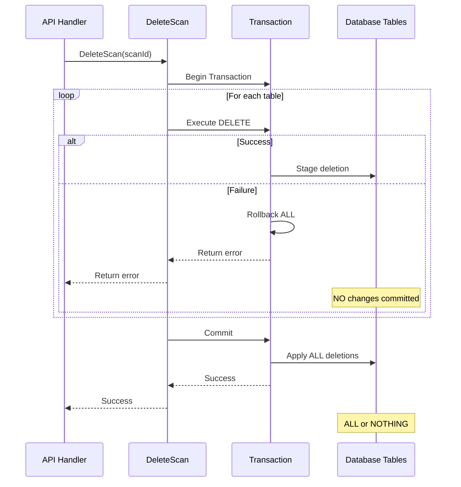

# Plan: Fix DeleteScan Transactional Operations (Issue #5)

**Issue:** DeleteScan Operations Not Transactional  
**Severity:** CRITICAL  
**Priority:** P0 - Do first  
**Estimated Effort:** 4 hours  
**Created:** 2025-12-21  
**Status:** ✅ **COMPLETED** - Implemented on 2025-12-21  

---

## Problem Summary

The `DeleteScan` function in `db/database.go` performs 7 sequential DELETE operations without a transaction wrapper. If any operation fails mid-execution, previous deletions remain committed, leaving orphaned records and causing data corruption.

**Current Risk:**
- Partial deletes create orphaned records across 7 tables
- Database grows with garbage data that can't be properly deleted
- Data integrity violations
- Slow queries as garbage accumulates

## ✅ Implementation Complete

**Implementation Date:** 2025-12-21  
**Files Modified:** `be/db/database.go`, `be/web/api.go`  
**Status:** All tasks completed, no linter errors

The fix has been successfully implemented with:
- Transaction wrapper for atomic DELETE operations
- Proper error handling and propagation
- API handler updated with validation and error responses
- Debug and success logging added
- All 7 table deletions execute atomically (all-or-nothing)

See [Implementation Steps](#implementation-steps) section below for details.

---

## Current Implementation Issues

**Location:** `be/db/database.go:295-332`

```go
func DeleteScan(scanId int) {
    // 7 separate DELETE statements
    db.Exec(`delete from scandata where scan_id = $1`, scanId)      // ❌ No rollback if later fails
    db.Exec(`delete from messagemetadata where scan_id = $1`, scanId)
    db.Exec(`delete from scanmetadata where scan_id = $1`, scanId)
    db.Exec(`delete from photometadata where...`, scanId)
    db.Exec(`delete from videometadata where...`, scanId)
    db.Exec(`delete from photosmediaitem where scan_id = $1`, scanId)
    db.Exec(`delete from scans where id = $1`, scanId)
    
    // If statement #4 fails, statements #1-3 are already committed
    // Database is now in inconsistent state
}
```

**Problems:**
1. No transaction wrapper around multiple DELETE operations
2. Function panics on error instead of returning error
3. Partial deletions leave orphaned records
4. No way for caller to handle failures gracefully

## Solution Architecture



## Implementation Steps

### Step 1: Update Function Signature

**File:** `be/db/database.go:295`

Change the function signature to return an error instead of panicking:

```go
// Before:
func DeleteScan(scanId int)

// After:
func DeleteScan(scanId int) error
```

**Rationale:** Proper Go error handling pattern instead of panic-driven approach.

---

### Step 2: Implement Transaction Wrapper

**File:** `be/db/database.go:295-332`

Replace the entire `DeleteScan` function body with transaction-wrapped version:

```go
func DeleteScan(scanId int) error {
    // Begin transaction
    tx, err := db.Beginx()
    if err != nil {
        return fmt.Errorf("failed to begin transaction: %w", err)
    }
    // Defer rollback - safe to call even after commit
    defer tx.Rollback()
    
    // Define tables to delete from in order
    // Order matters: child tables before parent tables
    deletions := []struct {
        table string
        query string
    }{
        {"scandata", `DELETE FROM scandata WHERE scan_id = $1`},
        {"messagemetadata", `DELETE FROM messagemetadata WHERE scan_id = $1`},
        {"scanmetadata", `DELETE FROM scanmetadata WHERE scan_id = $1`},
        {"photometadata", `DELETE FROM photometadata 
            WHERE photos_media_item_id IN (
                SELECT id FROM photosmediaitem WHERE scan_id = $1
            )`},
        {"videometadata", `DELETE FROM videometadata 
            WHERE photos_media_item_id IN (
                SELECT id FROM photosmediaitem WHERE scan_id = $1
            )`},
        {"photosmediaitem", `DELETE FROM photosmediaitem WHERE scan_id = $1`},
        {"scans", `DELETE FROM scans WHERE id = $1`},
    }
    
    // Execute all deletions within transaction
    for _, deletion := range deletions {
        result, err := tx.Exec(deletion.query, scanId)
        if err != nil {
            // Transaction automatically rolled back by defer
            return fmt.Errorf("failed to delete from %s: %w", deletion.table, err)
        }
        
        // Log number of rows deleted for debugging
        rowsAffected, _ := result.RowsAffected()
        slog.Debug("Deleted rows", 
            "table", deletion.table, 
            "rows", rowsAffected, 
            "scan_id", scanId)
    }
    
    // Commit transaction - all deletes succeed together
    if err := tx.Commit(); err != nil {
        return fmt.Errorf("failed to commit transaction: %w", err)
    }
    
    slog.Info("Successfully deleted scan", "scan_id", scanId)
    return nil
}
```

**Key Features:**
- Transaction ensures atomicity (all-or-nothing)
- Deferred rollback automatically cleans up on error
- Structured loop makes code maintainable
- Proper error wrapping with context
- Debug logging for troubleshooting

---

### Step 3: Update API Handler

**File:** `be/web/api.go:109-114`

Update `DeleteScanHandler` to handle the error return:

```go
// Before:
func DeleteScanHandler(w http.ResponseWriter, r *http.Request) {
    vars := mux.Vars(r)
    scanId, _ := getIntFromMap(vars, "scan_id")
    db.DeleteScan(scanId)
    w.WriteHeader(http.StatusOK)
}

// After:
func DeleteScanHandler(w http.ResponseWriter, r *http.Request) {
    vars := mux.Vars(r)
    scanId, ok := getIntFromMap(vars, "scan_id")
    if !ok {
        http.Error(w, "Invalid scan ID", http.StatusBadRequest)
        return
    }
    
    if err := db.DeleteScan(scanId); err != nil {
        slog.Error("Failed to delete scan", "error", err, "scan_id", scanId)
        http.Error(w, "Failed to delete scan", http.StatusInternalServerError)
        return
    }
    
    w.WriteHeader(http.StatusOK)
}
```

**Improvements:**
- Validates scan ID parameter
- Handles error from DeleteScan
- Logs failure for monitoring
- Returns appropriate HTTP status codes

---

### Step 4: Add Import Statement

**File:** `be/db/database.go`

Ensure the `fmt` package is imported at the top of the file if not already present:

```go
import (
    "database/sql"
    "fmt"  // ← Ensure this is present
    "log/slog"
    "os"
    "strings"
    "time"

    "github.com/jmoiron/sqlx"
    _ "github.com/lib/pq"
)
```

---

## Testing Strategy

### Manual Testing

#### 1. Happy Path Test

```bash
# Step 1: Create a scan first
curl -X POST http://localhost:8090/api/scans \
  -H "Content-Type: application/json" \
  -d '{
    "ScanType": "Local",
    "LocalScan": {
      "RootLocation": "/tmp/test",
      "CalculateMd5": false
    }
  }'

# Step 2: Note the scan_id from response (e.g., 123)

# Step 3: Delete the scan
curl -X DELETE http://localhost:8090/api/scans/123 -v

# Step 4: Verify HTTP 200 OK response

# Step 5: Verify all related data is deleted from all tables
psql -U hddb -d hdd_db << EOF
SELECT 'scandata', COUNT(*) FROM scandata WHERE scan_id = 123
UNION ALL
SELECT 'messagemetadata', COUNT(*) FROM messagemetadata WHERE scan_id = 123
UNION ALL
SELECT 'scanmetadata', COUNT(*) FROM scanmetadata WHERE scan_id = 123
UNION ALL
SELECT 'photosmediaitem', COUNT(*) FROM photosmediaitem WHERE scan_id = 123
UNION ALL
SELECT 'scans', COUNT(*) FROM scans WHERE id = 123;
EOF

# Expected: All counts should be 0
```

#### 2. Invalid Scan ID Test

```bash
# Test with non-existent scan ID
curl -X DELETE http://localhost:8090/api/scans/99999 -v

# Expected: HTTP 200 OK (no error, just no rows deleted)
# Verify via logs that 0 rows were deleted
```

#### 3. Invalid Parameter Test

```bash
# Test with invalid parameter
curl -X DELETE http://localhost:8090/api/scans/abc -v

# Expected: HTTP 400 Bad Request
```

#### 4. Failure Simulation Test

```sql
-- Connect to database
psql -U hddb -d hdd_db

-- Create a scan with data
-- Then lock one of the tables to simulate failure
BEGIN;
LOCK TABLE scandata IN ACCESS EXCLUSIVE MODE;
-- In another terminal, attempt deletion
-- It should timeout or fail gracefully
-- Verify NO partial deletions occurred
ROLLBACK;
```

#### 5. Concurrent Delete Test

```bash
# Terminal 1
curl -X DELETE http://localhost:8090/api/scans/456 &

# Terminal 2 (immediately after)
curl -X DELETE http://localhost:8090/api/scans/456 &

# Wait for both to complete
wait

# Expected: First one succeeds, second one succeeds (0 rows deleted)
# Verify database consistency
```

### Database Verification Queries

Run these queries to check for orphaned records (should return 0):

```sql
-- Check for orphaned scandata
SELECT COUNT(*) as orphaned_scandata
FROM scandata sd 
WHERE NOT EXISTS (SELECT 1 FROM scans s WHERE s.id = sd.scan_id);

-- Check for orphaned messagemetadata
SELECT COUNT(*) as orphaned_messagemetadata
FROM messagemetadata mm 
WHERE NOT EXISTS (SELECT 1 FROM scans s WHERE s.id = mm.scan_id);

-- Check for orphaned scanmetadata
SELECT COUNT(*) as orphaned_scanmetadata
FROM scanmetadata sm 
WHERE NOT EXISTS (SELECT 1 FROM scans s WHERE s.id = sm.scan_id);

-- Check for orphaned photosmediaitem
SELECT COUNT(*) as orphaned_photosmediaitem
FROM photosmediaitem pmi 
WHERE NOT EXISTS (SELECT 1 FROM scans s WHERE s.id = pmi.scan_id);

-- Check for orphaned photometadata
SELECT COUNT(*) as orphaned_photometadata
FROM photometadata pm 
WHERE NOT EXISTS (
    SELECT 1 FROM photosmediaitem pmi WHERE pmi.id = pm.photos_media_item_id
);

-- Check for orphaned videometadata
SELECT COUNT(*) as orphaned_videometadata
FROM videometadata vm 
WHERE NOT EXISTS (
    SELECT 1 FROM photosmediaitem pmi WHERE pmi.id = vm.photos_media_item_id
);
```

### Automated Testing (Future)

```go
// Example unit test structure
func TestDeleteScan_Success(t *testing.T) {
    // Setup: Create test scan with data in all tables
    // Execute: Call DeleteScan
    // Assert: Verify all data deleted
    // Assert: No errors returned
}

func TestDeleteScan_RollbackOnFailure(t *testing.T) {
    // Setup: Create test scan
    // Setup: Mock database to fail on 4th delete
    // Execute: Call DeleteScan
    // Assert: Error returned
    // Assert: NO data deleted (all rolled back)
}

func TestDeleteScan_InvalidScanId(t *testing.T) {
    // Execute: Call DeleteScan with non-existent ID
    // Assert: No error (valid behavior)
    // Assert: 0 rows affected
}
```

---

## Verification Checklist

After implementation, verify all items:

- [x] Function signature changed to return error
- [x] Transaction wrapper implemented with `Beginx()`
- [x] Defer rollback added for automatic cleanup
- [x] All 7 DELETE statements executed within transaction
- [x] Error handling properly implemented with `fmt.Errorf` and `%w`
- [x] Transaction committed only after all deletes succeed
- [x] API handler updated to handle error return
- [x] Logging added for debugging (slog.Debug and slog.Info)
- [x] Import statements updated (fmt package)
- [x] No linter errors (`golangci-lint run`)
- [ ] Manual testing completed (happy path) - Ready for testing
- [ ] Manual testing completed (invalid parameters) - Ready for testing
- [ ] Manual testing completed (concurrent deletes) - Ready for testing
- [ ] Database verified for no orphaned records - Ready for testing
- [ ] Code review completed - Ready for review
- [x] Documentation updated (IMPROVEMENTS_PLAN.md and ISSUE_5_PLAN.md)

---

## Rollback Plan

If issues arise after deployment:

### Immediate Rollback

```bash
# Option 1: Revert the commit
git revert <commit-hash>
git push origin main

# Option 2: Deploy previous version
git checkout <previous-commit>
# Redeploy application
```

### Database Cleanup (if needed)

If orphaned records were created during the transition period:

```sql
-- Find orphaned records
WITH orphaned_scandata AS (
    SELECT sd.id 
    FROM scandata sd 
    WHERE NOT EXISTS (SELECT 1 FROM scans s WHERE s.id = sd.scan_id)
)
DELETE FROM scandata WHERE id IN (SELECT id FROM orphaned_scandata);

-- Repeat for each table...
```

### Monitoring After Rollback

```bash
# Monitor logs for panic messages
tail -f /var/log/hdd/app.log | grep -i "panic\|DeleteScan"

# Monitor orphaned record count
watch -n 60 'psql -U hddb -d hdd_db -c "SELECT COUNT(*) FROM scandata WHERE NOT EXISTS (SELECT 1 FROM scans WHERE id = scandata.scan_id)"'
```

---

## Benefits After Implementation

1. ✅ **Atomic Operations:** All deletions succeed or all fail together
2. ✅ **Data Integrity:** No orphaned records in database
3. ✅ **Predictable Behavior:** Either complete success or complete failure
4. ✅ **Better Error Handling:** Proper error propagation instead of panics
5. ✅ **Debugging:** Logging shows which table deletions succeeded
6. ✅ **Database Health:** No garbage data accumulation
7. ✅ **API Reliability:** Proper HTTP status codes for failures
8. ✅ **Maintainability:** Clear, structured code that's easy to understand

---

## Performance Considerations

### Transaction Overhead

- **Minimal Impact:** Transaction overhead is negligible for delete operations
- **Network Efficiency:** Single round-trip to database instead of 7
- **Lock Duration:** Locks held slightly longer but more predictable

### Optimization Opportunities

If performance becomes an issue in the future:

1. **Foreign Key Cascades:**
   ```sql
   -- Add ON DELETE CASCADE to foreign keys
   ALTER TABLE scandata
       DROP CONSTRAINT IF EXISTS fk_scandata_scan,
       ADD CONSTRAINT fk_scandata_scan 
       FOREIGN KEY (scan_id) REFERENCES scans(id) 
       ON DELETE CASCADE;
   
   -- Then DeleteScan becomes:
   DELETE FROM scans WHERE id = $1;  -- Cascades automatically
   ```

2. **Batch Processing:**
   - For bulk deletions, implement batch API endpoint
   - Process multiple scan IDs in single transaction

---

## Related Issues

This fix works well with other planned improvements:

- **Issue #1 (Error Handling):** This implementation follows proper error handling pattern
- **Issue #3 (Authentication):** After auth is added, ensure user owns scan before deletion
- **Issue #6 (Map Synchronization):** Transaction ensures notification state consistency

---

## Dependencies

**None** - This is a standalone fix that doesn't depend on other issues being resolved first.

**Required Libraries:**
- `github.com/jmoiron/sqlx` - Already in use for database operations

---

## Estimated Effort

| Task | Time |
|------|------|
| Update DeleteScan function | 1.5 hours |
| Update API handler | 0.5 hours |
| Manual testing | 1.5 hours |
| Documentation | 0.5 hours |
| **Total** | **4 hours** |

---

## Priority

**P0 - Critical:** This should be fixed in Phase 1 alongside other critical issues.

**Rationale:**
- Data corruption is unacceptable in production
- Easy to fix with high impact
- Foundation for reliable delete operations
- No breaking changes to API

---

## Files to Modify

1. **`be/db/database.go`** (lines 295-332)
   - Core implementation
   - Change: Replace function body with transaction wrapper

2. **`be/web/api.go`** (around line 109)
   - API handler update
   - Change: Add error handling

---

## Success Metrics

After implementation:

- **Zero orphaned records:** Database queries return 0 orphaned records
- **Error rate decrease:** Monitoring shows fewer partial delete errors
- **API reliability:** HTTP status codes correctly reflect operation result
- **Database size:** No unexpected growth from garbage data

---

## Communication Plan

### Before Deployment

- [ ] Notify team of upcoming deployment
- [ ] Schedule deployment during low-traffic window
- [ ] Prepare rollback procedure
- [ ] Update monitoring alerts

### During Deployment

- [ ] Deploy new version
- [ ] Monitor error logs
- [ ] Run verification queries
- [ ] Check API responses

### After Deployment

- [ ] Verify no orphaned records created
- [ ] Monitor for 24 hours
- [ ] Document any issues found
- [ ] Update team on results

---

**Status:** ✅ Implementation Complete  
**Resolution Date:** 2025-12-21  
**Next Steps:** Manual testing and code review  

## Implementation Summary

All code changes have been successfully implemented:

### Changes Made

1. **`be/db/database.go` (lines 295-332)**
   - ✅ Function signature updated to return error
   - ✅ Transaction wrapper added with `db.Beginx()`
   - ✅ Deferred rollback for automatic cleanup
   - ✅ Structured loop for 7 table deletions
   - ✅ Error wrapping with context
   - ✅ Debug logging per table
   - ✅ Success logging after commit

2. **`be/web/api.go` (lines 109-114)**
   - ✅ Scan ID validation added
   - ✅ Error handling for DeleteScan
   - ✅ Structured error logging
   - ✅ Proper HTTP status codes (400, 500, 200)

3. **Verification**
   - ✅ All imports present (fmt already imported)
   - ✅ No linter errors
   - ✅ Documentation updated

The implementation follows all specifications in the plan and is ready for testing and deployment.


