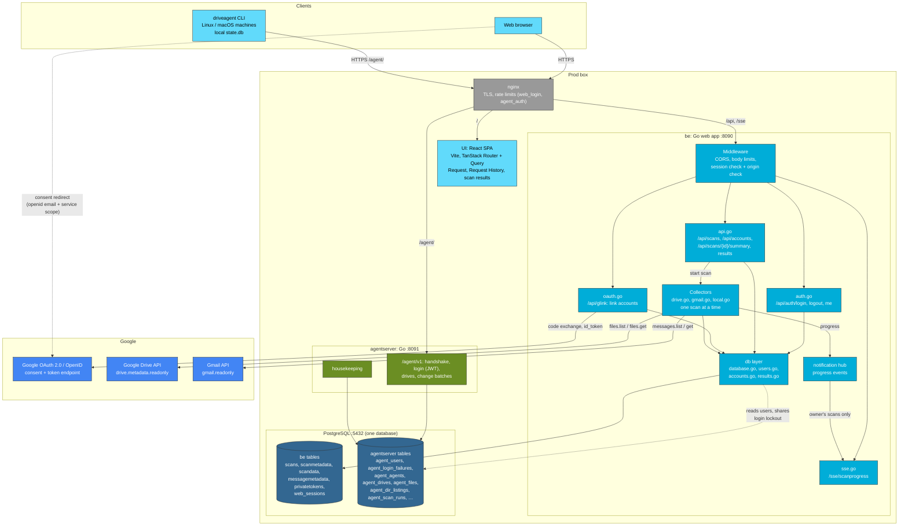
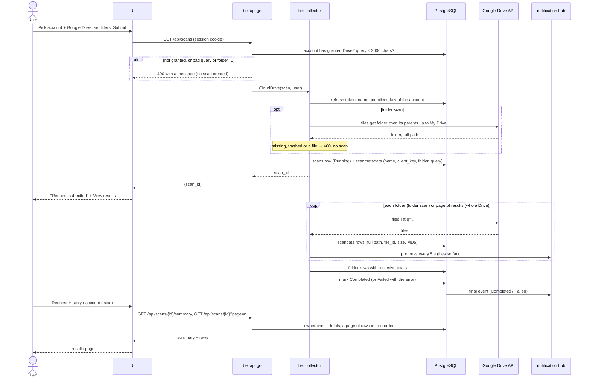
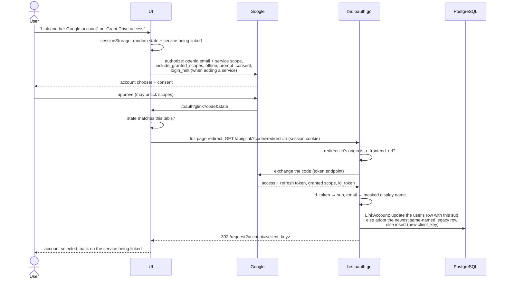
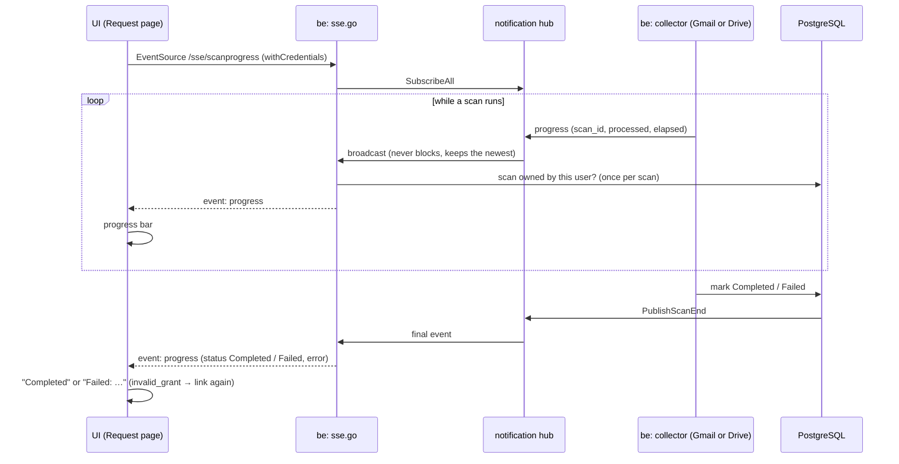
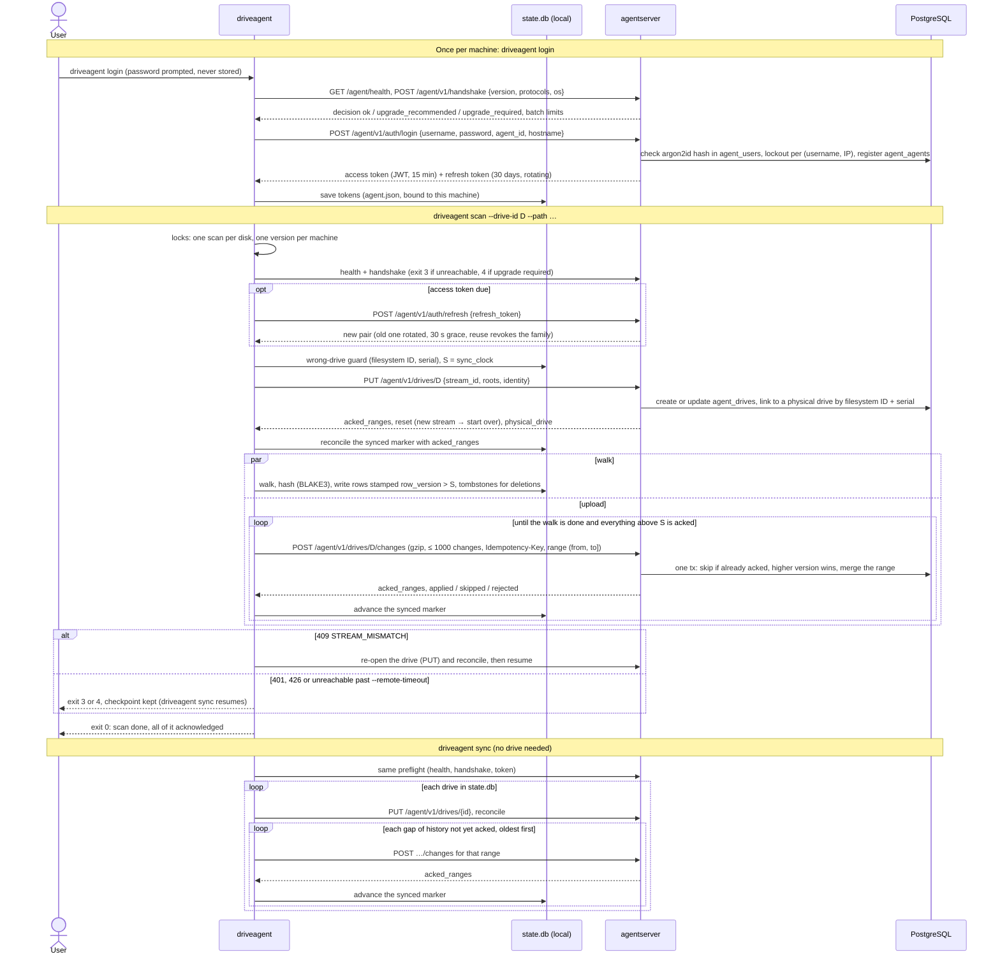

# Bhandaar Architecture

## System Overview

Bhandaar is a storage analyzer application that scans and analyzes data across multiple sources: local filesystems, Google Drive, Gmail, and Google Photos.

## Architecture Diagram

The whole system as built. Google Photos is left out: its scanner can't work since Google's 2025 API change (review item 7.15). The proposed Browse page ([specs/browse.md](specs/browse.md)) isn't built yet.



- **Web users** log in to `be` with `agentserver`'s users (`agent_users`), sharing its login lockout. Sessions are `web_sessions` rows behind an HttpOnly cookie (see [Web authentication](#web-authentication)).
- **Scans and linked Google accounts** belong to the user who made them.
- **`be` and `agentserver` never call each other.** They only share the database, where each owns its own tables.
- **The local scanner** walks the filesystem of the machine `be` runs on. `driveagent` is how other machines' disks are scanned.

## Component Details

### 1. Frontend Layer (React + TypeScript)

**Technology Stack:**
- React 18 with TypeScript
- Vite (build tool)
- TanStack Router (routing)
- TanStack Query (data fetching)
- Tailwind CSS (styling)

**Key Components:**
- `/routes/request.tsx` - Scan request form for Gmail and Google Drive (`?type=gmail|drive`). An account without the chosen service gets a "Grant … access" button, which links it again for that service with Google's `login_hint`; the service being linked is kept in `sessionStorage` across the round trip. Drive fields build the Drive query (`driveQuery.ts`), which "Edit query" lets you replace, plus an optional folder (link or ID) with or without subfolders
- `/routes/requests.tsx` - List view of scan requests by account, with readable scan types; each scan ID links to its results. The selected account is in the URL (`?account=<client_key>`), so links and Back return to it
- `/components/Breadcrumbs.tsx` - The trail under the nav tabs on Request History and scan pages: `Request History › <account> › Scan N`. A scan's trail always goes through its account (the summary's `client_key`), however the scan was opened, and the Request History tab stays highlighted on it
- `/routes/scans.$scanId.tsx` - One scan's results: its summary, then 10 rows a page: files and folders with their folder, size, file count, modified time and MD5, linked to Drive (Drive, local), or new messages (Gmail)
- `/routes/oauth/glink.tsx` - OAuth callback handler
- `/api/index.ts` - Backend API client
- `/components/ScanProgress.tsx` - Real-time progress display
- `/components/hooks/useSse.ts` - SSE connection hook

### 2. Backend Layer (Go)

#### Web Server (`web/`)
- **Framework:** Gorilla Mux router
- **Port:** 8090
- **Features:** CORS enabled, RESTful API, OAuth2, SSE

#### API Endpoints (`web/api.go`)

Every route but health and login/logout needs a logged-in user (see [Web authentication](#web-authentication)), and only shows that user's scans and linked accounts; another user's scan answers 404.

| Endpoint | Method | Description |
|----------|--------|-------------|
| `/api/health` | GET | Health check |
| `/api/auth/login` | POST | Log in; sets the session cookie |
| `/api/auth/logout` | POST | End the session |
| `/api/auth/me` | GET | The logged-in user |
| `/api/scans` | POST | Submit scan request; a Gmail or Drive request's account must have granted that service, and its query must fit 2000 characters (else 400, before any scan is created) |
| `/api/scans` | GET | List all scans (paginated) |
| `/api/scans/requests/{client_key}` | GET | The scans of one linked account, newest first |
| `/api/scans/{scan_id}/summary` | GET | A scan's details and totals: file (or new-message) count and bytes, and folder count |
| `/api/scans/{scan_id}` | GET | A page (10) of a scan's files and folders, in tree order (paths compared a segment at a time), with `file_id` for Drive |
| `/api/scans/{scan_id}` | DELETE | Delete scan |
| `/api/gmaildata/{scan_id}` | GET | A page (10) of a Gmail scan's new messages, newest first |
| `/api/photos/{scan_id}` | GET | Get Photos scan results |
| `/api/photos/albums` | GET | List photo albums |
| `/api/accounts` | GET | List linked Google accounts: `clientKey`, `displayName`, `services` (`gmail`, `drive`) and `loginHint` (the Google account ID, when known) |
| `/api/scans/accounts` | GET | The accounts with scans, as `{clientKey, displayName}`, each named by its newest scan |

#### Linking Google accounts (`web/oauth.go`)
- The UI sends the user to Google asking for `openid email` plus a service's scope, with `include_granted_scopes=true` and `access_type=offline`, and Google returns to `/oauth/glink`, which hands the code to `GET /api/glink`.
- `/api/glink` exchanges the code, and identifies the Google account by the `id_token`'s `sub` (its email gives the masked display name). It stores the scopes Google actually granted. The linked account is the user's row with that `sub`, else the user's newest row from before `sub`s were recorded with the same display name, else a new row; an existing row keeps its `client_key`. Then it redirects to `/request?account=<client_key>`.
- See [specs/request-drive-scans.md](specs/request-drive-scans.md#identity-and-re-linking-beweboauthgo).
- A Google scan is recorded (`scanmetadata`) under its linked account's `client_key` and `display_name`, both read from `privatetokens`, never taken from the request. Request History groups by `client_key`, since masked names can collide; the UI adds the start of the key to names two accounts share. Scans from before `client_key` was recorded get their user's newest account of the same name, at startup.

#### Server-Sent Events (`web/sse.go`)
- `/events` - Real-time scan progress updates
- Broadcasts progress for Gmail and Drive scans, to the scan's owner only

#### Web authentication

`be` has no users of its own: it logs web users in against `agentserver`'s `agent_users` table in the shared database (argon2id hashes, verified by `be/auth`), and shares its login lockout (`agent_login_failures`: 10 failures per username and client IP in 15 minutes). Users are managed only with `agentserver user …`; `user disable` also ends web sessions at once. A login creates a row in `web_sessions` (keyed on sha256 of a random token) and sets the `bhandaar_session` cookie (HttpOnly, SameSite=Lax, Secure when the UI is on https), valid for 30 days after last use. Requests that change state must come from a `-frontend_url` origin, since SameSite=Lax still lets sibling subdomains send the cookie. nginx no longer asks for basic auth.

`scans.user_id` and `privatetokens.user_id` reference `agent_users`. Rows from before users are given to `-legacy_owner` (default `jyothri`) at startup, once that user exists.

#### Collection Services (`collect/`)

**Local Scanner (`local.go`):**
- Scans local filesystem
- Recursive directory traversal
- Calculates sizes including subdirectories
- Stores: filename, path, size, modification time, MD5 hash

**Drive Scanner (`drive.go`):**
- Uses the Google Drive API with a linked account's refresh token, and the `drive.metadata.readonly` scope: it reads metadata only
- Lists the files matching the request's `QueryString` (Drive's `q`), across the whole Drive; folders are skipped, and Google Docs files have no size or MD5
- Or, with `FolderId`, one folder: breadth first, one list call per folder, into subfolders when `Recursive`. The query applies to files; every subfolder is walked whether it matches or not, except trashed ones, and shortcuts aren't followed. The folder is checked (`files.get`) before the scan is recorded: a bad one is a 400, with no scan. `scanmetadata.search_path` records it as `<path> (<id>)`, plus ` and subfolders`
- Saves, at the end, a row per folder below the scanned one (`is_dir`, with its Drive ID), with the total size and file count under it, as local scans do. Totals are tracked by folder ID, since a folder name can contain `/`. A whole-Drive scan saves only folders with scanned files under them; a folder scan, every subfolder it walked
- Stores: file name, its full folder path as the Drive UI shows it (`My Drive/A/Desktop/Qns/q1.pdf`, or `Shared with me/<shared folder>/…`; a folder scan looks up its folder's parents first, one call per level), the Drive file ID (`scandata.file_id`), size, modification time, MD5. A whole-Drive scan lists every folder once first, to build the paths
- Real-time progress updates via SSE (files so far), like Gmail
- See [specs/request-drive-scans.md](specs/request-drive-scans.md#folder-scans)

**Gmail Scanner (`gmail.go`):**
- Uses Gmail API
- Scans mailbox messages
- Extracts: message ID, thread ID, from, to, subject, size, labels
- Real-time progress updates via SSE
- Deduplication by message ID

**Photos Scanner (`photos.go`):**
- Uses Google Photos API
- Scans photos and videos
- Extracts metadata: camera info, EXIF data, file size
- Separate tables for photo vs video metadata

#### Notification Hub (`notification/hub.go`)
- Pub/sub pattern for progress updates
- Channel-based communication
- Broadcasts to all subscribers or specific client keys
- Progress data: processed count, completion %, ETA

### 3. Database Layer (PostgreSQL)

**Connection Details:**
- Host: `hdd_db` (Docker) / `localhost` (local)
- Port: 5432
- User: `hddb`
- Database: `hdd_db`

**Schema:**

```
scans (main scan records)
├── scandata (file/directory data from local/drive scans)
├── scanmetadata (scan configuration)
├── messagemetadata (Gmail message data)
└── photosmediaitem (Photos/videos)
    ├── photometadata (photo-specific EXIF)
    └── videometadata (video-specific metadata)

privatetokens (linked Google accounts: refresh tokens, granted scope, google_sub)
web_sessions (web login sessions)

scans, privatetokens and web_sessions have a user_id → agent_users (agentserver's)
```

**Auto-Migration:**
- Tables auto-created on startup
- Migration system with versioning
- Handles schema updates

### 4. Agent sync service (`agent/server/`, Go)

A separate service for `driveagent` (the local drive-comparison agent in `agent/client/`), designed in [`specs/remote-sync.md`](specs/remote-sync.md). It shares the Postgres database but only uses its own `agent_*` tables, created by its own numbered migrations (`agentserver_schema_migrations`); `be` and `agentserver` never call each other, but `be` reads its users (see [Web authentication](#web-authentication)). nginx routes `/agent/` to it on port 8091.

Implemented (rollout steps 1 and 4): `GET /agent/health`, `POST /agent/v1/handshake` (version negotiation), username/password login with JWT access tokens and rotating refresh tokens, `PUT`/`GET /agent/v1/drives` (a drive's upload stream, acked version ranges, and linking copies of one physical drive by filesystem ID and serial), and `POST /agent/v1/drives/{id}/changes` (gzip JSON batches of the agent's change feed, applied with higher-version-wins and tombstones, so batches can arrive in any order). Plus the `agentserver user` admin commands and hourly housekeeping. Uploaded data lives in `agent_files`, `agent_dir_listings` and `agent_scan_runs`, keyed on a hash of the raw path. On the agent side, every `driveagent scan` uploads what it writes as it goes (step 6), and `driveagent sync` (step 5) uploads the rest of each drive's pending change feed from `state.db`. Data flow: `driveagent` → nginx `/agent/` → `agentserver` → Postgres, step by step in [Agent Upload Flow](#agent-upload-flow-driveagent--agentserver).

### 5. External Services (Google APIs)

**OAuth 2.0:**
- Authorization code flow, one service at a time with incremental authorization (see [Account Linking Flow](#account-linking-flow))
- Refresh tokens stored per linked account, with the scopes Google granted
- Scopes: `openid email` (identifies the account) plus `gmail.readonly` and/or `drive.metadata.readonly`. The Photos scopes the Photos scanner asks for are no longer granted (review item 7.15)
- The OAuth client is in "Testing": refresh tokens expire 7 days after they're issued (review item 2.11)

**Required Credentials:**
- `OAUTH_CLIENT_ID` - Google OAuth client ID
- `OAUTH_CLIENT_SECRET` - Google OAuth client secret
- `GOOGLE_APPLICATION_CREDENTIALS` - Service account key file path

## Data Flow

### Scan Request Flow

A Google Drive scan, from the Request page to its results. A Gmail scan runs the same way, minus the folder lookup, and saves messages instead of files.



### Account Linking Flow

Linking a Google account, or adding a service (e.g. Drive) to one already linked. The user is logged in to the web app throughout.



### Real-time Progress Updates (SSE)



### Agent Upload Flow (driveagent → agentserver)

How a machine's `driveagent` gets its scan data to `agentserver`: logging in once, then a `scan` that uploads while it walks, and a `sync` that uploads whatever is left. The full protocol is in [specs/remote-sync.md](specs/remote-sync.md) and [specs/remote-sync-server.md](specs/remote-sync-server.md).

- **Every request** goes through nginx's `/agent/` location (with a rate limit on `/agent/v1/auth/`), and carries `X-Agent-Version` and `X-Agent-Id`, and after the handshake `X-Agent-Protocol`.
- **At home,** the agent dials `lan_addr` (the prod box's LAN address) first, verifying the certificate for the public name, and falls back to DNS, because the router's hairpin NAT is unreliable.



## Deployment

### Docker Compose Stack

```yaml
Services:
├── hdd_db (PostgreSQL)
│   └── Port: 5432
├── hdd_be (Go Backend)
│   ├── Port: 8090
│   └── Volume: ~/keys/gae_creds.json
├── hdd_ui (React Frontend)
│   └── Port: 80/443
└── agentserver (driveagent uploads)
    └── Port: 8091 (nginx only)
```

### Environment Variables

**Backend:**
- `OAUTH_CLIENT_ID` - Google OAuth client ID
- `OAUTH_CLIENT_SECRET` - Google OAuth client secret
- `GOOGLE_APPLICATION_CREDENTIALS` - Path to service account JSON
- `FRONTEND_URL` - UI origin, or a comma-separated list of origins (e.g. `https://sm.jkurapati.com,http://192.168.1.118:5173`). Used for CORS, and as the only origins account linking may return to

**agentserver:** the same `DB_*` variables as the backend, plus `AGENTSERVER_JWT_SECRET` (required) and the optional settings in the [server spec](specs/remote-sync-server.md#configuration).

**Frontend:**
- Backend API URL configured in `ui/src/api/index.ts`

## Technology Stack Summary

| Layer | Technology |
|-------|-----------|
| Frontend | React, TypeScript, Vite, TanStack Router/Query, Tailwind CSS |
| Backend | Go 1.x, Gorilla Mux, sqlx |
| Database | PostgreSQL 15+ |
| APIs | Google Drive API, Gmail API, Google Photos API |
| Auth | Google OAuth 2.0 |
| Real-time | Server-Sent Events (SSE) |
| Containerization | Docker, Docker Compose |

## Key Features

1. **Multi-source Scanning:** Local, Google Drive, Gmail, Photos
2. **Real-time Progress:** SSE-based progress updates for long-running scans
3. **OAuth Integration:** Secure Google account authentication
4. **Persistent Storage:** PostgreSQL with auto-migration
5. **RESTful API:** Clean REST endpoints with pagination
6. **Deduplication:** Gmail messages deduplicated by message ID
7. **Rich Metadata:** EXIF data for photos, email headers, file attributes

## Known Limitations

1. **Directory Size Inconsistency:**
   - Local scans: recursive size calculation
   - Cloud scans: directory-level only (excludes subdirectories)

2. **No Testing:** Codebase currently lacks test coverage

3. **Hardcoded Configuration:** Database connection and API URLs are hardcoded

4. **Single Region:** Timestamps converted to America/Los_Angeles timezone

