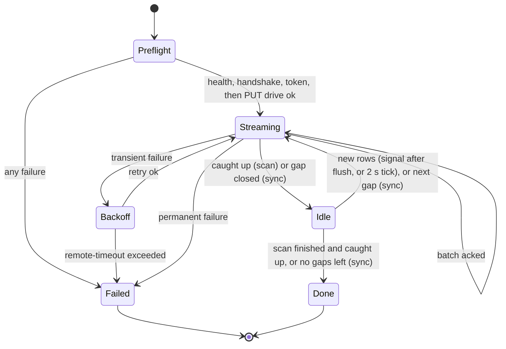

# Remote Sync: `driveagent` Client

**Status:** partly implemented. PR 2 implements `version`, `login`, `logout` and `remote-status` (without the per-drive section), configuration, `lan_addr`, identity and credentials, and the client's error classification. The change feed, drive identity, `sync` and uploading are still proposed. The overview and decisions are in [`remote-sync.md`](remote-sync.md); the server API is in [`remote-sync-server.md`](remote-sync-server.md).

This covers what changes in `agent/client/`: what each command uploads, why the remote is required, configuration, new commands, the local change feed in `state.db` and its synced marker, and the uploader that sends the feed to `agentserver`.

## New packages

```
agent/client/internal/
  version/     Version ("0.1.0"), Protocols ([]int{1}); `driveagent version` prints them
  remote/      HTTP client: health, handshake, auth, drives, changes; error classification
  creds/       agent.json + credentials.json load/save, file lock, refresh with race handling
  syncer/      the uploader: upload sessions, batching, synced-marker bookkeeping, the state machine
```

`internal/store` gains the change-feed columns, the synced-marker tables and the read queries. `internal/scan` doesn't import `syncer`; `cmd/driveagent` wires them together, as it does for `scan` and `store` today.

`Version` is a constant, bumped by hand in any PR that changes the agent. CI enforces the bump, and on merge to `main` it releases exactly that version as the tag `driveagent/v<Version>`, with binaries attached (see [`remote-sync-ci.md`](remote-sync-ci.md#agent-driveagentyml)). A plain local `go build` therefore reports a real version rather than `dev`, so the server's minimum-version check works for local builds too. CI also stamps `version.Commit` through `-ldflags`.

### Platforms

Releases are built for `linux/amd64`, `darwin/amd64` (Intel Macs) and `darwin/arm64` (Apple Silicon), all with `CGO_ENABLED=0`. Nothing in the agent is Linux-only: the `syscall` import is only for `SIGTERM`, and SQLite, `flock` and the terminal prompt all work on macOS. On macOS:
- The state dir is still `~/.driveagent/`.
- External drives mount under `/Volumes/<name>`, so `--drive-root /Volumes/Seagate1`.
- The binaries are unsigned. They run as-is when downloaded with `curl`; a browser download needs `xattr -d com.apple.quarantine driveagent` once.

New dependencies: `golang.org/x/term` (password prompt without echo), `github.com/gofrs/flock` (credentials and upload locks), and `github.com/jyothri/bhandaar/agent/wire`, a standard-library-only module resolved from the same checkout with `replace … => ../wire` (see [Shared wire module](remote-sync-server.md#shared-wire-module)).

## What each command uploads

The local feed has two kinds of unsynced data per drive:

- **Current scan data**: what the running `scan` writes. That means new or changed files, files found deleted, directory-listing changes, and the scan's own `scan_runs` row, or in feed terms every entry of that drive with a version above the scan's **start version** `S` (see [Upload during `scan`](#upload-during-scan)).
- **History**: every other pending entry. This includes rows from scans that stopped before their upload finished (remote lost, Ctrl-C, crash), anything scanned before remote sync existed (the migration backfill makes all of it pending), and anything the server lost.

| Invocation | Uploads |
|---|---|
| `driveagent scan` | **Current scan data only**, always; the command fails if the upload does. History is skipped. At startup it prints a one-line hint if history is pending |
| `driveagent sync` | **History**, for every drive (or those in `--drive-id`), with no scan and no drive access. See [`driveagent sync`](#driveagent-sync) |
| `compare`, `report`, `version` | Nothing; never contact the remote |

A consequence: a file that hasn't changed since an earlier scan that never uploaded is not in the current scan's data, because the scan skips unchanged files. It reaches the server only through `sync`. Until then the server's copy of a drive can be incomplete, and `remote-status` shows by how much.

## Remote is required

Every `scan` uploads, and there are no modes: the upload is part of the command's success. If the remote can't be reached or refuses the agent, the command fails. (`compare` and `report` still never contact the remote.)

0. **Take the drive's [upload lock](#upload-lock)**, waiting if a `sync` holds it. The lock comes first: it's the only thing that keeps two scans of one drive apart, and it stops `--replace-root`'s `ClearDrive` (step 2) from running while a `sync` is uploading that drive.
1. **Preflight, before the drive is touched:** health → handshake → token (refresh, or fail with `not logged in: run "driveagent login"`). Health has a 5 s timeout and 2 retries, 1 s apart. Any failure exits with code 3 (unreachable or auth) or 4 (upgrade required) before the scan starts.
2. **Local drive checks, before the upload starts.** `cmd/driveagent`, not `scan.Run`, does these, in this order:
   1. The `--drive-root` check (`RootConflict` / `--replace-root`). With `--replace-root`, `ClearDrive` runs here.
   2. The [wrong-drive guard](#drive-identity).
   3. `UpsertDrive`.
   4. Reading `S`.

   Only then does the uploader open the drive (`PUT /drives/{id}`). So a `--replace-root` always gets its new stream id *before* anything is uploaded; the old root's rows can't land on the old stream. `scan.Run` keeps these checks as assertions, but no longer performs them.
3. **During the scan**, the uploader runs next to it (see [Uploader](#uploader)). A transient failure is retried with exponential backoff (1 s, 2 s, 4 s … capped at 30 s, with jitter) until `--remote-timeout` (default `2m`) has passed with no successful request. At that point the uploader cancels the scan's context. The scan stops the same way as for Ctrl-C (below): the checkpoint stays consistent and the scan can be resumed. The command exits with code 3 and the message `remote unavailable for 2m; scan stopped. Local checkpoint is intact — re-run to resume, and run "driveagent sync" to upload what this scan already recorded`.
4. A permanent failure (426, re-login needed, `400 INVALID_BATCH`) cancels the scan immediately with code 3 or 4.
5. **After the scan**, the uploader drains the rest of the current scan's data (the directory listings, deletions and the scan-run finish are all written at the end of a scan), under the same `--remote-timeout` rule. Exit 0 only once the server has acknowledged all of it.

**Ctrl-C.** Today an interrupted scan returns nil and exits 0. Under the table below, 0 means "everything acknowledged", so that changes:
- The **first** Ctrl-C (or `SIGTERM`) stops the walk. The uploader then drains what the scan already wrote, under the same `--remote-timeout` rule, and the command exits **130** for SIGINT or **143** for SIGTERM (128 + the signal number, as shells report them), because the scan is incomplete.
- A **second** signal aborts the drain at once, with the same exit code.

The uploader cancels the scan with `context.WithCancelCause`, so `main` can tell a remote failure (exit 3 or 4) from a signal (exit 130 or 143).

Whatever a failed or interrupted scan recorded locally but didn't upload becomes history. A re-run of `scan` doesn't send it, because the re-run skips files it already hashed. `driveagent sync` does. The failure message says so.

### Exit codes

| Code | Meaning |
|---|---|
| 0 | Success: everything the scan wrote was acknowledged by the server |
| 1 | Local error, as today |
| 2 | Usage error, as today |
| 3 | Remote unavailable, auth failure or upload failure |
| 4 | Agent upgrade required |
| 130 | Interrupted by Ctrl-C (`SIGINT`); what was already written was drained, unless a second signal aborted that |
| 143 | Stopped by `SIGTERM`; otherwise as 130 |

## Configuration

Precedence: flag > environment > `<state-dir>/config.json` > default.

| Setting | Flag | Env | Default |
|---|---|---|---|
| Remote URL | `--remote-url` | `DRIVEAGENT_REMOTE_URL` | `https://sm.jkurapati.com` |
| Give-up budget for a failing remote | `--remote-timeout` | | `2m` |
| LAN address to try first (see below) | `--lan-addr` | `DRIVEAGENT_LAN_ADDR` | none |

```json
// <state-dir>/config.json (optional)
{"remote_url": "https://sm.jkurapati.com", "lan_addr": "192.168.1.118:443"}
```

The agent calls `<remote-url>/agent/health`, `<remote-url>/agent/v1/…`. It refuses `http://` URLs unless the host is `localhost`/`127.0.0.1` (for local dev against `agentserver` on port 8091).

### Reaching the server from the LAN

From inside the home LAN, `sm.jkurapati.com` resolves to the public IP (75.58.11.74), and the connection has to loop back through the AT&T gateway (NAT hairpinning). That path is unreliable. Measured from the dev box (optiplex7070, 192.168.1.136) on 2026-09-25, 7 tries each:

| Path | Result |
|---|---|
| DNS → public IP (hairpin) | 4 of 7 timed out after 10 s, 1 took 2 s, 2 took about 0.03 s; `/agent/health` also timed out |
| LAN address `192.168.1.118:443`, name `sm.jkurapati.com` | 7 of 7 succeeded in 0.01–0.02 s, certificate verified |

The LAN's DNS is the gateway (192.168.1.254), not Pi-hole, so there is no local DNS override (checked the same day: Pi-hole at 192.168.1.118 also answers with the public IP). Instead of relying on network setup, the agent can be given the server's LAN address with `lan_addr`:

1. **LAN first.** For each new connection to the remote host, the agent first dials `lan_addr` with a 1 s connect timeout. It then does the TLS handshake **for the `remote-url` host name** (`sm.jkurapati.com` as SNI) and verifies the certificate exactly as usual. The host name and certificate checks don't change, only the IP the agent connects to.
2. **Fall back to DNS.** If the TCP connect or the TLS handshake at `lan_addr` fails, the agent connects normally through DNS instead. A handshake failure covers the case where some other network happens to have a host at that address: its certificate doesn't verify, so nothing is sent to it. Credentials and tokens only ever travel inside a verified TLS session.
3. **Remember the outcome.** After a failed LAN attempt, the agent skips `lan_addr` for 5 minutes, so an agent away from home pays the 1 s penalty at most once per 5 minutes, not per connection. HTTP keep-alive means new connections are rare anyway.

Implementation: a custom `DialTLSContext` on the agent's `http.Transport`. It's a small amount of code and applies to every request (health, handshake, auth, uploads). `remote-status` prints which path it used: `connected via LAN 192.168.1.118:443` or `connected via DNS 75.58.11.74:443`.

`lan_addr` is optional; without it the agent always uses DNS. Set it in `config.json` on machines that are sometimes on the home LAN, including a roaming Mac: at home it takes the LAN path, elsewhere it falls back automatically. On the prod box itself, `127.0.0.1:443` works as well.

This only fixes the agent. For the browser UI from the LAN, the options were split DNS in Pi-hole (with Pi-hole taking over DHCP from the gateway, or per-machine DNS settings) or router NAT loopback. Those can be added independently, and `lan_addr` keeps working alongside them.

## Identity and credentials

Both files live in the state dir (default `~/.driveagent/`), created with mode `0600`:

- `agent.json`: `{"agent_id": "<uuid v4>"}`, generated on first use. Each state dir is one agent. It survives deleting `state.db`.
- `credentials.json`: `{"remote_url", "username", "access_token", "access_expires_at", "refresh_token", "refresh_expires_at"}`. It is written atomically (temp file + rename).

Tokens are bound to `remote_url`. If the configured URL differs from the one in `credentials.json`, the agent is treated as not logged in.

**A state dir syncs to exactly one remote.** The stream ids and the synced marker are per drive, not per remote, so pointing one `state.db` at two servers (say `dev.sm` and then prod) makes each server look like it lost coverage to the other: every switch mints new streams and re-uploads every drive, plus a re-login. To try another server, use a copy of the state dir (`--state-dir`) for it.

**Never copy a state dir to another machine and keep using both.** Both copies would share the `agent_id` and the stream ids, and the [reconcile](#reconciling) rules would make them wipe each other's upload on the server, one full re-upload per alternation. Give each machine its own state dir, created by its own `driveagent`. (Detecting a clone, for example by storing `/etc/machine-id` or macOS's `IOPlatformUUID` in `agent.json` and minting a new `agent_id` on a mismatch, is deferred; see the overview's [Operational rules](remote-sync.md#operational-rules).)

The access token is refreshed when it has less than 60 s left, or after a `401 TOKEN_EXPIRED`. Refresh happens under an exclusive `flock` on `<state-dir>/credentials.lock`:
1. Take the lock, then re-read `credentials.json`. If another process already rotated the token and the new access token is valid, use it and stop.
2. Otherwise call `/auth/refresh` and save the result.

The lock keeps concurrent processes (two `scan`s of different drives, or a `scan` and a `sync`) from refreshing the same token twice. The more common cause of a replay is a **lost refresh response**, or a crash before `credentials.json` was written. The agent then still holds the old token and presents it again. The server's grace window handles that: within 30 s it accepts the old token once more and issues a fresh pair (see the [server spec](remote-sync-server.md#post-agentv1authrefresh)). So a network blip during refresh never forces an interactive `driveagent login`.

## Drive identity

`--drive-id` is a label you choose, so on its own it can't tell that two machines scanned the same portable drive. At the start of every `scan`, the agent reads identifiers from the drive holding `--drive-root`. It only reads: nothing is written to the drive, and no root access is needed.

| Identifier | Linux | macOS |
|---|---|---|
| **Filesystem ID** (`fs_uuid`), set at format time: a UUID for ext4/APFS/HFS+, the volume serial for NTFS/exFAT/FAT. Plus the filesystem type (`fs_type`) and where the ID came from (`fs_uuid_source`: `linux` or `macos`) | `stat(--drive-root)` gives the device number (`st_dev`, major:minor). The partition's udev record, `/run/udev/data/b<major>:<minor>`, holds `ID_FS_UUID` and `ID_FS_TYPE` (the same data `lsblk -o UUID,FSTYPE` shows). The filesystem type comes from udev, **not** from `/proc/self/mountinfo`: `mountinfo` names the driver, so an NTFS drive shows as `ntfs3` or `fuseblk` depending on how it was mounted. `mountinfo`, matched on the same device number, is only a fallback for the type when udev has no record (e.g. in a container), with driver names normalised (`ntfs3`, `fuseblk` → `ntfs`). Using the device number, not the longest path prefix, handles symlinked roots and bind mounts, and avoids `/media/x` matching `/media/xy`. Verified on the dev box on 2026-09-26 | `diskutil info -plist <drive-root>`: `VolumeUUID` and `FilesystemType` |
| **Hardware serial** (`hw_serial`) of the disk behind that filesystem, as reported through the USB enclosure | `ID_SERIAL_SHORT` from the same partition udev record (udev copies the disk's serial onto its partitions). This is what `lsblk -o SERIAL` shows | The disk's entry in the I/O Registry (`ioreg`): the USB device's serial number. **Unverified:** the macOS path has only been checked against documented plist formats, not a real Mac |

`diskutil` and `ioreg` are the only external commands the agent runs, and only on macOS. Either identifier can be missing: `--drive-root` on a network or virtual filesystem has no filesystem ID, and many cheap USB enclosures report no serial or a generic one. Serials on a built-in denylist of generic values (all zeros, `0123456789ABCDEF`, `000000000000`, and similar placeholders seen from USB-SATA bridges) are treated as missing. The agent records whatever it finds. If it finds neither, it prints one warning and the scan goes ahead, but the drive can't be linked across machines (see the [server spec](remote-sync-server.md#matching-physical-drives)).

**Normalising.** Filesystem IDs are compared uppercase with dashes removed.

**Across Linux and macOS**, the IDs only match for some filesystems:
- **ext4, APFS, HFS+**: both systems report the filesystem's own UUID, so the same drive gets the same ID on either OS.
- **FAT, exFAT, NTFS**: they very likely don't match. macOS reports a synthesized `VolumeUUID` rather than the raw volume serial, and reading the raw serial from `/dev/rdiskN` needs root. Linux also shows NTFS serials as 16 hex digits, not the `ABCD-1234` form.

So for FAT, exFAT and NTFS, drives are **linked automatically only between agents on the same OS** (same `fs_uuid_source`); a Linux copy and a Mac copy of such a drive stay unlinked in v1 (decided 2026-09-25). The same ID on the same OS is still reliable. The drives attached to the dev box were checked on 2026-09-26 (Linux only): both Seagate backup drives are NTFS, so they link only between Linux agents. The internal WD drive is ext4. See the implementation plan's [M0](remote-sync-implementation-plan.md#m0--pre-work).

**Stored locally** in the `drives` table (`fs_uuid`, `fs_type`, `fs_uuid_source`, `hw_serial`, `identity_seen_at`; see the [migration](#change-feed-in-statedb)), and sent with every `PUT /drives/{id}`, including from `sync`, which uses the stored values because it doesn't touch the drive.

**Wrong-drive guard.** Before walking (in `cmd/driveagent`, see [Remote is required](#remote-is-required)), `scan` compares what it found with what's stored for that `--drive-id`:

| Stored vs found | Result |
|---|---|
| Both have a filesystem ID, from the same source, and they differ | **Refuse**, exit 1, before touching anything: `drive "seagate1" was last scanned on filesystem ABCD1234; the drive at /media/jyothri/Seagate1 has EF015678. Wrong drive? If it was reformatted, re-run with --accept-identity-change` |
| Same filesystem ID, different serial | **Warn** and continue, recording the new serial. Many USB-SATA bridges report their own serial rather than the disk's, so moving a disk to another dock changes it |
| Nothing stored yet (a new drive, or scanned before this feature) | Record what was found |
| Stored, but not found this time | Warn and keep the stored identity |

This works like the existing `--drive-root` guard (`--replace-root`), and catches plugging the wrong drive in under a familiar label. A clone of the drive (same filesystem ID, different serial), such as one half of a mirrored pair made by cloning, only gets the warning; the serial can't be trusted enough to refuse on. `--accept-identity-change` records the new identity and keeps the checkpoint data, and the scan's own deletion detection then reconciles the contents. To start the drive over instead, use `--replace-root`.

## New commands

```
driveagent login          [--remote-url <url>] [--username <name>] [--password-stdin] [--state-dir <dir>]
driveagent logout         [--state-dir <dir>]
driveagent sync           [--drive-id <id,id,...>] [--remote-timeout 2m] [--state-dir <dir>]
driveagent remote-status  [--state-dir <dir>]
driveagent version
```

- **`login`**: health → handshake → prompts for the username (unless `--username` is given) and the password (no echo, via `golang.org/x/term`) → `/auth/login` → saves the credentials. For non-interactive use, `--password-stdin` reads the password from standard input, as `docker login` does. There is deliberately no `--password` flag and no password environment variable: argv shows up in `ps` and shell history, and environment variables are inherited by child processes.
- **`logout`**: `/auth/logout` (best effort), then deletes `credentials.json`.
- **`sync`**: runs the agent on its own to upload history. See [below](#driveagent-sync).
- **`remote-status`**: prints reachability and the path used (LAN or DNS, see [Reaching the server from the LAN](#reaching-the-server-from-the-lan)), the handshake decision, the logged-in user, and for each drive its identity and the other machines' copies of the same physical drive (`also scanned by: macbook as seagate1, last synced 2026-09-20`), the synced marker (watermark, number of synced ranges, `synced_at`) and the count of pending history entries. It uploads nothing. It reconciles a drive's marker only if it can take that drive's upload lock without waiting; for a drive being scanned, it just shows the server's view.
- **`version`**: prints the agent version and supported protocols.

`scan` gains `--remote-url`, `--remote-timeout`, `--lan-addr` and `--accept-identity-change`. `sync`, `login` and `remote-status` also take `--lan-addr`.

### `driveagent sync`

This is the dedicated way to start the agent to upload history. It never touches a drive, so it works with every drive unplugged, and it suits a cron job or systemd timer.

1. **Health → handshake → token.** Nothing is uploaded until the handshake returns `ok` or `upgrade_recommended`. Any failure exits 3 (unreachable or auth) or 4 (upgrade required).
2. **Per drive**, in `drive_id` order, for each drive in `state.db` (or only those in `--drive-id`):
   1. **Try to take the drive's [upload lock](#upload-lock)**, without waiting. If it's held (a `scan` of that drive is running), skip the drive with a note; the next `sync` picks it up.
   2. **Reconcile**: `PUT /drives/{id}` and [reconcile](#reconciling) the local marker with the server's ranges. Every locked drive is reconciled, including ones with nothing pending locally, so a server or `state.db` that went back in time is caught.
   3. **Upload** each [gap](#gaps) as one session, oldest first, until none is left. A gap with no pending entries is closed with an empty batch, so the server's ranges merge too.
   4. Release the lock.

   Reconciling only under the lock means a `sync` can't overwrite a running scan's fresh acknowledgement with an older server snapshot.
3. **Report.** Print one line per drive (`seagate2: uploaded 18,532 changes, fully synced` or `… 1,204 still pending`), then exit 0. Mid-upload transient failures follow `--remote-timeout`, then exit 3; whatever was acknowledged before that stays synced, and the next `sync` continues from there.

`sync` uploads what's pending when it reads each gap, then exits. It doesn't keep running to follow later writes.

### Upload during `scan`

After the local drive checks (root check, `ClearDrive` if `--replace-root`, wrong-drive guard, `UpsertDrive`), and before `scan.Run` starts, `cmd/driveagent` reads the global version clock: `S = sync_clock.v`. Every entry of this drive with a version above `S` was written by this scan. Only one scan runs per drive at a time, and versions are allocated in commit order. That includes `StartScanRun`, which comes after `S` is read, so the scan-run row is part of the current scan's data.

The scan's upload session covers `(from, ∞)`. Let `e` be the end of the highest acked range at or below `S` (or the watermark):
- `from = e` if no pending entry of this drive lies in `(e, S]`. The session then continues that range, and the server's ranges stay contiguous.
- `from = S` otherwise. The session becomes a new synced range above a gap of history, which `sync` fills later.

The check is one `EXISTS` over the feed indexes.

The session never reads entries at or below `from`, so history is skipped by construction. If the scan supersedes a history entry (rehashes a changed file, deletes it, re-lists a directory), the new version is above `S`, so it is uploaded as current data, and its old version disappears from the history gap.

## Change feed in `state.db`

This migration adds versioning to the scan-owned tables. It doesn't change what `scan`, `compare` or `report` compute.

```sql
CREATE TABLE IF NOT EXISTS sync_clock (id INTEGER PRIMARY KEY CHECK (id = 1), v INTEGER NOT NULL);
INSERT OR IGNORE INTO sync_clock (id, v) VALUES (1, 0);

ALTER TABLE drives       ADD COLUMN sync_stream_id TEXT;                        -- uuid; NULL until first needed
ALTER TABLE drives       ADD COLUMN synced_version INTEGER NOT NULL DEFAULT 0;  -- watermark: every entry of this drive at or below it is on the remote
ALTER TABLE drives       ADD COLUMN synced_at TIMESTAMP;                        -- last time the marker advanced
ALTER TABLE drives       ADD COLUMN fs_uuid TEXT;                               -- drive identity (see "Drive identity"); NULL if not detected
ALTER TABLE drives       ADD COLUMN fs_type TEXT;
ALTER TABLE drives       ADD COLUMN fs_uuid_source TEXT;                        -- 'linux' | 'macos'
ALTER TABLE drives       ADD COLUMN hw_serial TEXT;
ALTER TABLE drives       ADD COLUMN identity_seen_at TIMESTAMP;
ALTER TABLE files        ADD COLUMN row_version INTEGER NOT NULL DEFAULT 0;
ALTER TABLE dir_listings ADD COLUMN row_version INTEGER NOT NULL DEFAULT 0;
ALTER TABLE scan_runs    ADD COLUMN row_version INTEGER NOT NULL DEFAULT 0;

-- synced ranges above the watermark: every entry of the drive with from_version < v <= to_version is on the remote
CREATE TABLE IF NOT EXISTS sync_ranges (
  drive_id      TEXT NOT NULL,
  from_version  INTEGER NOT NULL,        -- exclusive
  to_version    INTEGER NOT NULL,        -- inclusive
  PRIMARY KEY (drive_id, from_version)
);

-- entries the server rejected (acked but not stored); shown by remote-status
CREATE TABLE IF NOT EXISTS sync_rejected (
  drive_id       TEXT NOT NULL,
  row_version    INTEGER NOT NULL,
  kind           TEXT NOT NULL,
  relative_path  TEXT NOT NULL,
  child_name     TEXT NOT NULL DEFAULT '',
  reason         TEXT NOT NULL,
  rejected_at    TIMESTAMP NOT NULL,
  PRIMARY KEY (drive_id, row_version)
);

CREATE TABLE IF NOT EXISTS sync_tombstones (
  drive_id       TEXT NOT NULL,
  kind           TEXT NOT NULL,          -- 'file' | 'dir_child'
  relative_path  TEXT NOT NULL,
  child_name     TEXT NOT NULL DEFAULT '',
  row_version    INTEGER NOT NULL,
  PRIMARY KEY (drive_id, kind, relative_path, child_name)
);

CREATE INDEX IF NOT EXISTS idx_files_feed      ON files(drive_id, row_version);
CREATE INDEX IF NOT EXISTS idx_dir_feed        ON dir_listings(drive_id, row_version);
CREATE INDEX IF NOT EXISTS idx_runs_feed       ON scan_runs(drive_id, row_version);
CREATE INDEX IF NOT EXISTS idx_tombstones_feed ON sync_tombstones(drive_id, row_version);
```

`migrate()` today is a list of `CREATE … IF NOT EXISTS` statements. `ALTER TABLE ADD COLUMN` isn't idempotent, so the migration checks `pragma_table_info` first. The store has no migration tracking yet, so this adds a `schema_version` table; the change-feed migration is version 1 and runs once.

**Backfill** (same transaction as the migration): assign a distinct increasing `row_version` to every existing `files`, `dir_listings` and `scan_runs` row, and set `sync_clock.v` to the maximum. Existing checkpoints become history, uploaded in full by the first `sync`.

On a large `state.db` the backfill rewrites every row, which can take a while. The agent prints `upgrading state.db (one-time, N rows)…` with progress. Another `driveagent` started meanwhile gives up after its ~5 s busy timeout; that's expected, and it just needs re-running once the migration is done.

**Don't run an older `driveagent` on a migrated `state.db`.** A binary from before the migration still opens the file, but it doesn't bump `row_version`, write tombstones or advance `sync_clock`, so what it writes is never uploaded and nothing reports it. This is easy to hit on a machine where builds are copied around and an older binary sits earlier on `PATH`. After upgrading, check `driveagent version` and remove old copies. (Enforcing this, for example by having the migration move the database to a new file name so that an old binary starts a fresh, obviously empty one, is deferred; see the overview's [Operational rules](remote-sync.md#operational-rules).)

### Version allocation

- Each version is unique across the whole database. Inside a write transaction, `UPDATE sync_clock SET v = v + ? RETURNING v` reserves a block of `n` versions, and the rows are numbered from that block.
- Every transaction that writes to the feed starts with **`BEGIN IMMEDIATE`** (the `_txlock=immediate` DSN option of `modernc.org/sqlite` on the writer connection). `SyncDirListings` reads before it writes, and can't know up front how many versions `cascadePurge` will need. So version reservation happens after a read, and a deferred transaction that has to upgrade to a writer after another process committed fails straight away with `SQLITE_BUSY_SNAPSHOT`, which `busy_timeout` doesn't cover. Taking the write lock at `BEGIN` avoids that.
- SQLite allows one writer at a time, even across processes, so versions become visible in commit order. A reader that has seen everything up to version `V` can never later find a newly committed entry with version ≤ `V`. This is what makes a batch's coverage claim (below) true, and what makes `S` a clean split between history and the current scan. It holds with several processes sharing the file.

### What bumps a version

| Store method | Feed effect |
|---|---|
| `UpsertFiles` | Each row gets a new version. This happens only for new or changed files, plus files still in `error` status (re-attempted each scan) |
| `DeleteFiles` | Deletes the row; upserts a `file` tombstone with a new version |
| `SyncDirListings` | Insert, or a change in `is_dir`: new version. **A `last_seen_at`-only touch does not bump**, or every scan would re-upload every listing. Stale deletes and `cascadePurge`: a `dir_child` tombstone per removed row |
| `StartScanRun` / `FinishScanRun` | New version on the `scan_runs` row |
| `ClearDrive` (`--replace-root`) | Now **one transaction** (today it's four separate statements). Also deletes the drive's tombstones, `sync_ranges` and `sync_rejected`, and sets `sync_stream_id = NULL`, `synced_version = 0`, `synced_at = NULL`. It runs in `cmd/driveagent` before the uploader starts, so the next `PUT` carries a new stream id and the server wipes the old root's data before anything new is uploaded |
| `UpdateComparisonStatuses`, `UpsertFolderStatus` | **No bump**. Compare data isn't uploaded |

A tombstone is removed when the same key is re-inserted, since the row's new, higher version supersedes it. So **each key appears in the feed at most once**, at its latest version, either as a row or as a tombstone. This is why history and current-scan data can be uploaded in any order; the server applies the same "higher version wins" rule (see the [server spec](remote-sync-server.md#apply-algorithm)). Synced tombstones are pruned after each acknowledged batch. On a machine that never uploads, tombstones accumulate: one small row per deleted file, which is acceptable.

`sync_stream_id` is generated lazily (UUID v4) the first time a drive is uploaded. A new `state.db`, or a drive after `ClearDrive`, therefore gets a new stream, and the server can't mistake its low versions for data it already has.

## Synced marker

A feed entry of a drive is **synced** if its version is at or below the drive's **watermark** (`drives.synced_version`), or inside one of its **synced ranges** (`sync_ranges`). Otherwise it is **pending**. Scans skip history, so a drive's synced coverage can have holes: typically the watermark, then a gap of history, then one range per scan uploaded since. The marker is kept per drive and per range, not per row. An acknowledgement is one small write, instead of rewriting up to 1000 data rows while a scan writes to the same tables.

### Recording an acknowledgement

A batch covers `(from_version, to_version]` (see [batches](#batches)). The marker changes **only after the server has acknowledged the batch**, meaning it committed it and replied. Nothing is written locally when a batch is sent. After the acknowledgement, in one short write transaction:

1. **Check the response still covers the old marker**, plus the batch's own `(from, to]`. If it doesn't, the server went back in time mid-session (a restore while the agent was uploading). Copying its shrunken ranges would erase the evidence, so the marker is left alone, the session stops, and the drive is re-opened and [reconciled](#reconciling), which mints a new stream.
2. Replace the local marker with the `acked_ranges` in the response: the first range from 0 is the watermark, the rest go in `sync_ranges`. The local marker is always a **copy of the server's ranges**, never merged further locally. That's what lets [reconciling](#reconciling) notice when either side goes back in time.
3. Record any `rejected` entries from the response in `sync_rejected` (see [Rejected entries](#rejected-entries)).
4. Set `synced_at`, and prune tombstones that are now synced.

A batch that fails, times out or is interrupted leaves the marker where it was, so its rows are still pending and the next run sends them again.

Ranges merge **on the server**, when a batch meets or overlaps an existing range. For a gap that has no pending entries left (its history was superseded by later scans), `sync` sends an empty batch covering the gap, and the server merges the ranges on either side. That's how "history fully uploaded" turns back into a single watermark.

### Gaps

A **gap** is the interval between the watermark (or the end of one range) and the start of the next range, or the current clock `head` after the last range. It contains all of a drive's pending entries. `sync` uploads gaps one at a time, oldest first. The last batch of a gap is sent with `to_version` equal to the gap's upper end, even if the last entry is lower, so the range meets the next one exactly and merges on both sides. If the last entry sits exactly at the gap's upper end, that batch already closes the gap; the agent doesn't send a further empty batch, which would have `from = to`.

### Reconciling

Whenever a drive is opened (`PUT /drives/{id}` at the start of a `scan` upload, in `sync`, and in `remote-status` under the lock), the server returns `acked_ranges`. (Every acknowledgement is also checked for lost coverage; see [Recording an acknowledgement](#recording-an-acknowledgement).) The agent compares them with its local marker (its copy of the server's ranges as of the last acknowledgement) and with its local clock:

| Check | Meaning | Action |
|---|---|---|
| The server's highest acked version is **above the local `sync_clock.v`** | **`state.db` went back in time**: a Time Machine restore, a VM snapshot, or `~/.driveagent` copied from a backup. The restored DB still has the old stream id but a lower clock, so its next versions would collide with ranges the server already covers, and be skipped as duplicates | **New stream**: mint a new `sync_stream_id`, clear the marker and `sync_rejected`, and `PUT` again. The server wipes the drive, and the whole drive is re-uploaded |
| The server's ranges **don't cover everything the local marker covered** | **The server went back in time** (a database restore). Rows could simply be re-sent, but deletions couldn't: synced tombstones were pruned locally, so the server would keep files that no longer exist | **New stream**, as above |
| The server covers **more** than the local marker, but nothing above the local clock | The process died between the server's commit and the local marker update | Adopt the server's ranges; nothing is re-sent |
| Same ranges | Normal | Nothing |
| `reset: true` | The server started a new stream (for example, for the new stream id sent above) | Clear the marker (watermark 0, no ranges) and `sync_rejected` |

After a new stream, everything is history: `scan` still uploads only what it writes, and `sync` re-uploads the rest. The legitimate "server has more" case always stays at or below the local clock, so it can't be confused with a rewound `state.db`.

### Resuming

`sync` and `scan` both resume without any extra state: the marker already records every acknowledged batch. An interrupted run (network loss, Ctrl-C, crash) leaves everything after the last acknowledged batch pending, and the next run reconciles with the server and continues from there. At most the one batch that was in flight is sent again (the exact same bytes, see [Batches](#batches)), and the server ignores it as already covered (see [below](#why-a-lost-response-cant-duplicate-data)).

### Inspection views

These are for looking at the marker by hand (with no scan running; see the note under [Reading the feed](#reading-the-feed)):

```sql
-- every feed entry, with its synced flag
CREATE VIEW sync_feed_status AS
SELECT f.drive_id, f.kind, f.op, f.row_version, f.relative_path, f.child_name,
       (f.row_version <= d.synced_version
        OR EXISTS (SELECT 1 FROM sync_ranges r
                   WHERE r.drive_id = f.drive_id
                     AND f.row_version > r.from_version AND f.row_version <= r.to_version)) AS synced
FROM (
  SELECT drive_id, 'file' AS kind, 'upsert' AS op, row_version, relative_path, '' AS child_name FROM files
  UNION ALL SELECT drive_id, 'dir_child', 'upsert', row_version, relative_path, child_name FROM dir_listings
  UNION ALL SELECT drive_id, 'scan_run', 'upsert', row_version, CAST(id AS TEXT), '' FROM scan_runs
  UNION ALL SELECT drive_id, kind, 'delete', row_version, relative_path, child_name FROM sync_tombstones
) f JOIN drives d USING (drive_id);

-- per-drive summary, used by remote-status (not by scan's startup hint, see below)
CREATE VIEW sync_summary AS
SELECT d.drive_id, d.synced_version, d.synced_at,
       (SELECT count(*) FROM sync_ranges r WHERE r.drive_id = d.drive_id) AS ranges,
       (SELECT count(*) FROM sync_feed_status s WHERE s.drive_id = d.drive_id AND NOT s.synced) AS pending
FROM drives d;
```

The uploader doesn't read through these views; it uses the explicit range query below, which uses the `(drive_id, row_version)` indexes.

`sync_summary` is expensive: a `UNION` over four tables with a correlated `EXISTS` per row, which takes seconds on a multi-million-row drive. So `scan`'s startup hint ("history is pending") doesn't use it. Instead, it runs one `EXISTS … row_version > a AND row_version <= b LIMIT 1` per gap on the feed indexes, which is instant.

## Reading the feed

```sql
SELECT 'file', row_version, relative_path, NULL, … FROM files        WHERE drive_id = ?1 AND row_version > ?2 AND row_version <= ?3
UNION ALL
SELECT 'dir_child', row_version, relative_path, child_name, … FROM dir_listings WHERE drive_id = ?1 AND row_version > ?2 AND row_version <= ?3
UNION ALL
SELECT 'scan_run', row_version, … FROM scan_runs WHERE drive_id = ?1 AND row_version > ?2 AND row_version <= ?3
UNION ALL
SELECT kind || '_delete', row_version, relative_path, child_name, … FROM sync_tombstones WHERE drive_id = ?1 AND row_version > ?2 AND row_version <= ?3
ORDER BY row_version
LIMIT ?4
```

`?2` is the session cursor. `?3` is the gap's upper end for a `sync` session, or unbounded (`MaxInt64`) for a `scan` session.

Each page is read inside one read transaction, so it is a consistent snapshot. The uploader uses a **separate read-only `*sql.DB`** on the same file. The store's writer is capped at one connection, and WAL mode lets readers run beside it without blocking the scan. (This is the store's own connection with a proper snapshot, unlike an ad-hoc `sqlite3` CLI session against a live scan, which is still not recommended.)

## Uploader

One uploader per `scan`/`sync` process. A `scan` has one drive and one session. A `sync` handles several drives one after another, with one session per gap.

### Upload lock

While uploading a drive, an uploader holds an exclusive `flock` on `<state-dir>/upload-<sha256(drive_id)[:16]>.lock`:
- **`scan`** takes its drive's lock before preflight and holds it until the scan and its drain end. If the lock is busy because a `sync` is uploading that drive's history, the scan waits for it and prints `waiting for "driveagent sync" to finish uploading <drive>`. This wait doesn't count toward `--remote-timeout`, and `sync` releases each drive as soon as that drive is done.
- **`sync`** tries each drive's lock without waiting, and skips a drive whose lock is held.

Correctness of the uploaded data doesn't depend on the lock: batches can be applied in any order, and the server ignores anything it has already covered. The lock keeps a scan and a `sync` from interleaving writes to the same drive's marker, and reconciling happens only under it.

### State machine



### Batches

A session starts at `from` (for a `scan`, as described in [Upload during `scan`](#upload-during-scan); for `sync`, the gap's lower end) and keeps a `cursor`, initially `from`:

1. Read a page of entries in `(cursor, upper]`, up to `min(1000, limits.max_changes_per_batch)` entries, and stop adding once the encoded JSON would exceed `limits.max_batch_bytes`.
2. Set `from_version = cursor`. `to_version` is the last entry's version. For a `sync` session, when this page reaches the end of the gap, `to_version` is the gap's upper end instead. An empty page at the end of a gap still produces an (empty) batch, so the gap closes on the server, unless that would give `from_version = to_version`, in which case nothing is sent.
3. `Idempotency-Key = hex(sha256(agent_id | drive_id | stream_id | from_version | to_version))`. It is the same for every retry of the same batch, including after a process restart.
4. Encode and gzip the batch **once**, and keep those bytes until the batch is acknowledged. Every retry within the process sends **exactly the same bytes**. Re-reading the page on retry could, with the byte limit, give the same `(from, to]` with different contents, which the server would reject as a reused key. After a restart the page is re-read; that's safe because the server checks range coverage before the key (see the [server spec](remote-sync-server.md#apply-algorithm)).
5. `POST` the batch. On success, [record the acknowledgement](#recording-an-acknowledgement) and set `cursor = to_version`.
6. Responses that need resyncing:
   - `409 STREAM_MISMATCH` or `404 DRIVE_NOT_OPEN`: `PUT` the drive again and reconcile. A `scan` session keeps its `from`; a `sync` recomputes its gaps.
   - `413`: halve the page size (minimum 1), re-encode and retry. The agent classifies responses **by HTTP status code**, never only by the JSON `code` field: nginx's own `413` (and `502`/`504`) have an HTML body.
   - `401 TOKEN_EXPIRED`: refresh once, then retry.
7. Everything else follows the classification in the [server spec](remote-sync-server.md#status-and-error-codes).

Each batch claims to cover `(from_version, to_version]`: every pending entry of the drive in that interval is in the batch. The claim is true because the page is a snapshot and versions commit in order. Later writes to the drive only add entries above the clock head at that point. They never add entries inside an interval already read; they can only move an entry out of it by superseding it with a higher version.

**Wakeup.** The scan's batch writer already flushes every 200 records or 2 s. After each flush it sends a non-blocking signal on a channel the uploader listens to. The uploader also ticks every 2 s, so it never depends on the signal.

**Progress.** The existing progress line gains `uploaded N / pending M`, or `remote: retrying (1m10s left)`.

**A slow remote never slows the scan.** The feed lives in SQLite, not in memory, so there's no in-memory queue to fill up. The only thing that can stop the scan is running out of the give-up budget, or a permanent failure.

### Rejected entries

A few entries can fail on the server every time: for example, an entry that breaks a server-side limit. Retrying such an entry forever would block the whole drive. So the server validates **per entry**. It acknowledges the batch's range, skips the bad entries, and lists them in the response as `rejected: [{"v": 18241, "reason": "…"}]`.

The agent records each one in `sync_rejected`, and `remote-status` lists them per drive. A rejected entry counts as synced for the marker. If the file changes later, its new version is uploaded (and validated) again like any other change. The server doesn't keep the key's older row: it replaces it with a tombstone at the rejected version, so the server shows the file as missing rather than with a stale size and hash. The server spec has the [details](remote-sync-server.md#apply-algorithm).

`sync_rejected` is kept current:
- When a batch is acknowledged, rows for any key that the batch carried at a newer version (and that wasn't rejected again) are deleted: the key is on the server now.
- It is cleared whenever the drive gets a new stream (reconcile or `reset: true`), as well as by `ClearDrive`. The whole drive is re-uploaded then, and the same `row_version` may be rejected again; stale rows would otherwise collide on the primary key.

### Why a lost response can't duplicate data

Suppose the server applies a batch and commits, but the response is lost (connection reset). The agent retries with the same key:
- The key is found, so the stored response is returned.
- Even if the key record had been pruned, the server finds `(from_version, to_version]` already inside its acked ranges and returns `duplicate: true` without applying anything.

## Wire mapping

| Local | Wire (`agent/wire`) |
|---|---|
| `files` row | `{"kind":"file","op":"upsert","v","path","size","mtime_unix","mode","content_hash","hash_algo","status","error_message","scanned_at"}` |
| `file` tombstone | `{"kind":"file","op":"delete","v","path"}` |
| `dir_listings` row | `{"kind":"dir_child","op":"upsert","v","path","child","is_dir","first_seen_at"}` |
| `dir_child` tombstone | `{"kind":"dir_child","op":"delete","v","path","child"}` |
| `scan_runs` row | `{"kind":"scan_run","op":"upsert","v","run_id","started_at","finished_at","files_seen","bytes_hashed","interrupted"}` |

`path`/`child` become `path_b64`/`child_b64` when the value isn't valid UTF-8 (`utf8.ValidString`). Without that, Go's JSON encoder would silently replace the bytes with U+FFFD.

## Testing

All of these run against a fake `agentserver` (`httptest.Server`) built on the shared `wire` types and golden fixtures.

- **Feed**: versions are strictly increasing and unique across `UpsertFiles`, `DeleteFiles` and `SyncDirListings`; a `last_seen_at`-only touch doesn't bump; a comparison update doesn't bump; a key appears at most once (row or tombstone); `ClearDrive` resets the stream and the marker; the migration backfill numbers existing rows. There's also a two-process test: two `scan`s on different drives with the uploader reading concurrently, and no row missed.
- **History skipped by `scan`**: with pending history on the drive, `scan` uploads only entries above `S` (including superseded history entries at their new version) and leaves the rest pending; with no pending history, the session continues the watermark and no new range appears.
- **Remote required** (`scan`): remote down at start → exit 3, `state.db` untouched; not logged in → exit 3 before scanning; remote dies mid-scan → scan interrupted after the budget, checkpoint resumable, and the unsent rows are pending history that `sync` uploads; permanent 426 mid-scan → scan cancelled, exit 4.
- **`sync`**: uploads every drive's history after a successful handshake and nothing before it; a failed handshake uploads nothing and exits 3 or 4; gaps are closed oldest first, and after them the drive is one watermark with no ranges; an empty gap is closed with an empty batch; an interrupted `sync` (killed between batches, and between the server's commit and the local marker update) resumes and ends with the same server state; a drive locked by a running `scan` is skipped; after the migration, a pre-existing `state.db` uploads in full.
- **Out-of-order safety**: `scan` deletes (or rehashes) a file whose older version is still pending history; a later `sync` never resurrects or downgrades it on the server. A property test applies random interleavings of the same batches to the fake server and checks the result equals the local state.
- **Synced marker**: it moves only after an acknowledgement, never on send or on a failed batch; after each ack it equals the server's returned ranges; an empty-gap batch merges ranges; a gap whose last entry is at its upper end sends no extra empty batch; `reset: true` clears it; `sync_summary.pending` matches the feed query.
- **Reconciling**: a `state.db` restored from an older copy (server's highest acked version above the local clock) mints a new stream and re-uploads; a server restored from backup (missing coverage the marker had, including lost deletions) mints a new stream and re-uploads, and afterwards the server has no deleted files; a server restored while a session is running (an ack whose ranges no longer cover the old marker) is caught at that ack, not copied into the marker; a server ahead of the marker but at or below the local clock is adopted without re-sending; `sync` and `remote-status` never reconcile a drive whose upload lock a scan holds.
- **Replace-root ordering**: with `--replace-root`, `ClearDrive` (one transaction) and the new stream id happen before the first `PUT`, so no row of the new root is uploaded on the old stream, and the server has none of the old root's files afterwards.
- **Retries**: a retried batch sends byte-identical content; after a restart, a re-read page with the same range is accepted as a duplicate.
- **Rejected entries**: a batch with one entry the server rejects is acknowledged; the entry is recorded in `sync_rejected` and shown by `remote-status`; the drive keeps syncing; the row goes once a newer version of the key is acked; a new stream clears the table, and re-uploading the same rejected entry doesn't hit its primary key.
- **Ctrl-C**: the first interrupt drains and exits 130 (143 for `SIGTERM`); a second aborts the drain with the same code; a remote failure still exits 3 (the cancel cause tells them apart).
- **SQLite**: two processes writing to the feed concurrently never fail with `SQLITE_BUSY_SNAPSHOT` (immediate transactions); the backfill on a large fixture prints progress.
- **Idempotency**: the fake server drops the response after applying; the retry gets a duplicate; the final server state equals the local state.
- **Resync**: `STREAM_MISMATCH`, `DRIVE_NOT_OPEN`, `413` batch halving.
- **Credentials**: a concurrent refresh from two processes ends with one rotation and no `REFRESH_REUSED`; a lost refresh response followed by a replay within 30 s gets a fresh pair, with no re-login; file modes are `0600`; `--password` and a password environment variable don't exist, and `--password-stdin` works.
- **Drive identity**: detection from fixture `mountinfo`, `/dev/disk/by-uuid` and udev files (Linux) and `diskutil`/`ioreg` output (macOS), including a missing filesystem ID, a missing serial and a denylisted generic serial; the mount lookup by `st_dev` works through a symlinked root and a bind mount, and `/media/x` doesn't match `/media/xy`; normalisation; the wrong-drive guard refuses a filesystem-ID mismatch, only warns on a serial-only change, records a first identity, keeps the stored one when detection fails, and `--accept-identity-change` updates it.
- **LAN address**: with a fake TLS server for `sm.jkurapati.com` (test CA): `lan_addr` reachable → used; nothing listening at `lan_addr` → falls back to DNS within about 1 s; a server at `lan_addr` with a certificate for another name → falls back, and no request (so no token) reaches it; after a failure, `lan_addr` isn't retried for 5 minutes; without `lan_addr`, only DNS is used.
- **Paths**: non-UTF-8 file and directory names round-trip through `path_b64` / `child_b64`, and the server stores the raw bytes. Valid UTF-8 is never sent as `_b64`. A path near Linux's 4 KB limit uploads without error.
- **Status classification**: an HTML `413` from nginx is handled like the JSON one (batch halved); HTML `502`/`504` are transient.
- **End-to-end** (manual, per release): run `agentserver` locally with Postgres in Docker; `driveagent login --remote-url http://localhost:8091`; scan a folder, kill the remote mid-scan, restore it, re-scan, and check only the re-scan's changes reached Postgres; run `sync` and check Postgres matches `state.db`; then check a normal scan uploads everything it writes.
