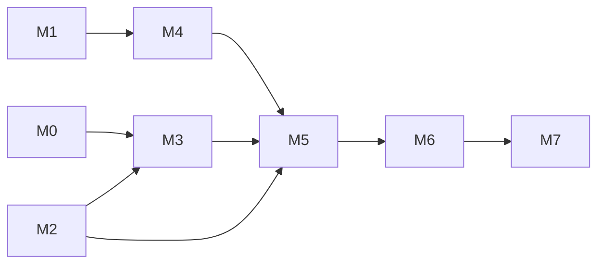

# Remote Sync: Implementation Plan

**Status:** M1 (PR 1, #22) implemented; M2 (PR 2) implemented; the rest not started. Written 2026-09-25; revised 2026-09-26 to six PRs, one per milestone.

This plan turns the four remote-sync specs into six pull requests, one per milestone:
- [`remote-sync.md`](remote-sync.md) (overview and decisions)
- [`remote-sync-server.md`](remote-sync-server.md)
- [`remote-sync-agent.md`](remote-sync-agent.md)
- [`remote-sync-ci.md`](remote-sync-ci.md)

The specs say *what* to build; this says *in what order*, *in which files*, *how each step is tested*, and *what the user has to do on the prod box*. It follows the rollout in the overview (steps 1–7), split into milestones M0–M7.

## Ground rules

- **Every PR is mergeable on its own and keeps `main` working.** A plain `driveagent scan` stays local only, with no login, until M6. Before that, only PR 3 changes what a user sees: the wrong-drive guard, and an interrupted scan exiting 130 (143 for `SIGTERM`) instead of 0. Server endpoints that aren't used yet are harmless.
- **One PR per milestone: six in total.** Each PR is split into **parts**, and each part is its own commit. The parts are in the order to review them, so a large PR can be read one commit at a time. Part sizes: S (a few hundred lines), M (up to ~1,000), L (more, usually because of tests).
- **Tests come with the code**, in the same part. The agent has **no tests today**, so PR 2 starts by adding a test harness.
- **Docs move with the code.** When a behaviour ships, [`drive-comparison-agent.md`](drive-comparison-agent.md), `agent/client/README.md`, [`architecture.md`](../architecture.md) and `CLAUDE.md` are updated in the same PR. The remote-sync specs change status from "proposed" to "implemented" section by section.
- **Go isn't installed on the dev box.** Build and test in containers that match each module's `go.mod`: `golang:1.27.1` for the agent, and whatever `agent/server/go.mod` pins, e.g. `docker run --rm -v "$PWD":/src -w /src golang:<ver> go test -race ./...`. CI uses `actions/setup-go` with the same `go.mod`.
- **The user applies anything on the prod box** (compose, `.env`, nginx, users). Each milestone lists those steps separately, under "User steps".

## Overview

| Milestone | Rollout step | PR | Ships | User steps |
|---|---|---|---|---|
| **M0** Pre-work | – | – | Real-drive check on the dev box (done 2026-09-26); test fixtures for PR 3 | – |
| **M1** Server skeleton | 1 | PR 1 | `agentserver` with health, handshake, users, login/refresh/logout, housekeeping; image on Docker Hub | Secret, compose service, nginx `/agent/`, create user |
| **M2** Agent foundation | 2 | PR 2 | Agent test harness, `driveagent version`, release pipeline, `login`/`logout`/`remote-status`, `lan_addr` | Log in once per machine |
| **M3** Change feed + drive identity | 3 | PR 3 | `state.db` migration, restructured scan preflight, Ctrl-C exit code, drive identity and guard | – |
| **M4** Server upload endpoints | 4 | PR 4 | `PUT /drives`, `POST /changes`, physical-drive matching | Redeploy `agentserver` |
| **M5** `driveagent sync` | 5 | PR 5 | The uploader, and `sync` for history | First `sync` of existing data |
| **M6** Upload in `scan` | 6 | PR 6 | Every scan uploads; remote required | Every machine must be logged in |
| **M7** Rollout and follow-ups | 7 | – | End-to-end verification; later: UI, server-side compare | Set `AGENTSERVER_LATEST_AGENT_VERSION` per release |

### Agent versions

`version-check` (CI spec) demands a bump in every PR that touches release-relevant files, which includes `agent/wire`. The sequence, decided up front:

| PR | Agent version | Why |
|---|---|---|
| PR 1 | – | Adds `agent/wire`, but the `driveagent` workflow doesn't exist yet, so nothing checks or releases it |
| PR 2 | `0.1.0` | First release: `version`, `login`, `logout`, `remote-status` |
| PR 3 | `0.2.0` | The `state.db` migration, the guard, exit codes |
| PR 4 | `0.2.1` | Only the new `wire` types for drives and changes; the agent's behaviour is unchanged. A patch release is the price of keeping `wire` in one module |
| PR 5 | `0.3.0` | `driveagent sync` |
| PR 6 | `0.4.0` | Every `scan` uploads (the behaviour change) |

After each release, the user raises `AGENTSERVER_LATEST_AGENT_VERSION` in the prod `.env` (M7). `AGENTSERVER_MIN_AGENT_VERSION` only needs raising when a release is required.

**Critical path:** M1 → M4 → M5 → M6 on the server side, and M2 → M3 → M5 → M6 on the agent side. M2 and M3 can run in parallel with M1 and M4, because they don't need upload endpoints. M3 needs M2 for the test harness, the `version` package and agent CI.

---

## M0 · Pre-work

### Real-drive check

**Done 2026-09-26, Linux only**, with the drives attached to the dev box (optiplex7070). No Mac check is planned. The commands were read-only: `lsblk`, `findmnt`, `stat` and the udev records in `/run/udev/data`. Serials and IDs are masked here because the repo is public.

| Mount | Drive | Bus | Filesystem (udev `ID_FS_TYPE`) | Mount type in `mountinfo` | Filesystem ID | Serial | `stat` device = `mountinfo` device? |
|---|---|---|---|---|---|---|---|
| `/media/jyothri/Seagate1` | Seagate, 1.8 TB | USB | `ntfs` | **`ntfs3`** (kernel driver) | 16 hex digits (`8650…E771`) | `NA77…` | yes (8:33) |
| `/mnt/seagate2` | Seagate, 1.8 TB | USB | `ntfs` | **`fuseblk`** (ntfs-3g) | 16 hex digits (`E856…BF7E`) | `NA95…` | yes (8:17) |
| `/mnt/wd1tb` | WD, 1 TB (internal) | SATA | `ext4` | `ext4` | UUID (`e12a…d136`) | `WD-W…` | yes (8:5) |

Seagate1 also carries a small `vfat` partition (`DBR_BOOT`) with the same disk serial, which confirms that a serial identifies the disk, not the partition.

What it confirmed:
- **The mount lookup works.** `stat(--drive-root)`'s device number matched the `mountinfo` entry for all three, including the FUSE-mounted drive.
- **Both backup drives are NTFS**, so under the same-OS rule they would never link across Linux and macOS anyway. Skipping the Mac check loses nothing for them.
- **NTFS IDs are 16 hex digits on Linux**, as the review said.
- **The enclosures report real disk serials** (Seagate's `NA…` form), not generic placeholders.

What it changed in the spec (agent spec, [Drive identity](remote-sync-agent.md#drive-identity)):
- **Filesystem type comes from udev, not `mountinfo`.** `mountinfo` reports the *driver* (`ntfs3` for one drive, `fuseblk` for the other), which would give the same kind of drive different `fs_type` values. That would break the FAT/exFAT/NTFS same-OS rule, which needs to know the drive is NTFS. udev's `ID_FS_TYPE` says `ntfs` for both.
- **One udev record gives everything.** The *partition's* record, `/run/udev/data/b<major>:<minor>` for the device number from `stat`, holds `ID_FS_UUID`, `ID_FS_TYPE` and `ID_SERIAL_SHORT`. There's no need to walk `/dev/disk/by-uuid` or the parent disk. `mountinfo` is only a fallback, for the filesystem type when udev has no record (for example, inside a container).

**Fixtures for PR 3:** that PR saves these outputs (`lsblk`, the `mountinfo` lines, the three udev records), with the same masking, under `agent/client/internal/identity/testdata/linux/`. The macOS parser (`diskutil`/`ioreg` plists) is tested against **hand-written fixtures** that follow Apple's documented plist format. They are unverified against a real Mac, and the macOS code path stays marked as such in the agent spec until someone runs `driveagent` on a Mac.

---

## M1 · Server skeleton (rollout step 1): PR 1

### Part 1 · Module layout, health, migrations, image and CI (M)

**Files**
- `agent/wire/go.mod`: `module github.com/jyothri/bhandaar/agent/wire`, `go 1.22`, no `require`.
- `agent/wire/`: `health.go` (`HealthResponse`), `errors.go` (`ErrorResponse`, code constants), `wire_test.go` (fails if `go.mod` gains a `require`).
- `agent/server/go.mod`: requires `wire` with `replace => ../wire`; dependencies `pgx/v5`.
- `agent/server/cmd/agentserver/main.go`: subcommands `serve` (default) and `housekeeping` (stub for now).
- `agent/server/internal/config/`: reads the env vars in the server spec's Configuration table (including `AGENTSERVER_TRUSTED_PROXIES`), and refuses to start without `AGENTSERVER_JWT_SECRET` (≥ 32 bytes).
- `agent/server/internal/store/`: pgx pool from `DB_*`, and a migration runner. Migrations are numbered SQL files embedded with `embed.FS`, applied in order inside one transaction each, and recorded in `agentserver_schema_migrations`. Migration 1 creates only that table.
- `agent/server/internal/api/`: `ServeMux` routes; `GET /agent/health` (DB ping, 1 s timeout; `200` or `503`); a JSON error helper matching `be`'s shape; middleware for the request body limit (16 KiB default), request logging and `X-Real-IP` (trusted only from the nginx address).
- `agent/server/build/Dockerfile` and `agent/server/build/Dockerfile.dockerignore`, as in the CI spec.
- `.github/workflows/agentserver-docker-image.yml`, as in the CI spec (Postgres service, two test steps, BuildKit).

**Tests:** config validation; the migration runner (applies once, is idempotent across restarts, and a failed migration rolls back), run against Postgres via `AGENTSERVER_TEST_DB` and skipped when it's unset; health `200` and `503` (DB down); the wire module having no dependencies.

**Done when** CI is green and `docker build . -f agent/server/build/Dockerfile` works from the repo root. (Merging PR 1 pushes the image; the user steps below deploy it.)

### Part 2 · Users, auth and the request pipeline (L)

**Migration 2:** `agent_users`, `agent_login_failures` (with `client_ip`), `agent_agents`, `agent_refresh_tokens` (with `parent_id`, `grace_used_at` and `revoked_reason`), `agent_idempotency_keys`, and their indexes. The idempotency table is here rather than in migration 3 because part 3's housekeeping cleans it.

**Code**
- `internal/auth/password.go`: argon2id hash and verify with a PHC string; a dummy hash for constant-time "no such user".
- `internal/auth/jwt.go`: issue and verify HS256 access tokens (`sub`, `aid`, `iat`, `exp`, `jti`) with `golang-jwt/jwt/v5`.
- `internal/auth/refresh.go`: 256-bit random tokens (`rt_` prefix), stored as `sha256`; rotation under `SELECT … FOR UPDATE`; the 30 s grace (accept once if the successor is unused, issue a fresh pair, revoke the orphaned successor with `revoked_reason = 'grace'`); reuse after that, or presenting a grace-revoked successor, revokes the family.
- `internal/api/auth.go`: `POST /agent/v1/auth/login`, `/refresh`, `/logout`. Lockout per (username, `X-Real-IP`): 10 failures in 15 min gives `429` with `Retry-After`.
- Middleware, in order:
  1. body limit;
  2. `X-Agent-Version` check (`426` below the minimum, except on health and handshake);
  3. `X-Agent-Protocol` check;
  4. bearer auth, with `X-Agent-Id` matching the `aid` claim;
  5. `Idempotency-Key` presence on mutating `POST`s (the storage comes in PR 4).
- `cmd/agentserver`: `user add | passwd | disable | list`. Passwords are prompted twice with no echo, at least 12 characters, and never logged. `disable` revokes all of the user's refresh tokens.
- `wire/`: `LoginRequest`, `TokenResponse`, `RefreshRequest`.

**Tests:** password round trip; constant-time path for an unknown user; JWT expiry and tampering; refresh rotation, grace replay, second replay revoking the family, replay after 30 s giving `REFRESH_REUSED`, the grace-revoked successor presented later revoking the family (theft by a replay within the window); two simultaneous refreshes serialised by the row lock; lockout per (username, IP) with a second IP unaffected; `426` everywhere except health and handshake; the admin CLI against Postgres.

### Part 3 · Handshake and housekeeping (S)

- `POST /agent/v1/handshake`: semver comparison (a small in-house parser, to avoid a dependency); decisions `ok`, `upgrade_recommended`, `upgrade_required`, `unsupported_protocol`; returns `limits` and `download_url` (default `https://github.com/jyothri/bhandaar/releases/latest`).
- `internal/housekeeping/`: the hourly goroutine (first run 5 min after start) and `agentserver housekeeping` for a one-off run. Tasks: idempotency keys, login failures, refresh tokens. The tombstones task is added in PR 4, once that table exists. Batched `ctid` deletes of 5,000 rows, one `slog` line per task.
- `wire/`: `HandshakeRequest`, `HandshakeResponse`.

**Tests:** every decision branch, including an agent newer than the server; each housekeeping task's cutoff boundary and batching; one failing task not stopping the others.

### User steps for M1

1. Generate the JWT secret: `openssl rand -base64 48`. Add it as `AGENTSERVER_JWT_SECRET` to the prod `.env` in `~/jyothri-apps/apps/storagemanager`.
2. Add the `agentserver` compose service: image `jyothri/bhandaar-agentserver:latest`, same network as `hdd_db`, `DB_*` as for `be` (`HDD_DB_PASS`), port 8091 exposed to nginx only.
3. Add the nginx `location /agent/` and `/agent/v1/auth/` blocks (server spec, Deployment) to both `sm.jkurapati.com` and `dev.sm.jkurapati.com`; `nginx -t`, then reload.
4. Create the user: `docker exec -it <agentserver> agentserver user add --username jyothri`.
5. Smoke test from the prod box: `curl --resolve sm.jkurapati.com:443:127.0.0.1 https://sm.jkurapati.com/agent/health` should give `200 {"status":"ok"}`; `/agent/` must not ask for basic auth, and the rest of the site still must. (Done 2026-09-26. Requests made on the prod box itself pass through Docker's userland proxy, so nginx and `agentserver` log them as `172.23.0.1`, not `127.0.0.1`; from the LAN, real client addresses come through, e.g. `192.168.1.136`. A forged `X-Real-IP` sent straight to `:8091` is ignored.)

---

## M2 · Agent foundation (rollout step 2): PR 2

### Part 1 · Agent test harness (S)

The agent has no `_test.go` files today. Before changing `internal/store` and `internal/scan`, add a baseline that pins current behaviour, so later PRs can prove they changed only what they meant to:
- `internal/store/store_test.go`: open a temp state dir; `UpsertFiles` then `GetFile`; `DeleteFiles`; `SyncDirListings` with and without `deleteStale`, including `cascadePurge`; `ClearDrive`.
- `internal/scan/scan_test.go`: scan a `t.TempDir()` tree; rescan with no changes (all skipped); change, delete and add files, then check hashed, deleted and new counts; an unreadable file disables deletion detection; `RootConflict`.
- A test helper that builds a small file tree.

Part 2 adds the agent CI workflow, which runs these from then on.

### Part 2 · Version, release pipeline, install docs (S)

- `agent/client/internal/version/version.go`: `const Version = "0.1.0"`, `var Commit = "unknown"`, `var Protocols = []int{1}`.
- `driveagent version` subcommand.
- `agent/client/scripts/version-check.sh`: the rules table in the CI spec. Test it locally against a scratch repo with tags.
- `.github/workflows/driveagent.yml`: `test`, `version-check`, the `build` matrix (linux/amd64, darwin/amd64, darwin/arm64) and `release`.
- `agent/client/README.md`: an install section (`curl`, `SHA256SUMS`, macOS `xattr` note), and the rule that a state dir belongs to one machine and syncs to one remote: never copy `~/.driveagent` to another machine and keep using both (overview, [Operational rules](remote-sync.md#operational-rules)).
- Branch protection (user, after the first green run): require `test`, `version-check` and `build`.

**Done when** merging PR 2 cuts `driveagent/v0.1.0` with three tarballs and `SHA256SUMS`, and `driveagent version` from a downloaded tarball prints `0.1.0 (<sha>)`.

### Part 3 · Remote client, credentials, login/logout/remote-status (L)

**Code**
- `agent/client/go.mod`: require `github.com/jyothri/bhandaar/agent/wire` with `replace => ../wire`; add `golang.org/x/term` and `github.com/gofrs/flock`.
- `internal/remote/transport.go`: an `http.Transport` with a custom `DialTLSContext`:
  - with `lan_addr` set, dial it first (1 s timeout), then TLS with `ServerName` = the remote host;
  - on any failure, dial through DNS;
  - skip `lan_addr` for 5 minutes after a failure;
  - record which path was used, for `remote-status`.
- `internal/remote/client.go`: health, handshake, login, refresh, logout. Every request sets the `X-Agent-Version`, `X-Agent-Id` and `X-Agent-Protocol` headers. `https` only, except `localhost`/`127.0.0.1`. The error classification table (by **status code** first, then the JSON `code`; HTML bodies tolerated); typed errors `ErrTransient`, `ErrAuth`, `ErrUpgrade`, `ErrPermanent`.
- `internal/creds/`: `agent.json` (created with a UUID v4, mode 0600); `credentials.json` (atomic temp file + rename, 0600); refresh under `flock(credentials.lock)`, with the re-read-then-refresh logic; tokens tied to `remote_url`.
- `internal/config/`: precedence flag > env > `config.json` > default, for `remote_url` and `lan_addr`.
- Commands:
  - `login`: `--username`, `--password-stdin`, no-echo prompt.
  - `logout`.
  - `remote-status`: reachability, path used, handshake decision, user. The per-drive section comes in PR 5.

**Tests:** transport against `httptest.NewTLSServer`: LAN used; LAN refused → DNS; LAN with a wrong certificate → DNS, and the server records no request; the 5-minute skip. Credentials: atomic write and modes; two processes refreshing at once (two goroutines with separate file locks) give one rotation. Classification: an HTML `413`/`502` from a fake nginx. Login with `--password-stdin`.

### User steps for M2

On each machine: `driveagent login` (for the dev box and the prod box, also add `"lan_addr": "192.168.1.118:443"`, or `127.0.0.1:443` on the prod box, to `~/.driveagent/config.json`), then `driveagent remote-status`.

---

## M3 · Change feed and drive identity (rollout step 3): PR 3

Nothing in M3 contacts the server. It prepares `state.db` and the scan flow so that M5 and M6 only add upload code.

### Part 1 · `state.db` migration and feed writes (L)

**Code** (`internal/store`)
- **Migration tracking:** a `schema_version` table. `migrate()` keeps today's `CREATE IF NOT EXISTS` list as version 0, then applies numbered Go migrations. Migration 1 is the change feed. `ALTER TABLE ADD COLUMN` is guarded by `pragma_table_info`.
- **Migration 1:**
  - `sync_clock`;
  - the `drives` columns (`sync_stream_id`, `synced_version`, `synced_at`, `fs_uuid`, `fs_type`, `fs_uuid_source`, `hw_serial`, `identity_seen_at`);
  - `row_version` on `files`, `dir_listings`, `scan_runs`;
  - `sync_ranges`, `sync_rejected`, `sync_tombstones`;
  - the feed indexes, and the `sync_feed_status` / `sync_summary` views;
  - the backfill: number every existing row in `rowid` order per table, in one transaction, printing progress every 100k rows.
- **Writer connection:** DSN with `_txlock=immediate`, so every `BeginTx` is `BEGIN IMMEDIATE`. The uploader's read-only handle arrives in PR 5.
- **`reserveVersions(tx, n)`:** `UPDATE sync_clock SET v = v + ? RETURNING v`.
- **Writers**, per the "What bumps a version" table:
  - `UpsertFiles`: versions for the batch.
  - `DeleteFiles`: tombstones.
  - `SyncDirListings`: bump only on insert or an `is_dir` change, never for a `last_seen_at` touch. This needs the existing row read first, which the immediate transaction makes safe. Tombstones for stale deletes and `cascadePurge`; a re-insert removes the key's tombstone.
  - `StartScanRun` / `FinishScanRun`.
  - `ClearDrive`: **one transaction**, which also clears tombstones, ranges and rejected rows and resets the sync columns.
- Unchanged: `UpdateComparisonStatuses`, `UpsertFolderStatus`.

**Tests** (extending the harness from PR 2):
- every writer's version effect;
- no bump on a `last_seen_at` touch or a comparison update;
- a key appears at most once (row or tombstone);
- the backfill numbers existing rows and sets the clock;
- migration idempotency, and a re-open being a no-op;
- **two processes** (two `*sql.DB` handles on one file) writing the feed concurrently, never getting `SQLITE_BUSY_SNAPSHOT`;
- versions strictly increasing in commit order.

### Part 2 · Scan preflight in `cmd/driveagent`, exit codes (M)

Today `scan.Run` does the root check, `ClearDrive`, `UpsertDrive`, `SetBackupRoot` and `StartScanRun` itself, and `runScan` turns `Interrupted` into `nil` (exit 0). The plan:
- **New `scan.Prepare(st, opts) (Prepared, error)`**, called by `runScan`. It resolves paths, does the `RootConflict` check, `ClearDrive` for `--replace-root`, `UpsertDrive` and `SetBackupRoot`, and returns the resolved `driveRoot` and `relScanPath`.
- **`scan.Run(ctx, st, prepared, opts)`** takes over from there, starting at `StartScanRun`. It keeps an assertion that the drive row matches, rather than repeating the checks.
- The slot between `Prepare` and `Run` is where part 3's wrong-drive guard goes, and where M6 reads `S` and starts the uploader.
- **Exit codes** in `main`:
  - errors carry a code: 1 local, 2 usage, 3 remote, 4 upgrade, 130 `SIGINT`, 143 `SIGTERM`;
  - `Interrupted` now exits **130** (or **143** for `SIGTERM`), not 0;
  - on the first signal, cancel the walk with `context.WithCancelCause(ctx)` and cause `errUserInterrupt`; on a second signal, cancel the drain context. Until M6 there's no drain, so a single Ctrl-C exits 130 (143 for `SIGTERM`);
  - `main` maps the cancel cause to the exit code.
- Update `drive-comparison-agent.md` (preflight order, exit 130/143) and the README. The README also gets the rule not to run older binaries on the migrated `state.db` (overview, [Operational rules](remote-sync.md#operational-rules)).

**Tests:** `Prepare` then `Run` behaves like today's `Run` (PR 2's harness tests pass unchanged, apart from the call signature); `--replace-root` clears data before `Run`; Ctrl-C exits 130 and `SIGTERM` 143; `RootConflict` still exits 1.

### Part 3 · Drive identity and wrong-drive guard (M)

**Code:** `internal/identity/`
- **`linux.go`:**
  - `stat(root).Dev` gives major:minor;
  - read the partition's udev record `/run/udev/data/b<maj>:<min>`: `ID_FS_UUID`, `ID_FS_TYPE` and `ID_SERIAL_SHORT`;
  - if udev has no record, fall back to `/proc/self/mountinfo` (matched on the same major:minor) for the filesystem type only, and normalise driver names (`ntfs3` and `fuseblk` on an NTFS source → `ntfs`).

  Every path is behind an interface, so fixtures can stand in for the real files. The M0 check verified this on the dev box.
- **`darwin.go`:** `diskutil info -plist <root>` (`VolumeUUID`, `FilesystemType`, the device identifier), and `ioreg -a -r …` (plist) for the USB serial. Plists are parsed with a small `encoding/xml` walker, since plist has no standard-library support.
- **`identity.go`:** normalise (uppercase, no dashes); the denylist of generic serials; the `fs_uuid_source` constant from the build OS.
- **Guard in `runScan`, after `Prepare`:** refuse only on a filesystem-ID mismatch, warn on a serial-only change, record on first sight, keep the stored value when detection fails. The `--accept-identity-change` flag, and `store.SetDriveIdentity`.

**Tests:** fixture-driven: Linux from the M0 outputs (an `ntfs3` and a `fuseblk` NTFS drive both give `fs_type = ntfs`), macOS from the hand-written plists; the symlinked root; a bind mount; `/media/x` vs `/media/xy`; no filesystem ID; no serial; a denylisted serial; every guard branch.

---

## M4 · Server upload endpoints (rollout step 4): PR 4

### Part 1 · Drive tables, `PUT`/`GET` drives, matching (M)

- **Migration 3:**
  - `agent_physical_drives` (with `fs_uuid_source`);
  - `agent_drives`;
  - `agent_files` (`path_key` primary key);
  - `agent_dir_listings` (`entry_key` primary key, `parent_key` index);
  - `agent_scan_runs`, `agent_tombstones` (`key`), `agent_sync_ranges`, and the housekeeping indexes. (`agent_idempotency_keys` is already in migration 2.)
- **`PUT /agent/v1/drives/{drive_id}`**, in one transaction with the drive row `FOR UPDATE`:
  - create the row, or update root and identity;
  - a different `stream_id` deletes the drive's rows and ranges and returns `reset: true`;
  - returns `acked_ranges` and `physical_drive`.
- **Physical-drive matching**, under `SELECT … FROM agent_users WHERE id = $1 FOR UPDATE`: the table in the server spec, with the same-source rule for FAT, exFAT and NTFS, and the tie-break.
- **`GET /agent/v1/drives`.**
- **The tombstones housekeeping task**, which needs these tables.
- **`wire/`:** `DriveOpenRequest`, `DriveOpenResponse`, `PhysicalDrive`, `Identity`.

**Tests:** every matching row, including a clone, a serial filled in later, ambiguous candidates, and the same filesystem ID from different sources for exFAT (not linked) vs ext4 (linked); two concurrent `PUT`s of a new drive by two agents give one physical drive; a stream reset.

### Part 2 · `POST /changes` (L)

**Code:** `internal/api/changes.go` and `internal/store/apply.go`
- **Decode:** `Content-Encoding: gzip` read through a limited reader (2 MiB compressed, 16 MiB decompressed); strict JSON (`DisallowUnknownFields`).
- **Envelope validation** gives `400 INVALID_BATCH`: sorted, unique `v`, inside `(from, to]`, `from < to`, `stream_id` present.
- **The transaction, in spec order:**
  1. drive `FOR UPDATE` (`404` if missing);
  2. stream check (`409`);
  3. **coverage check** (a duplicate gives `200 duplicate: true`);
  4. **idempotency lookup** (a stored response, or `422`);
  5. **per-entry validation** (`rejected`); a rejected `file`/`dir_child` entry with a computable key becomes a delete at its version (tombstone), so no stale row survives;
  6. **apply**: one `unnest` statement per table and op, **each under its own `SAVEPOINT`**, with the higher-version-wins condition and the tombstone `NOT EXISTS`, and keys computed as SHA-256 from the decoded raw bytes. On a data error (SQLSTATE class `22` or `23`), roll back to the statement's savepoint and **fall back** to per-entry `SAVEPOINT`s, adding failures to `rejected` (as tombstones, like step 5). Any other error returns `500`;
  7. merge ranges and update `acked_version`;
  8. store the idempotency record;
  9. commit.
- **`_b64` handling:** decode, reject valid-UTF-8 and NUL cases, and build the display form (`\xHH`) plus the raw columns.
- **Idempotency storage:** insert the key row inside the transaction, so a concurrent request with the same key waits on it, then reads the committed response.
- **`wire/`:** `ChangeBatch`, `Change` (a tagged struct with `kind`/`op`), `ChangesResponse`, `Rejected`. Golden fixtures go in `wire/testdata/`, used by both sides.

**Tests:**
- every apply case in the server spec's test list (the full-duplicate, partial-overlap and out-of-order cases, the stale upsert after a tombstone, a delete older than a live row);
- range merge and watermark advance;
- empty batches; `from == to` giving `400`;
- a replayed range with different contents as a duplicate; key reuse with a different body on an uncovered range giving `422`;
- a bulk failure falling back to savepoints and rejecting one entry, and a non-data error (e.g. a forced serialization failure) returning `500` with nothing applied;
- a rejected upsert of a key with an older stored row leaving a tombstone, not the old row;
- 4 KB paths;
- the gzip bomb cap;
- a **property test**: random permutations of a fixed set of batches produce identical tables.

Bump the agent to `0.2.1` (see [Agent versions](#agent-versions)): the new `wire` types are release-relevant.

### User steps for M4

Redeploy (pull `:latest`, restart `agentserver`). Migration 3 runs at startup. `docker exec <agentserver> agentserver housekeeping` should log the four tasks.

---

## M5 · `driveagent sync` (rollout step 5): PR 5

### Part 1 · The uploader core (L)

**Code:** `internal/syncer/`
- `feed.go`: the read-only `*sql.DB` (`mode=ro`); the page query for `(cursor, upper]` with a `LIMIT`; mapping rows to `wire.Change` (`path_b64`/`child_b64` for invalid UTF-8).
- `marker.go`:
  - load the watermark and ranges;
  - `ReplaceWithServer(ranges)` after each ack, **after checking the new ranges still cover the old marker and the batch** (otherwise stop the session and re-open, which mints a new stream);
  - **reconcile rules**: server's highest acked version above the local clock → new stream; server missing local coverage → new stream; server ahead but at or below the clock → adopt; `reset` → clear;
  - gap computation;
  - `SetStream(new uuid)`, which also clears the marker and `sync_rejected`;
  - pruning synced tombstones; recording `rejected` in `sync_rejected`, and deleting its rows for keys acked at a newer version.
- `batch.go`:
  - build the page, respecting the change count and `max_batch_bytes`;
  - `from`/`to`, with the stretched `to` at the end of a gap, and no `from == to` batch;
  - encode and gzip **once**, keeping the bytes for retries;
  - the deterministic idempotency key.
- `uploader.go`: the state machine (preflight → streaming ↔ backoff → done/failed); exponential backoff with jitter under `--remote-timeout`; response handling (`409` and `404` re-open, `413` halving and re-encoding, `401` refresh once); the upload lock (`flock`), blocking for `scan` and try-lock for `sync`.

**Tests** (against a fake `agentserver` built on the `wire` fixtures):
- marker replacement;
- all four reconcile rules, including a `state.db` copied from an older snapshot and a server restored from an older snapshot, both ending in a new stream and a server with no deleted files;
- a server restored mid-session: the next ack's ranges don't cover the old marker, which is kept, and the session ends in a new stream;
- `sync_rejected`: a row removed once its key is acked at a newer version; cleared by a new stream, so re-uploading the same rejected entry doesn't collide on its primary key;
- gap closing, including the `from == to` case;
- a retry sending byte-identical bodies;
- a restart re-reading a page with the same range, accepted as a duplicate;
- rejected entries recorded;
- a lost response;
- `413` halving;
- lock behaviour.

### Part 2 · `sync` command, drive details in `remote-status` (M)

- `driveagent sync [--drive-id …] [--remote-timeout]`: health, handshake, token; then per drive (in `drive_id` order): try-lock, `PUT`, reconcile, upload the gaps oldest first, release. One report line per drive. Exit 0, 3 or 4.
- `remote-status`: per drive, the identity, `linked` copies, the marker (watermark, number of ranges, `synced_at`), pending (from `sync_summary`, fine for an explicit status command) and `sync_rejected` entries. It reconciles a drive only under a try-lock.

**Tests:**
- `sync` uploads nothing before a successful handshake;
- an interrupted `sync` (killed between batches, and between the server's commit and the local marker update) resumes to the same server state;
- a drive locked by a "scan" (a lock held by the test) is skipped;
- the migrated `state.db` fixture from PR 3 uploads in full.

### User steps for M5

A state dir syncs to exactly one remote (stream ids and the marker are per drive, not per remote), so don't point one state dir at both servers: every switch would mint new streams and re-upload every drive. On the dev box, first run `driveagent sync --state-dir <copy of ~/.driveagent> --remote-url https://dev.sm.jkurapati.com` against a **copy** of the state dir (log in once for that copy), then, when that looks right, run `driveagent sync` with the real state dir against prod. The first run uploads every existing checkpoint (the backfill made it all history), so expect it to take a while for large drives. Check the counts: `remote-status` shows `pending 0`, and Postgres row counts per drive (the read-only query recipe) match `state.db`.

---

## M6 · Upload in `scan` (rollout step 6): PR 6

### The change (M)

**Code** (`cmd/driveagent` and `internal/scan`)
- **`runScan` order:**
  1. take the upload lock (blocking, printing a waiting message). It comes first: it's the only thing enforcing one scan per drive, so `S` can't be read while another scan of the drive is writing, and it keeps `Prepare`'s `ClearDrive` from running while a `sync` is uploading the drive;
  2. preflight (health, handshake, token; exit 3 or 4 before touching the drive);
  3. `scan.Prepare`;
  4. the wrong-drive guard;
  5. read `S`;
  6. `PUT` and reconcile;
  7. compute the session `from` (the `e`/`S` rule, one `EXISTS`);
  8. start the uploader;
  9. `scan.Run`;
  10. drain.
- **`scan.Options.OnFlush func()`:** the batch writer calls it after each flush; the uploader uses it as a non-blocking wakeup channel, alongside a 2 s ticker.
- **Cancellation:** the uploader cancels the scan with `WithCancelCause(errRemoteFailed)` after `--remote-timeout`, or on a permanent failure. The first Ctrl-C cancels the walk, then drains under `--remote-timeout`; the second cancels the drain. `main` maps causes to exit codes 3, 4, 130 and 143.
- **Progress line:** `uploaded N / pending M`, or `remote: retrying (… left)`.
- **Startup hint:** one `EXISTS` per gap, printing `N drives have history not yet uploaded; run "driveagent sync"`.
- **Failure message:** points at `driveagent sync`.
- **Docs:** `drive-comparison-agent.md` (`scan` now requires the remote and a login), `agent/client/README.md` (login first; `sync` for backlog; `lan_addr`), `architecture.md` (agent → `agentserver` → Postgres), `CLAUDE.md`. Bump `Version` to `0.4.0` (a minor release: the behaviour change).

**Tests:**
- history is skipped (only rows above `S` are uploaded; a superseded history row is uploaded at its new version);
- remote down at start → exit 3 and `state.db` untouched;
- not logged in → exit 3 before scanning;
- remote dies mid-scan → exit 3 after the budget, the checkpoint resumable, and `sync` uploading the rest;
- `426` mid-scan → exit 4;
- Ctrl-C once → drain, then 130; twice → 130 at once; `SIGTERM` → 143;
- a second `scan` of the same drive waits for the first one's lock before its preflight;
- `--replace-root` → new stream before the first `PUT`, and the server has no files from the old root afterwards;
- the two-process test (two scans of different drives, both uploading) → no missed rows.

### User steps for M6

Before updating the agent on a machine, make sure it's logged in (`driveagent remote-status`); from 0.4.0 on, a plain `scan` fails without the remote. The first scan of each drive after the upgrade uploads only what it writes; run `driveagent sync` once to upload the rest. Consider a cron job or systemd timer for `driveagent sync`.

---

## M7 · Rollout verification and follow-ups (rollout step 7)

**End-to-end checklist**, first on `dev.sm`, then on prod:
1. `driveagent version` matches the release; `remote-status` shows the LAN path at home and the DNS path elsewhere (test the Mac off the home network, e.g. on a phone hotspot).
2. Scan a small folder; Postgres has exactly the scan's rows; kill the network mid-scan → exit 3; restore; `sync` → counts match.
3. Rename, delete and add files; rescan; the server reflects all three (tombstones applied).
4. Copy `~/.driveagent` from an older snapshot → the next `sync` mints a new stream and re-uploads.
5. `--replace-root` on a test drive → the server holds only the new root's files.
6. Plug the same ext4 or APFS drive into Linux and the Mac → `remote-status` shows `linked`. An exFAT drive → not linked (expected in v1).
7. Housekeeping log lines appear hourly.

**After each agent release:** set `AGENTSERVER_LATEST_AGENT_VERSION`, and `AGENTSERVER_MIN_AGENT_VERSION` only when a release is required, in the prod `.env`, then restart `agentserver`.

**Follow-ups** (separate specs, not part of this plan): a web UI for agent drives and linked copies (in `be`/`ui`, reading the `agent_*` tables); server-side compare; the thinner agent (overview, Future direction).

---

## Risks and how the plan handles them

| Risk | Mitigation |
|---|---|
| Restructuring `scan.Run` (PR 3) changes behaviour by accident | PR 2's test harness pins today's behaviour first; PR 3 must pass it unchanged |
| The backfill on a large `state.db` is slow or blocks another process | Progress output; documented "re-run the other command"; tested on a large generated fixture in PR 3 |
| macOS `diskutil`/`ioreg` output differs from what the parser expects | **Open until M7 item 6.** M0 was Linux-only, so the Mac fixtures are hand-written from Apple's plist format; the parser reads plist XML, never human-readable text, and the macOS path stays marked unverified until `driveagent` runs on a Mac |
| A state dir copied to another machine, or an old binary run on a migrated `state.db` | Deferred; documented as [operational rules](remote-sync.md#operational-rules) in the overview and the agent README |
| Hairpin NAT makes remote-required scans fail at home | `lan_addr` ships in M2, before scans depend on the remote (M6); `remote-status` shows the path |
| M6 breaks existing workflows (a scan now needs the remote) | It ships last, as a minor version bump, with user steps to log in first; M1–M5 change nothing for a plain `scan` |
| Bulk `unnest` apply is hard to get right with version guards and tombstones | The property test in PR 4 compares every batch ordering against the expected final state |
| Server and agent drift on the wire format | One `wire` module and shared golden fixtures; both CI workflows run on `wire` changes |
| A bad entry blocks a drive | Per-entry validation and savepoint fallback (PR 4); `sync_rejected` makes it visible (PR 5) |
