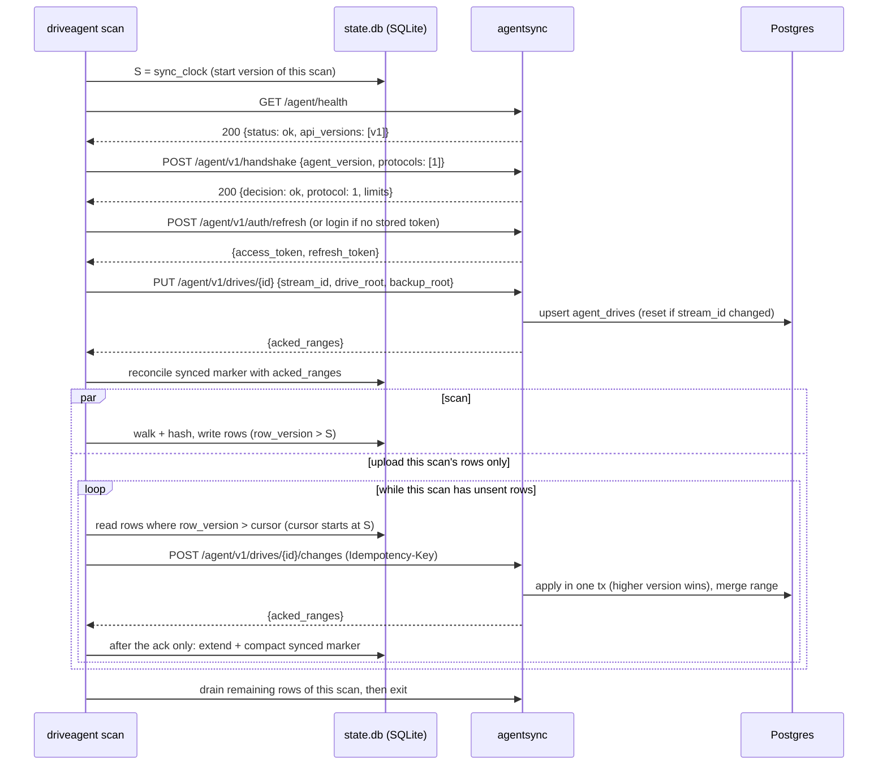

# Remote Sync: driveagent → sm.jkurapati.com

**Status:** proposed (not implemented). Written 2026-09-24.

This feature lets the local Linux agent (`driveagent`, see [`drive-comparison-agent.md`](drive-comparison-agent.md)) upload its scan data to the Bhandaar server at `sm.jkurapati.com`, so a drive's contents are known centrally and not only in one machine's `~/.driveagent/state.db`.

The design is split across four documents, plus an implementation plan:

| Document | Covers |
|---|---|
| this file | Goals, operational rules, key decisions (protocol, language, service placement, data model), the end-to-end flow, rollout |
| [`remote-sync-server.md`](remote-sync-server.md) | The new `agentsync` service: API reference, auth, Postgres schema, how change batches are applied, deployment |
| [`remote-sync-ci.md`](remote-sync-ci.md) | CI for both: the `agentsync` Docker image (Docker Hub, like `be`/`ui`) and automatic `driveagent` releases (GitHub Release per version tag, Linux + macOS binaries) |
| [`remote-sync-agent.md`](remote-sync-agent.md) | `driveagent` changes: what it uploads (a scan always does), config, new commands, the local change feed and synced marker (per-drive watermark), resume, the uploader state machine |
| [`remote-sync-implementation-plan.md`](remote-sync-implementation-plan.md) | How it gets built: six PRs, one per milestone (M1–M6), each split into reviewable parts, with files, tests and the user's prod-box steps |

## Goals

1. A versioned, agent-facing API on `sm.jkurapati.com`, with an unauthenticated health check.
2. Username + password login returning an access token and a refresh token.
3. Two ways to upload:
   - **`driveagent scan`** uploads the data of the scan it is running (new or changed files, deletions, listing changes, the scan-run record). It always uploads: if the remote can't be reached or refuses the agent, the scan fails. It skips **history**: older rows in `state.db` that never reached the remote.
   - **`driveagent sync`** runs the agent on its own, with no scan. After a successful handshake it uploads the history of every drive.
4. No modes. The remote is required for every scan; there is no offline or best-effort variant.
5. Before uploading, the agent checks health, negotiates version compatibility, then logs in.
6. `state.db` records, per drive, which of its data has been synced to the remote (a watermark, advanced only after each acknowledged batch), so `sync` and `scan` resume after any interruption.
7. Uploads are idempotent: retries after a network glitch never duplicate or corrupt data.

## Non-goals (v1)

- Uploading `compare` results or folder rollups. Only **scan data** is uploaded: drives, file records, directory listings and scan runs. `compare` and `report` stay local. The server can run its own comparison later from the uploaded hashes.
- Showing agent data in the web UI. The data lands in Postgres; UI work is a follow-up (see [Rollout](#rollout), step 7).
- Self-service sign-up. Users are created by an admin command on the server.
- Keeping history on the server. The server mirrors the agent's *current* checkpoint for each drive; it does not keep a snapshot per scan.
- Multi-writer drives. One agent (one `state.db`) owns a given drive's stream.
- Scanning without the remote. There is no offline or best-effort mode (decided 2026-09-25, to keep the agent simple): every `scan` needs the remote and fails without it.
- Removing the embedded SQLite, `compare` and `report` from the agent. That's a possible later version (see [Future direction](#future-direction-a-thinner-agent)).
- Merging copies of the same physical drive. A drive scanned from two machines is uploaded as two copies, which the server **links** as the same physical drive (D8) but doesn't merge. Merging would need multi-writer sync.
- Signing or notarizing the macOS binaries. Decided 2026-09-25: installing with `curl`, or running `xattr -d com.apple.quarantine` once after a browser download, is acceptable for v1 (see [`remote-sync-ci.md`](remote-sync-ci.md#installing-a-release)).

## Operational rules

Two ways of running the agent are unsupported in v1. The agent doesn't detect them yet; the fixes are deferred (review of PR 21, 2026-09-26), so they are rules for now:

1. **Never copy a state dir (`~/.driveagent`) to another machine and keep using both** (Migration Assistant, `rsync` to a new box, a cloned VM). The copies share the `agent_id` and every stream id, and the reconcile rules make them wipe each other's upload on the server, one full re-upload per alternation. Each machine gets its own state dir, created by its own `driveagent`, and a state dir syncs to exactly one remote. *Deferred fix:* store `/etc/machine-id` (Linux) or `IOPlatformUUID` (macOS) in `agent.json`, and mint a new `agent_id` on a mismatch, so a clone becomes a separate agent with its own drive rows.
2. **Never run a `driveagent` older than the `state.db` migration (rollout step 3) against a migrated `state.db`.** The old binary doesn't version its writes, so they're never uploaded, and nothing reports it. Check `driveagent version` after upgrading and remove old binaries from `PATH`. *Deferred fix:* have the migration move the database to a new file name (e.g. `state.v1.db`), so an old binary finds no `state.db` and starts a fresh one: slow and obvious, but it can't corrupt the migrated feed.

## Decisions

### D1. Wire protocol: HTTP/1.1 + JSON, gzip, batched request/response

Options evaluated:

| | HTTP + JSON batches (chosen) | HTTP + protobuf body | gRPC (client/bidi streaming) | WebSocket stream |
|---|---|---|---|---|
| Fits current nginx → Go setup | Yes, a plain `location` block | Yes | Needs `grpc_pass` + HTTP/2 upstream, a new nginx pattern here | Needs upgrade headers and long read timeouts |
| Debuggable with curl/jq | Yes | No, needs `protoc --decode` | Needs `grpcurl` | Awkward |
| Idempotency and resume | Natural: each batch is one request with one key and one version interval | Same as JSON | A stream breaks mid-way, so you still need per-message acks and a resume cursor; you rebuild batching on top | Same problem as gRPC, plus custom framing |
| Payload size | Largest raw, but gzip closes most of the gap (paths repeat heavily; hashes don't compress in any format) | ~20–30% smaller than gzipped JSON (rough estimate) | Same as protobuf | Same as whichever encoding it carries |
| Code and schema tooling | `encoding/json`, types shared as Go structs | `protoc` toolchain in both builds | `protoc` + grpc-go on both sides | Custom protocol |
| Throughput need | Initial upload of a large drive is a one-off; after that, scans send small deltas. Batching (≤1000 changes/request) amortises round trips well enough | Marginal gain | Marginal gain | Marginal gain |

Why: the traffic is bulk, append-mostly and latency-insensitive. Batched request/response gets nearly all of streaming's throughput and makes idempotency and resume simple, because each batch is one atomic unit with one key and one version interval. The size advantage of protobuf is small once gzip is on, because the bulk of each row is paths and hashes.

To leave room for a later switch: all wire types live in one small, standard-library-only Go module (`agentsync/wire`, shared by the agent and the server), and the server checks `Content-Type`. Adding `application/x-protobuf` later is an additive change inside `/agent/v1`. A breaking change goes to `/agent/v2`.

### D2. Language and placement: a new Go service, `agentsync`

- **Go**, not Java. Both the existing backend and `driveagent` are Go, so the wire types are shared Go structs instead of a second schema definition. It is also one toolchain in CI, and a small static binary fits the home-server box better than a JVM.
- **Separate service** (`agentsync/` at the repo root, its own module, image and container), not new routes in `be/`:
  - `be` has a 10 s read/write timeout and a 512 KB body limit, both wrong for bulk upload.
  - Upload traffic and deploys are isolated from the web UI's backend.
  - The two auth models stay separate: `be` sits behind nginx basic auth, and `agentsync` authenticates in the app.
- It uses the **same Postgres database** as `be`, with its own tables (prefixed `agent_`) and its own migrations. It never writes to `be`'s tables.

### D3. Data model: new tables, not `scandata`

`scandata` (written by `be/collect/local.go`) doesn't fit agent data:

| `scandata` | driveagent checkpoint |
|---|---|
| One full snapshot per scan (`scan_id`); a rescan re-inserts every row | Incremental: one row per `(drive_id, relative_path)`, updated in place; deletions are detected |
| `md5hash VARCHAR(60)` | BLAKE3 `content_hash` + `hash_algo` |
| `path VARCHAR(2000)`, absolute path on the scanning host | Path relative to a stable `drive_root`, no length limit |
| No drive identity; directories carry aggregated size and count | Drive identity (`drive_id`, `drive_root`, `backup_root`); directory structure as parent→child listings |

Reusing it would mean re-uploading every file on every scan. The server instead keeps `agent_files`, `agent_dir_listings` and `agent_scan_runs`, which mirror the agent's SQLite tables. Their rows are keyed on a SHA-256 of the raw path bytes rather than the path text. That keeps paths free of Postgres's index-size limit (about 2.7 KB, less than Linux's ~4 KB paths), and makes the key exact even for names that aren't valid UTF-8. The schema is in [`remote-sync-server.md`](remote-sync-server.md#database-schema).

### D4. Sync model: a versioned change feed, uploaded as ranges in any order

The agent does not stream records out of the scan pipeline. Instead:

- Every scan-owned write to `state.db` (a file upsert or delete, a directory-listing insert or delete, a scan-run start or finish) stamps the row with a monotonically increasing **`row_version`** in the same transaction. A deletion leaves a **tombstone** with its own version. Each key (file, or directory child) appears in the feed at most once, at its latest version.
- A batch **covers** a version interval `(from, to]` of one drive's feed, and carries every entry of the drive in it. The server applies it in one Postgres transaction and records the interval in the drive's **acked ranges**, merging it with any neighbours.
- **`scan` uploads only its own interval.** Before scanning, it reads the version clock `S`; everything of that drive above `S` was written by this scan. Its session covers `(S, …)`, or continues the drive's watermark when no history is pending. History below `S` is left alone.
- **`sync` fills the gaps.** It uploads the pending history between acked ranges, oldest first. Once a drive is fully synced, its ranges merge into a single watermark from 0.
- **Why any order is safe:** on the server, a key's higher version always wins, and the server keeps its own tombstones. A stale history upsert can't overwrite, or bring back, a file that a later scan changed or deleted. The server also skips entries inside ranges it has already acked, so replays are harmless. Tombstones below the watermark are garbage-collected.
- **Synced marker.** Locally, each drive has a **watermark** (`drives.synced_version`: everything at or below it is synced) plus a small **`sync_ranges`** table of synced intervals above it, typically one per scan uploaded while history was pending. An entry is synced if it falls at or below the watermark or inside a range, and pending otherwise. The marker moves **only after the server acknowledges a batch**: never when a batch is sent, and not for a batch that fails. After each acknowledgement, the local marker is set to the server's returned ranges: it's always a copy of the server's view. Ranges merge on the server, and `sync` closes gaps that have no pending entries with an empty batch. Views in `state.db` expose a per-row `synced` column and per-drive pending counts for inspection. See [agent spec](remote-sync-agent.md#synced-marker).
- **Either side going back in time.** When a drive is opened, the agent compares the server's ranges with its copy and with its local clock. If the server has acked beyond the local clock, `state.db` was restored from an older copy. If the server lacks coverage the agent had seen, the server was restored. Either way, the agent mints a new `stream_id`, and the whole drive is re-uploaded. That's the only way to also restore deletions, whose tombstones are pruned locally once synced. The legitimate "server has more" case (a crash between the server's commit and the local update) always stays at or below the local clock.
- **One bad entry can't block a drive.** The server validates per entry, acknowledges the batch's range, and returns the entries it couldn't store as `rejected`. The agent records them locally, and `remote-status` shows them.
- **Resume** needs no extra state: an interrupted `sync` or `scan` leaves everything after the last acknowledged batch pending, and the next run continues from there.

A per-row `synced` column was considered, twice, and rejected, most recently on 2026-09-25. Every acknowledgement would rewrite up to 1000 rows while a scan writes to the same tables. The per-drive watermark, updated once per acknowledged batch, was preferred.

This one mechanism covers every failure case:

- **Mid-scan outage**: the scan retries for up to `--remote-timeout`, then stops and fails. Nothing is lost: what it recorded but didn't send stays in SQLite as pending history, and `driveagent sync` uploads it.
- **Existing checkpoints**: their rows are pending history until `driveagent sync`. The migration numbers existing rows, so data scanned before this feature uploads in full the first time `sync` runs.
- **Agent crash or restart**: the agent gets the server's acked ranges when it opens the drive, and carries on from there.
- **Retry after a lost response**: the batch's interval is already acked, so the server returns success without re-applying (see D5).
- **Coalescing**: a file rehashed three times before an upload is sent once, with its latest state.

The trade-off of skipping history: until `sync` runs, the server's copy of a drive can be incomplete. For example, a file first recorded by a scan that failed mid-upload, or before this feature existed, isn't part of a later scan's data, because the later scan skips unchanged files. `driveagent remote-status` shows how much is pending.

`state.db` is disposable, and `--replace-root` wipes a drive. To handle both, each drive's feed has a **`stream_id`** (UUID), regenerated whenever the drive's local data is reset. When the server sees a new `stream_id` for a drive, it discards that drive's data and ranges. Without this, a fresh `state.db` with low versions would look "already synced".

### D5. Idempotency: two layers

1. **Acked ranges (structural).** Each batch carries `stream_id`, `from_version` and `to_version`. A batch whose interval is already inside an acked range is answered as a duplicate. Otherwise, entries inside acked ranges are skipped, and the rest follow "higher version wins". A batch can't be applied twice, even without a key.
2. **`Idempotency-Key` header (explicit, as required).** It is required on every mutating `POST`. For change batches the agent derives it deterministically, as `sha256(agent_id | drive_id | stream_id | from_version | to_version)`, so it survives a process restart. The server stores the key with a hash of the request and the response. A replay gets the stored response; the same key with a different body gets `422`.

### D6. Auth: short-lived JWT access token + rotating opaque refresh token

- `POST /agent/v1/auth/login` with username + password returns an access token (JWT, HS256, 15 min) and a refresh token (random 256-bit, 30 days, stored hashed on the server).
- Refresh rotates the refresh token. Within a 30 s grace window, the server accepts the just-rotated token once more and issues a fresh pair, so a lost refresh response doesn't force a re-login. Reuse beyond that revokes the whole token family (theft detection). The successor that a grace replay revokes is marked as such, and presenting it later also revokes the family, so a thief who replays a stolen token within the window is cut off at the owner's next refresh.
- Failed logins lock out per (username, client IP), not per username alone, so knowing the username isn't enough to lock the owner out.
- Passwords are hashed with argon2id. Users are created with `agentsync user add` on the server.
- The agent stores tokens in `<state-dir>/credentials.json` (mode 0600). The password is never stored, and never taken from a command-line flag or an environment variable; for scripts there's `--password-stdin`.

### D7. nginx: an exempt `/agent/` path

`sm.jkurapati.com` is behind nginx basic auth, and basic auth and bearer tokens both use the `Authorization` header. A new `location /agent/` proxies to `agentsync` **without** basic auth. App login, tokens and nginx rate limiting on the auth endpoints protect it instead. The prod nginx config change is listed in [`remote-sync-server.md`](remote-sync-server.md#deployment); the user applies it on the prod box.

From inside the home LAN, the public name only works through NAT hairpinning, which is unreliable: 4 of 7 requests from the dev box timed out on 2026-09-25, while 7 of 7 to the LAN address succeeded with a valid certificate. The LAN's DNS is the AT&T gateway, not Pi-hole, so the name can't simply be overridden locally. Decided 2026-09-25: the agent handles this itself. With `lan_addr` set (e.g. `192.168.1.118:443`), it tries that address first, still verifying the `sm.jkurapati.com` certificate, and falls back to DNS when it's not at home. No network change is needed. See [agent spec](remote-sync-agent.md#reaching-the-server-from-the-lan).

### D8. Drive identity: filesystem ID + hardware serial, read-only

`--drive-id` is just a label, so on its own it can't tell that two machines scanned the same portable drive. At the start of each scan, the agent reads two identifiers from the drive holding `--drive-root`, without writing anything to it and without root access:
- the **filesystem ID**: a UUID, or the volume serial for NTFS/exFAT/FAT. It travels with the drive, but a clone copies it. For ext4, APFS and HFS+, Linux and macOS report the same ID. For FAT, exFAT and NTFS they don't (macOS synthesizes one, and the raw serial needs root), so those drives are linked only between agents on the same OS.
- the **hardware serial** reported through the USB enclosure. This tells a clone from its original, but some enclosures don't report one.

The server links a user's drive rows (from any agent) into one **physical drive** when:
- the filesystem IDs match and the serials match, or
- the filesystem IDs match and either side has no serial.

Matching filesystem IDs with *different* serials is recorded as a clone. Copies stay separate and are only linked. Locally, the same identity powers a guard: `scan` refuses to run when the drive under a `--drive-id` has a different filesystem ID than last time (the wrong drive plugged in), unless `--accept-identity-change` is given. A changed serial alone only warns, because many USB docks report their own serial, and moving a disk to another dock changes it.

A marker file written to the drive was considered and rejected, because the agent never writes to drives. Details: [agent](remote-sync-agent.md#drive-identity), [server](remote-sync-server.md#matching-physical-drives).

## End-to-end flow

`driveagent sync` follows the same health → handshake → token steps. Then, for every drive, it opens the drive and reconciles the marker, and uploads each gap of pending history, oldest first. The last batch of a gap is stretched to meet the next range, so ranges merge. `sync` uploads nothing unless the handshake succeeds, and an interrupted `sync` resumes after the last acknowledged batch.

The first `driveagent login` (interactive, prompts for the password) does health → handshake → login once and stores the tokens. Later runs only refresh.

## When the agent uploads

| Invocation | Contacts the remote | Uploads |
|---|---|---|
| `driveagent scan` | Always; fails if the remote is unavailable | The current scan's data for that drive. History is skipped; a hint is printed if any is pending |
| `driveagent sync` | Always; fails if the remote is unavailable | Every drive's pending history, with no scan and no drive access |
| `compare`, `report`, `version` | Never | Nothing |

## Rollout

1. **Server skeleton**: `agentsync` with health, handshake, the users CLI, login/refresh/logout, schema migrations, the Dockerfile and the `agentsync-docker-image.yml` workflow. Deploy it and add the nginx `/agent/` block.
2. **Agent identity**: a `version` package, `driveagent version`, `login`, `logout`, `remote-status`, and the `driveagent.yml` workflow (test, version check, Linux/macOS builds, automatic release). Merging this step cuts the first release, `driveagent/v0.1.0`.
3. **Agent change feed and drive identity**: the `state.db` migration (`row_version`, tombstones, `stream_id`, the synced marker, `sync_ranges` and views, identity columns, backfill of existing rows), plus identity detection and the wrong-drive guard in `scan`. Nothing is uploaded yet. The visible behaviour changes are the guard, and an interrupted `scan` exiting 130 (143 for `SIGTERM`) instead of 0; the drive checks also move from `scan.Run` into `cmd/driveagent`, with the same results. The drives on the dev box were checked on 2026-09-26: both Seagate backup drives are NTFS, so cross-OS linking doesn't apply to them (see [agent spec](remote-sync-agent.md#drive-identity)).
4. **Upload**: the server's drive and changes endpoints, with acked ranges, tombstones and physical-drive matching.
5. **`driveagent sync`**: uploads history.
6. **Upload in `scan`**. From this step on, every `driveagent scan` needs the remote and a prior `driveagent login`; there is no way to scan locally only. Until it ships, scans stay local-only, so existing workflows keep working through steps 1–5.
7. **Later**: web UI for agent drives; server-side compare; then slimming the agent down (see below).

## Future direction: a thinner agent

With the remote required for every scan, the server is the system of record, and comparing drives can move there (rollout step 7). A later version could then drop the embedded SQLite checkpoint, along with the local `compare` and `report` commands, leaving an agent that walks, hashes and uploads.

That is out of scope for v1, and the v1 design doesn't depend on it. But two things in this design exist mainly because of the local database, and would need a replacement then:
- **Resumability.** Today an interrupted scan skips files it already hashed by checking `state.db`. Without it, the agent would ask the server for the drive's known `(path, size, mtime)`, or re-hash.
- **The change feed.** Versions, tombstones, acked ranges and `sync` are how unsent data survives a failure. Without a local store, a failed upload would mean re-scanning.

## Resolved questions

Decided 2026-09-25:

1. **Paths that aren't valid UTF-8** are uploaded, not rejected. Linux filenames are bytes, but JSON strings and Postgres `TEXT` require UTF-8. So the wire carries `path_b64` / `child_b64` for such names, and the server stores a readable escaped form plus the original bytes, keyed on a hash of the raw bytes (see [server spec](remote-sync-server.md#paths-that-arent-valid-utf-8)).
2. **Drive identity across machines.** The same drive scanned from two machines is stored as two copies, **linked** as one physical drive using the filesystem ID and hardware serial (D8). A missing serial on either side still counts as the same drive. For FAT, exFAT and NTFS, only copies from the same OS are linked (decided 2026-09-25). Copies aren't merged in v1.

There are no open questions.
